

# بررسی Acunetix 

## معرفی

نرم‌افزار Acunetix یک اسکنر امنیتی شناخته شده برای برنامه های وب  است که توسط متخصصان امنیتی برای شناسایی نقاط ضعف در وب سایت ها و برنامه های کاربردی وب استفاده می شود. این نقاط ضعف که آسیب‌پذیری نیز نامیده می‌شوند، می‌توانند توسط مهاجمان برای دستیابی به دسترسی غیرمجاز یا سرقت داده‌ها مورد سوء استفاده قرار گیرند.

نرم افزار Acunetix با شبیه سازی حملات هکرها برای یافتن این آسیب پذیری ها کار می کند. با اسکن منظم دارایی های وب با Acunetix، کسب و کارها می توانند وضعیت امنیتی کلی خود را بهبود بخشند و موفقیت مهاجمان را دشوارتر کنند.

در اینجا برخی از ویژگی های کلیدی Acunetix آورده شده است:

<ul>
<li>
<strong>
طیف وسیعی از آسیب‌پذیری‌ها را شناسایی می‌کند:
</strong>
 Acunetix می‌تواند آسیب‌پذیری‌های رایج برنامه‌های کاربردی وب مانند SQL Injection و اسکریپت بین سایتی (XSS) را شناسایی کند.
</li>
<li>
<strong>
سریع و کارآمد:
</strong>
 Acunetix به دلیل سرعت و کارایی خود شناخته شده است و نتایج را به سرعت ارائه می دهد.
</li>
<li>
<strong>
دقیق:
</strong>
 Acunetix از فناوری AcuSensor برای کاهش تعداد موارد مثبت کاذب استفاده می کند و اطمینان حاصل می کند که متخصصان امنیتی بر مشکلات واقعی تمرکز می کنند.
</li>
<li>
<strong>
با سایر ابزارهای امنیتی ادغام می شود:
</strong>
 Acunetix را می توان با سایر ابزارهای امنیتی ادغام کرد تا فرآیند تست امنیتی را ساده کند.
</li>
</ul>

## راه اندازی
پس از نصب برنامه Acunetix، آن را اجرا میکنیم. این برنامه بر روی Localhost و پورت 3443 اجرا میشود. پس از وارد کردن ایمیل و رمز عبوری که در مرحله ستاپ برای برنامه درنظر گرفتیم، وارد فضای زیر میشویم. همانطور که قابل مشاهده است، بخش های مختلفی در این برنامه قابل رویت می باشد. برای بررسی امنیتی یک ساعت وارد بخش Targets میشویم و از نوار دسترسی و از قسمت Add target با استفاده از URL پروژه، یک تارگت ایجاد میکنیم. همانطور که در تصویر زیر قابل مشاهده است، پروژه تیم در [آدرس](http://collabra.yaramsn.lol) دیپلوی شده است و این URL را با توضیحات Collabra Project به عنوان یک تارگت ایجاد کردیم و در لیست تارگت ها قابل مشاهده است و چون تابحال اسکنی روی آن رخ نداده، در بخش Last Scan status، Not scanned نمایش داده شده است.

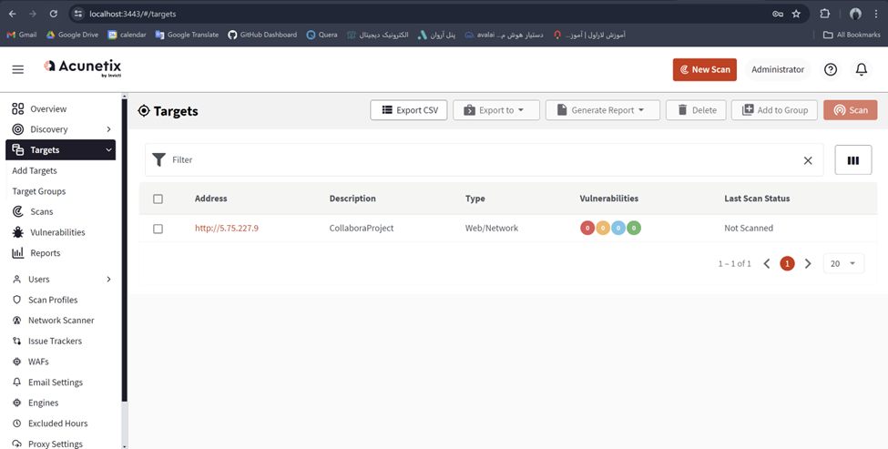

سپس در لیست تارگت ها بر روی URL پروژه کلیک میکنیم تا صفحه زیر باز شود که بتوانیم درخواست اسکن را صادر کنیم. در این بخش فرمی نمایش داده می شود که مربوط به سطح اسکن می باشد. تصویر زیر نمایش کاملی از این فرم می باشد.

## Business Critically

در بخش Business Critically، سطح اسکن قابل مشاهده است که دارای چهار سطح Low و Normal و High و Critical می باشد که هر سطح، حجم ریکوئست و اهمیت اسکن را مشخص می نماید. برای پروژه از سطح High استفاده می کنیم که در تصویر زیر مشخص است.

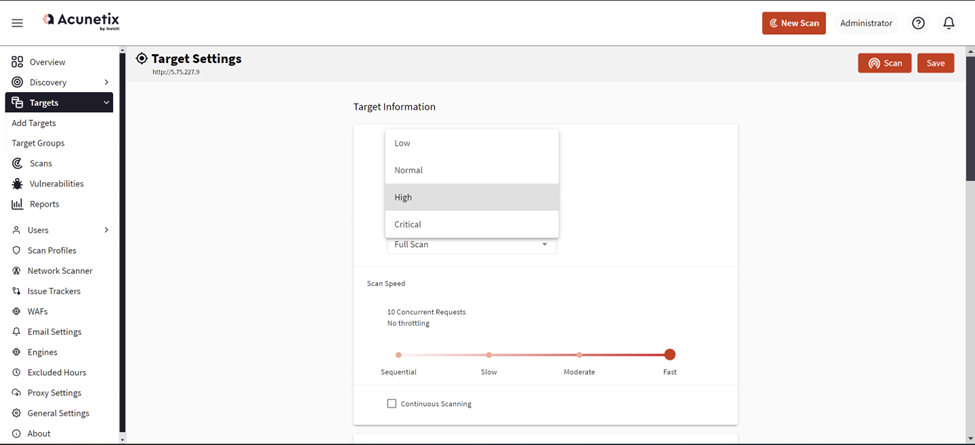

## Default Scan Profile

در بخش Default Scan Profile می توانیم نوع ریسک های وارده بر پروژه در مراحل اسکن را مشخص کنیم که دارای پنج حالت Full Scan، High Risk، High/Medium Risk، Cross-site Scripting و SQL-Injection می باشد و برای پروژه جاری از حالت Full Scan استفاده می نماییم تا همه حالات را بررسی نماید.

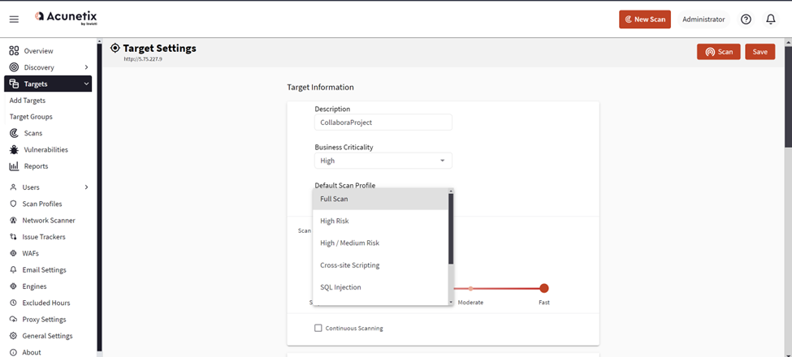

همچنین حالت Continuous Scanning را فعال میکنیم تا اسکن متوقف نشود. در تصویر زیر تنظیمات نهایی مشخص است.

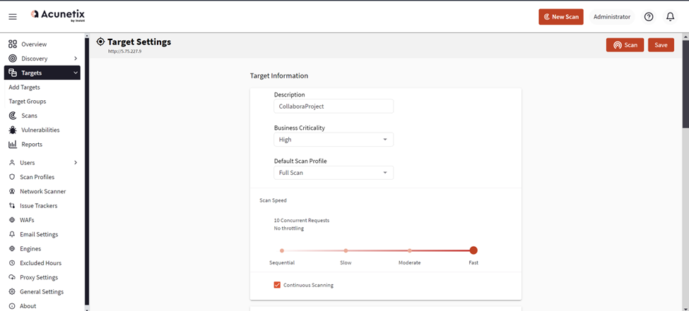

همچنین برای اینکه لاگین انجام شود، فایل LSR را از طریق Acunetix login sequence editor تولید میکنیم و در بخش زیر قرار میدهیم.

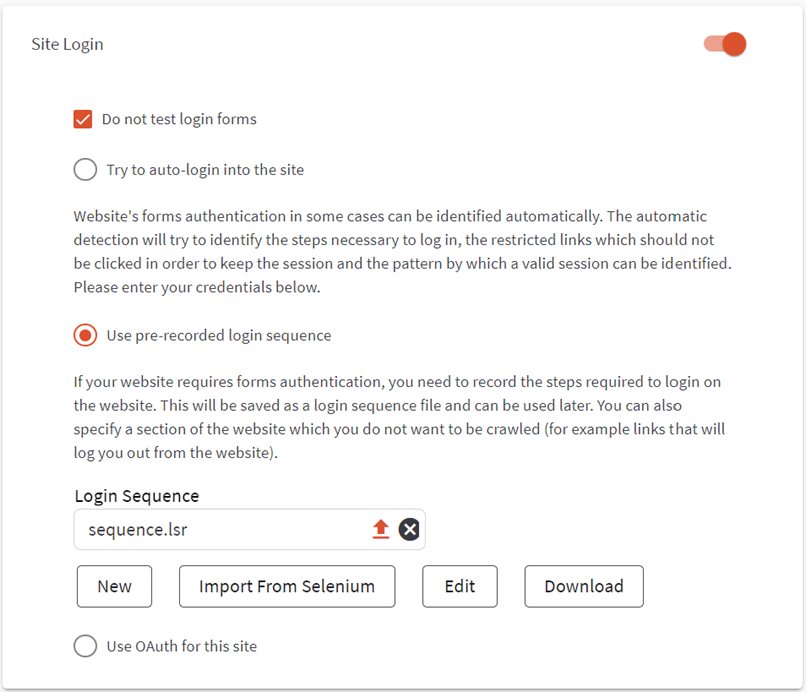

پس از تکمیل مراحل قبلی، بر روی گزینه Scan کلیک میکنیم که یک اسکن جدیدی را آغاز کنیم. در اینجا مواردی که قبلا تنظیم کرده بودیم نمایش داده می شود.

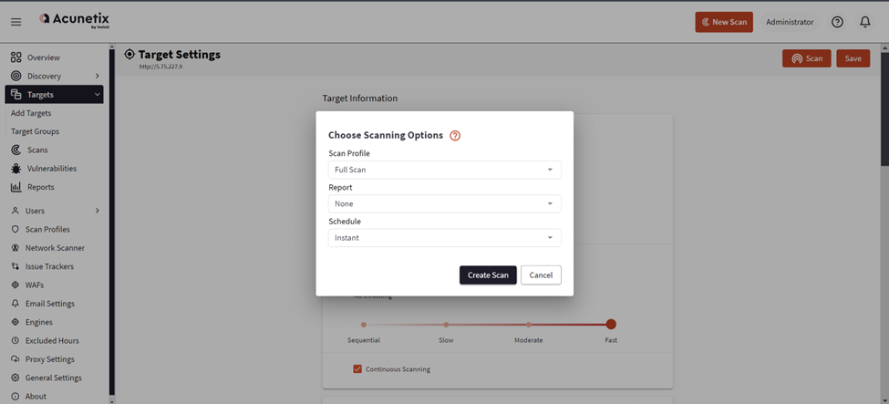

در صورتی که مراحل قبلی را به درستی انجام داده باشیم و همچنین License نرم افزار به درستی اعمال شده باشد، صفحه زیر باز شده و در بخش Activity عبارت In Progress نمایش داده می شود. توجه کنید در صورت مشکل در License اسکن پس از چند ثانیه Failed می شود و در بخش Events می توان error 70 را مشاهده کرد. پس از باز شدن صفحه زیر عملیات اسکن شروع می شود که در بخش های بعدی، هر قسمت از این صفحه را توضیح می دهیم.

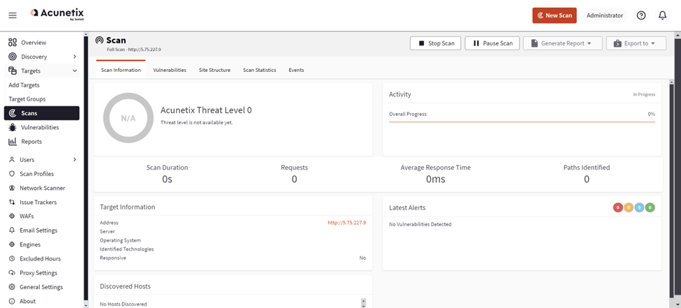

تصویر زیر نمایشی از وضعیت اسکن در حال اجرا می باشد:

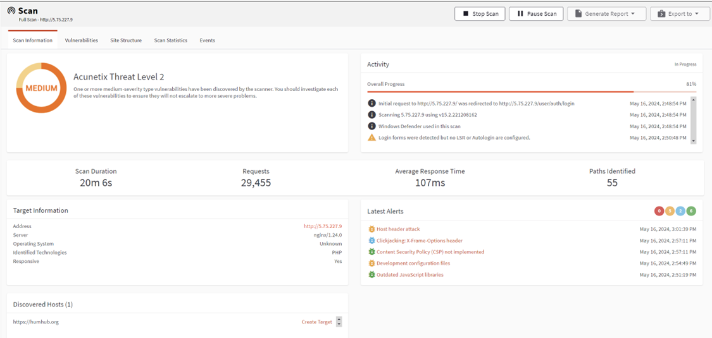

در بخش Activity می توانیم نحوه پیشرفت اسکن را مشاهده کنیم. مقدار پیشرفت اسکن در بخش overall Process نمایش داده شده است همچنین برخی از اتفاقات مراحل اسکن نیز در لیست قابل مشاهده است. بعنوان مثال در بخش اول نمایش داده شده است که درخواستی به [لینک](http://5.75.227.9) فرستاده شده است که آن درخواست به [صفحه](http://collabra.yaramsn.lol/user/auth/login ) هدایت شده است.

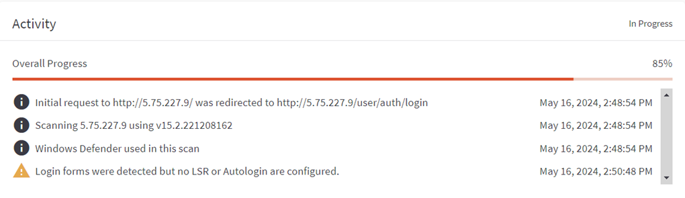

در بخش زیر جزئیاتی از مراحل اسکن نمایش داده می شود. مدت زمان جریان اسکن، تعداد ریکوئست های وارد شده بر پروژه و همچنین میانگین زمان پاسخ و تعداد مسیرهای شناسایی شده مشخص شده اند.

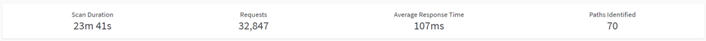

## Target Information

در بخش Target Information، اطلاعاتی راجب سایتی که اسکن بر روی آن اعمال شده نمایش داده می شود. در اولین بخش Address آن، در دومین بخش Server که در این پروژه nginx/1.24.0 و در بخش سومین operating system فعال، در بخش چهارم Identified Technologies که تکنولوژی مورد توسعه پروژه (در این پروژه PHP) و در بخش پنجم Responsive بودن سایت نمایش داده شده است.

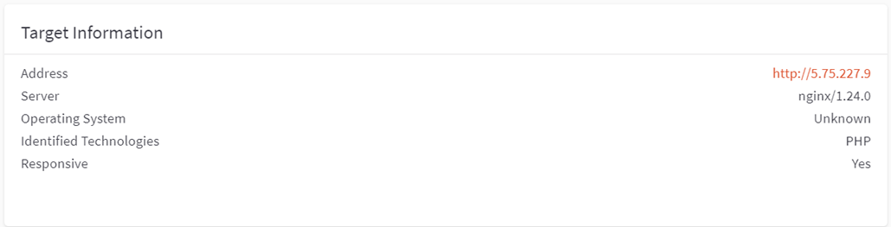

## Latest Alert

در بخش Latest Alert مشکلات امنیتی حاصل از اسکن نمایش داده می شود که در بخش های بعدی بطور کامل آنها را تحلیل و بررسی می کنیم.

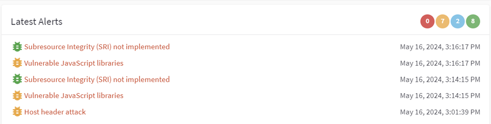

## Discovered Hosts

در قسمت Discovered Hosts هم، هاست هایی که از طریق پروژه به آنها درخواست یا ریدایرکتی اعمال شده است مشخص شده اند.

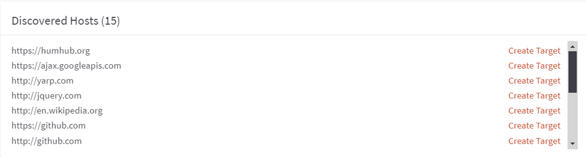

پس از پایان اسکن در بخش Activity عبارت In progress تبدیل به Failed می شود اما اسکن بطور کامل انجام شده است.

برای تولید فایل LSR که مربوط به لاگین کردن اتوماتیک در بخش اسکن می باشد، به Acuentix Login sequence record میرویم.

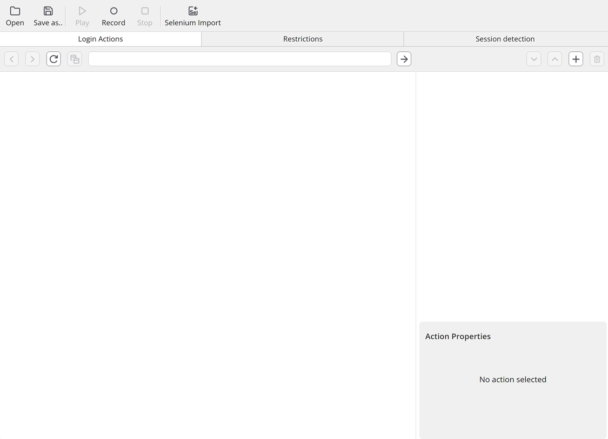

پس از اینکه وارد برنامه Login Sequence Recorder شدیم، دکمه ریکورد را فعال میکنیم و سپس URL سایت را جستجو میکنیم، اطلاعات کاربری را وارد میکنیم و وارد سایت میشویم سپس ریکورد را متوقف میکنیم و از طریق بخش Save as فایل LSR را دریافت می نماییم.

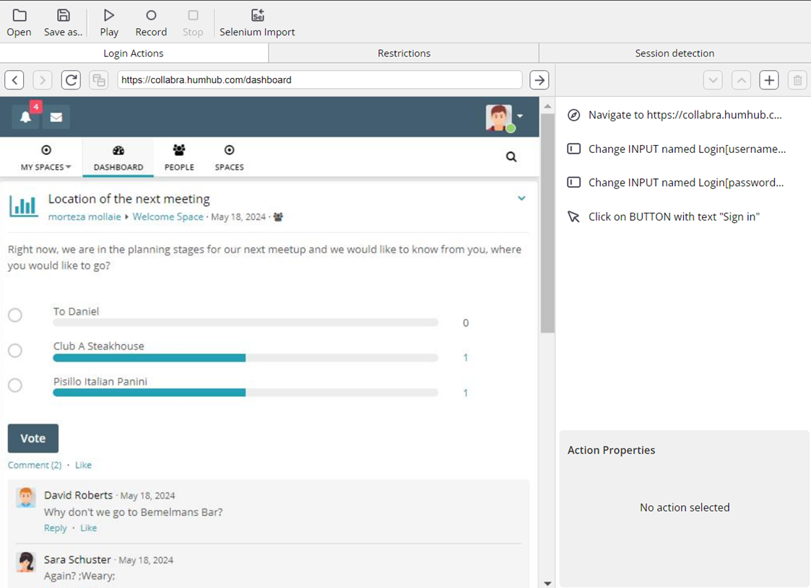

برای اینکه مطمئن شویم تمام نتایج حاصل بر اساس تست های امنیتی بوده، نیاز است تا در مرحله کانفینگ اسکن، تیک Acusensor را فعال نماییم.

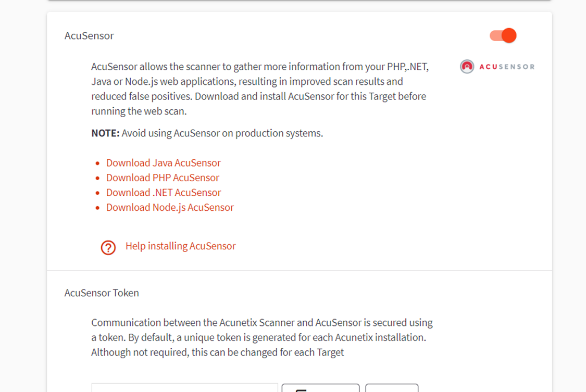

## خروجی ها و بررسی مشکلات امنیتی

پس از اتمام اسکن، میتوانیم بخش های مختلف را تحلیل کنیم:

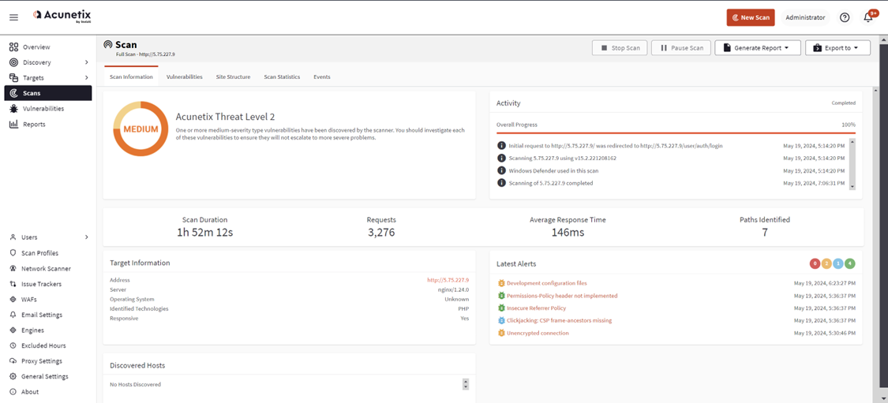

در بخش vulnerabilities می توانیم تهدیدات شناسایی شده را مشاهده کنیم که دارای سطوح critical، Medium، Low و informational هستند که در ادامه آن ها را تحلیل می کنیم.

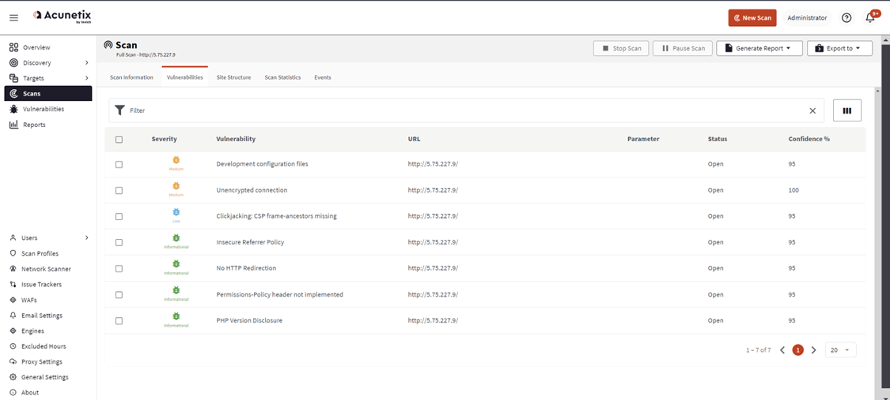

## Development configuration files:

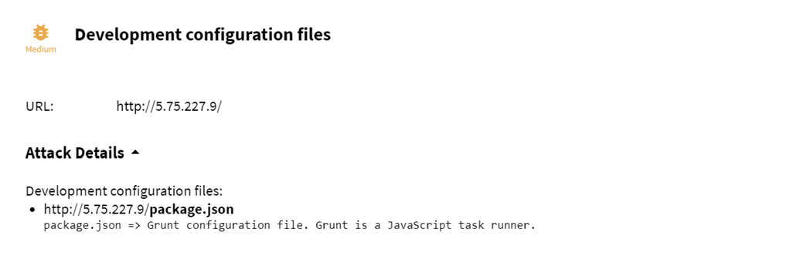

<ul>
<li>
<strong>
سطح تهدید:
</strong>
 متوسط
</li>
<li>
<strong>
توضیحات تهدید:
</strong>
 یک یا چند فایل پیکربندی (به عنوان مثال Vagrantfile، Gemfile، Rakefile، ...) پیدا شد. این فایل‌ها ممکن است اطلاعات حساسی را افشا کنند که می‌تواند به کاربر مخرب کمک کند تا حملات پیشرفته‌تری را آماده کند. توصیه می شود دسترسی به این نوع فایل ها را از سیستم های تولید حذف یا محدود کنید.
</li>
<li>
<strong>
تاثیر آسیب پذیری:
</strong>
 این فایل ها ممکن است اطلاعات حساسی را فاش کنند. از این اطلاعات می توان برای انجام حملات بیشتر استفاده کرد.
</li>
<li>
<strong>
روش حل مشکل:
</strong>
 دسترسی به تمام فایل های پیکربندی قابل دسترسی از اینترنت را حذف یا محدود کنید.
</li>
</ul>

## Unencrypted connection

<ul>
<li>
<strong>
سطح تهدید:
</strong>
  متوسط
</li>
<li>
<strong>
توضیحات تهدید:
</strong>
 این هدف اسکن از طریق یک اتصال رمزگذاری نشده متصل شد. یک مهاجم بالقوه می تواند داده های ارسالی و دریافتی از این سایت را رهگیری و اصلاح کند.
</li>
<li>
<strong>
تاثیر آسیب پذیری:
</strong>
 در برخی شرایط، می توان از آن برای حمله مرد میانی (MiTM - Man In The Middle Attack) استفاده کرد.
</li>
<li>
<strong>
روش حل:
</strong>
 سایت باید داده ها را از طریق اتصال ایمن (HTTPS) ارسال و دریافت کند و برای این کار باید SSL تنظیم شود.
</li>
</ul>

## No HTTP Redirection

<ul>
<li>
<strong>
سطح تهدید:
</strong>
 صرفا جهت اطلاع
</li>
<li>
<strong>
توضیح تهدید:
</strong>
 مشخص شد که برنامه وب شما از پروتکل HTTP استفاده می کند، اما به طور خودکار کاربران را به HTTPS هدایت نمی کند.
در واقع به نوعی زیر مجموعه مشکل Unencrypted connection است.
</li>
<li>
<strong>
روش حل:
</strong>
 توصیه می شود بهترین شیوه های تغییر مسیر HTTP را در برنامه وب خود پیاده سازی کنید. برای اطلاعات بیشتر به مراجع وب مراجعه کنید.
</li>
</ul>

## Clickjacking: CSP frame-ancestors missing

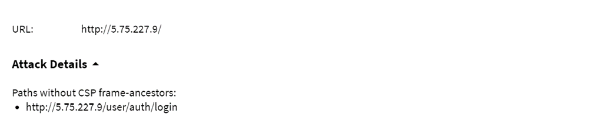

<ul>
<li>
<strong>
سطح تهدید:
</strong>
 پایین
</li>
<li>
<strong>
توضیح تهدید:
</strong>
 Clickjack (اسم های‌دیگر: حمله User Interface Redress ، حمله UI  Redress ،UI redressing) یک تکنیک مخرب فریب کاربر وب برای کلیک کردن بر روی چیزی متفاوت از آنچه کاربر تصور می کند روی آن کلیک می کند، بنابراین به طور بالقوه اطلاعات محرمانه را فاش می کند یا کنترل رایانه خود را در حین به دست گرفتن کنترل می کند. کلیک کردن بر روی صفحات وب به ظاهر بی ضرر
</li>
<li>
<strong>
توضیح تهدید (ادامه):
</strong>
 سرور دستور اجداد قاب را در سربرگ Content-Security-Policy برنگردانده است که به این معنی است که این وب سایت ممکن است در معرض خطر حمله کلیک جک قرار گیرد. دستورالعمل‌های Ancestor frame را می‌توان برای نشان دادن اینکه آیا یک مرورگر باید اجازه داشته باشد یک صفحه را در یک قاب ارائه دهد یا خیر، استفاده شود. سایت‌ها می توانند با اطمینان از اینکه محتوای آنها در سایت های دیگر تعبیه نشده است، از این برای جلوگیری از حملات کلیک جک استفاده کنند.
</li>
<li>
<strong>
تاثیر آسیب پذیری:
</strong>
 تأثیر بستگی به برنامه وب تحت تأثیر دارد.
</li>
<li>
<strong>
روش حل مشکل:
</strong>
 وب سرور خود را طوری پیکربندی کنید که یک هدرCSP‌با دستورالعمل Ancestor frame و یک هدر X-Frame-Options داشته باشد. برای اطلاعات بیشتر در مورد مقادیر احتمالی این هدر به مراجع وب مراجعه کنید.
</li>
</ul>

## Insecure Referrer Policy

<ul>
<li>
<strong>
سطح تهدید:
</strong>
 صرفا جهت اطلاع
</li>
<li>
<strong>
توضیح تهدید:
</strong>
 Referrer Policy رفتار هدر Referrer را کنترل می کند، که نشان دهنده مبدا یا URL صفحه وب است که درخواست از آن انجام شده است. برنامه وب از پیکربندی خط‌‌مشی ارجاع ناامن استفاده می‌کند که ممکن است اطلاعات کاربر را به سایت‌های شخص ثالث درز کند.
</li>
<li>
<strong>
تاثیر آسیب پذیری:
</strong>
 در برخی شرایط، مهاجم ممکن است اطلاعات خصوصی کاربر را افشا کند.
</li>
<li>
<strong>
روش حل مشکل:
</strong>
 هدر Referrer-Policy را روی «strict-origin-when-cross-origin» یا یک مقدار سخت‌گیرانه‌تر در نظر بگیرید.
</li>
</ul>

## Permissions-Policy header not implemented

<ul>
<li>
<strong>
سطح تهدید:
</strong>
 صرفا جهت اطلاع 
</li>
<li>
<strong>
توضیح تهدید:
</strong>
 هدر Permissions-Policy یکی از هدرهای امنیتی است که به وب سایت ها اجازه می دهد محدودیت هایی را برای استفاده از ویژگی ها و API های خاص توسط صفحات وب اعمال کنند .
</li>
<li>
<strong>
روش آسیب پذیری:
</strong>
</li>
</ul>
<ul>
<li>
سوء استفاده از ویژگی های مرورگر: عدم محدودیت در دسترسی به ویژگی هایی مانند دوربین، میکروفون، ژئولوکیشن و ... می تواند به سوء استفاده های احتمالی منجر شود. مهاجمان می توانند از این ویژگی ها برای جمع آوری اطلاعات حساس استفاده کنند.
</li>
<li>
کاهش حریم خصوصی کاربران:
بدون این هدر ، سایت ها ممکن است بدون اطلاع کاربر به داده های حریم خصوصی دسترسی پیدا کنند ، این می تواند به نقض حریم خصوصی کاربران منجر شود.
</li>
</ul>
<ul>
<li>
<strong>
روش حل:
</strong>
ابتدا باید ویژگی ها و API های مورد نیاز را مشخص کنیم و سپس با افزودن هدر Permission Policy در سرور مربوطه ، دسترسی به آنها را محدود کنیم.
</li>
</ul>

## PHP Version Disclosure

<ul>
<li>
<strong>
سطح تهدید:
</strong>
 صرفا جهت اطلاع
</li>
<li>
<strong>
توضیح تهدید:
</strong>
 سرور وب در حال ارسال هدرهای پاسخ X-Powered-By: است که نسخه PHP را آشکار می کند.
</li>
<li>
<strong>
تاثیر آسیب پذیری:
</strong>
 یک مهاجم ممکن است از اطلاعات افشا شده برای جمع آوری آسیب پذیری های امنیتی خاص برای نسخه شناسایی شده استفاده کند.
</li>
<li>
<strong>
روش حل:
</strong>
 وب سرور خود را برای جلوگیری از نشت اطلاعات از پاسخ HTTP خود پیکربندی کنید.
</li>
</ul>

## vulnerable javaScript libraries

<ul>
<li>
<strong>
سطح تهدید:
</strong>
 صرفا جهت اطلاع
</li>
<li>
<strong>
توضیح تهدید:
</strong>
 برخی از کتابخانه های جاوااسکریپتی مورد استفاده در پروژه دارای ورژن قدیمی هستند و ورژن جدیدتری از کتابخانه ها هم اکنون وجود دارد.
</li>
<li>
<strong>
تاثیر آسیب پذیری:
</strong>
 یک مهاجم ممکن است با استفاده از خلاء ها و مسیرهای نفوذ موجود در نسخه های قدیمی این کتابخانه ها جهت آسیب استفاده نماید.
</li>
<li>
<strong>
روش حل:
</strong>
 با استفاده از package manager های جاوااسکریپت یا با تغییر سورس پروژه، ورژن این کتابخانه ها (همچون jQuery) را اپدیت کنیم و از جدیدترین نسخه استفاده نماییم.
</li>
</ul>

## scan statics

در بخش scan statics میتوانیم جزئیات Operations و Locations را مشاهده کنیم.

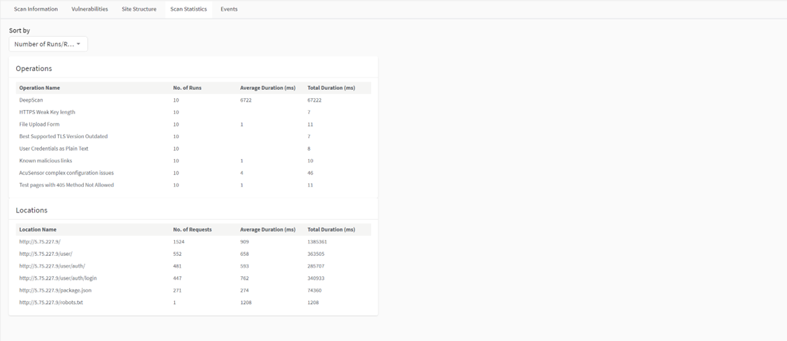

## گزارشات

همچنین برخی گزارش هایی که از طریق acunetix دریافت شده که شامل توضیحات مطرح می باشد در ادامه نمایش داده شده است که از بخش reports قابل دریافت است. 

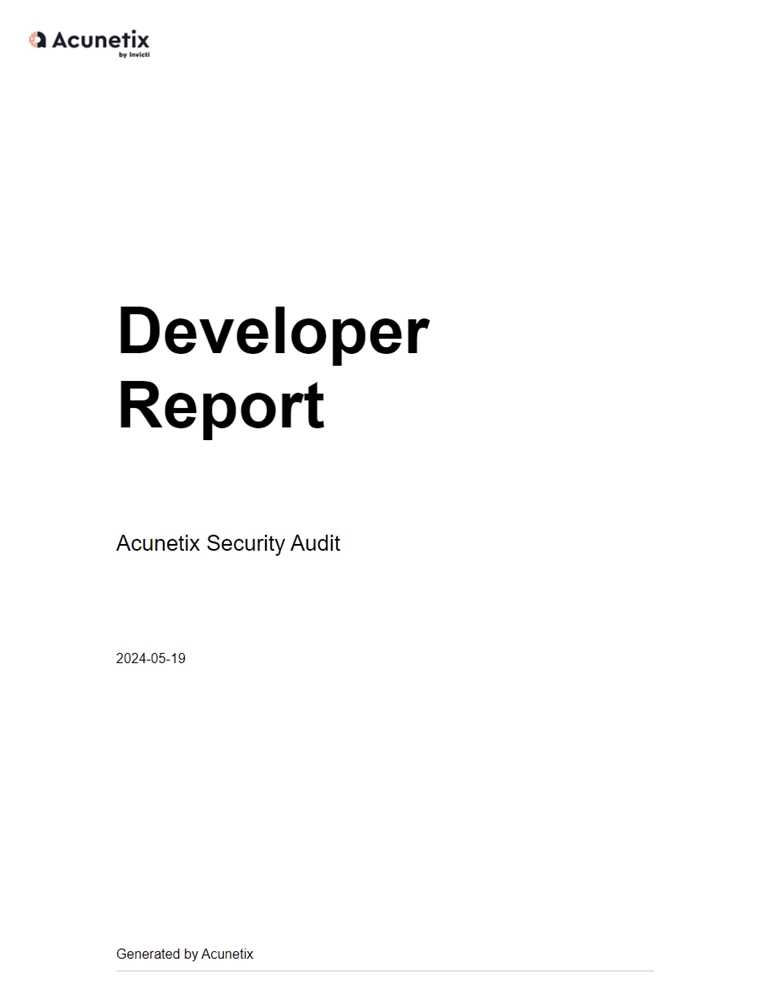

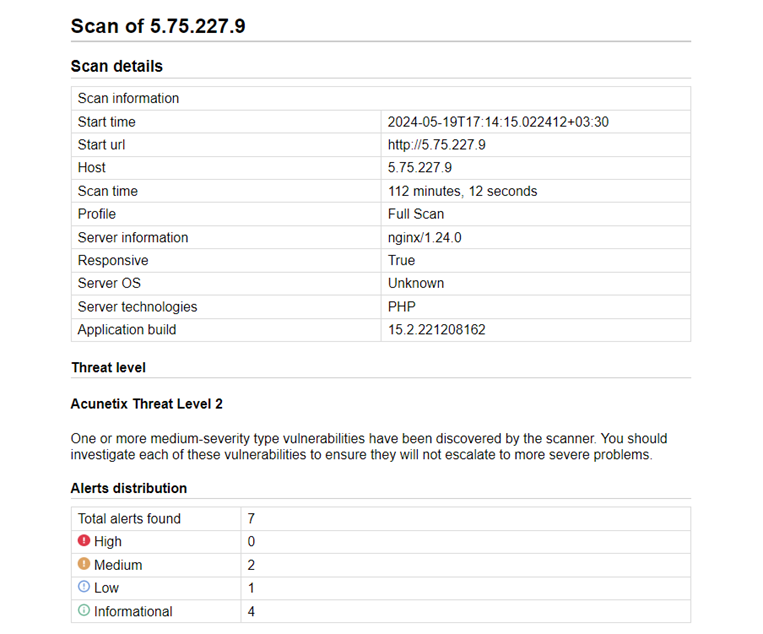

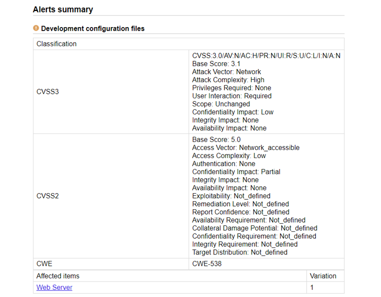

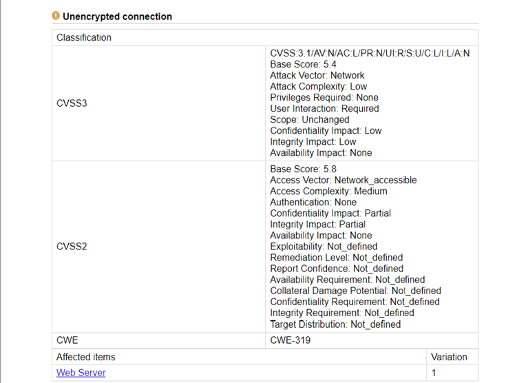

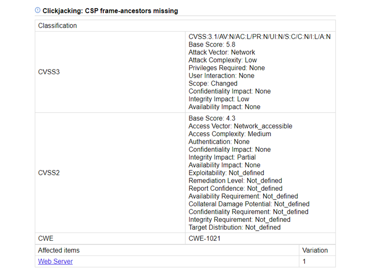

همچنین با توجه به وجود نسخه دمو از هام هاب در  این [لینک](https://collabra.yaramsn.lol/en/create)، یک نسخه دمو نیز در این وبسایت ایجاد کردیم و یک تست امنیتی نیز از آن گرفتیم و نتایج را در زیر مشاهده می کنیم.

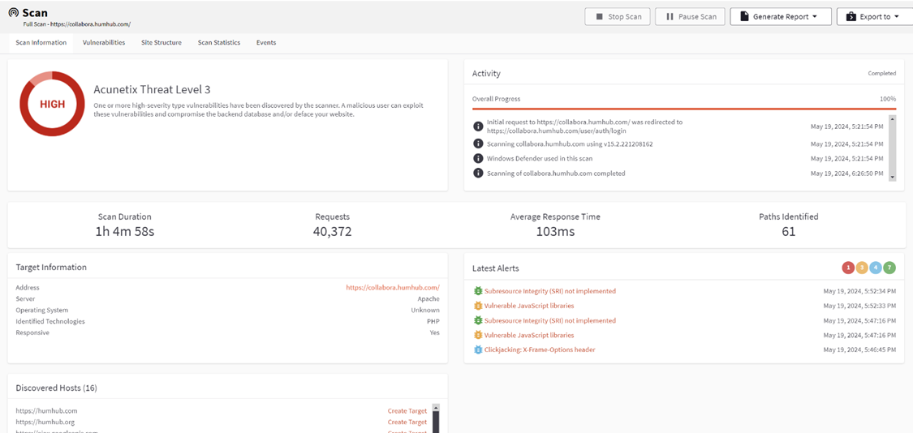

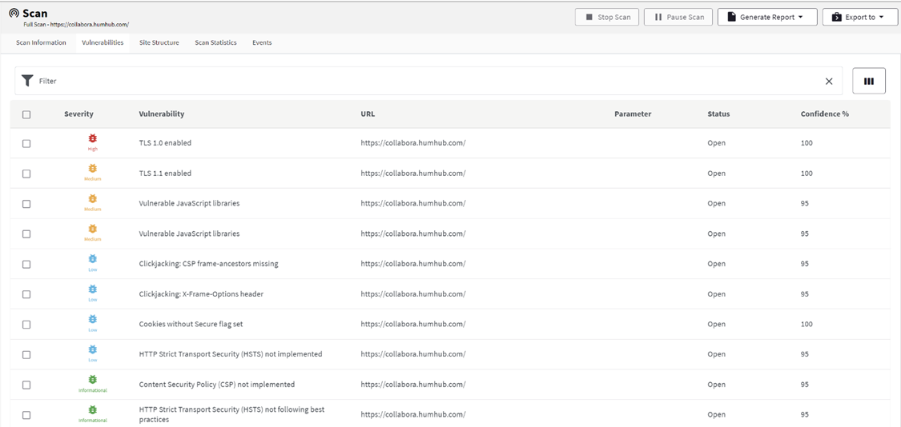

## نتایج

این تست حدود یک ساعت و چهار دقیقه به طول انجامید که 40372 درخواست روی سایت وارد شد و با میانگین زمانی 103 میلی ثانیه به آنها پاسخ داده شد. در این تست یک مشکل امنیتی از سطح High هم یافت شد که مربوط به نسخه پایین TLS موجود بوده است که توضیحات آن در تصویر زیر مشخص می باشد.

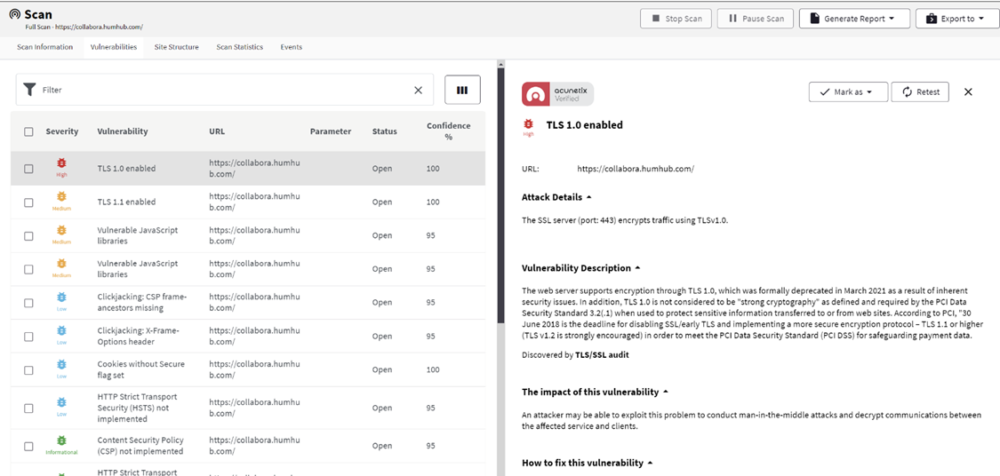

