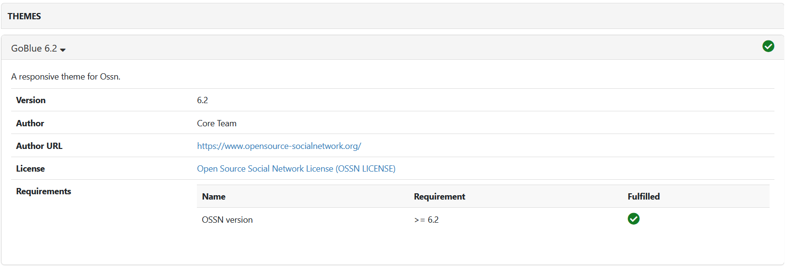
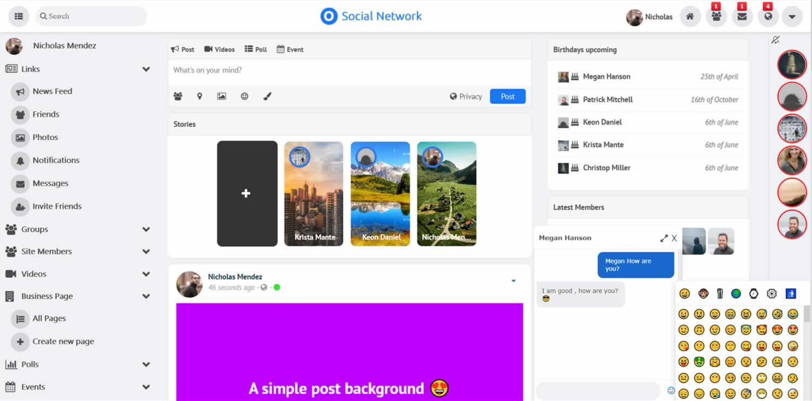
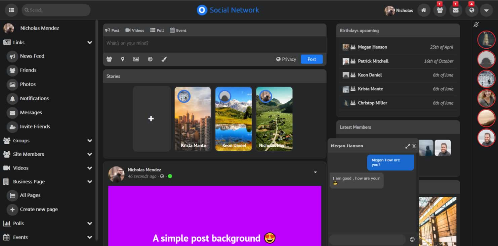
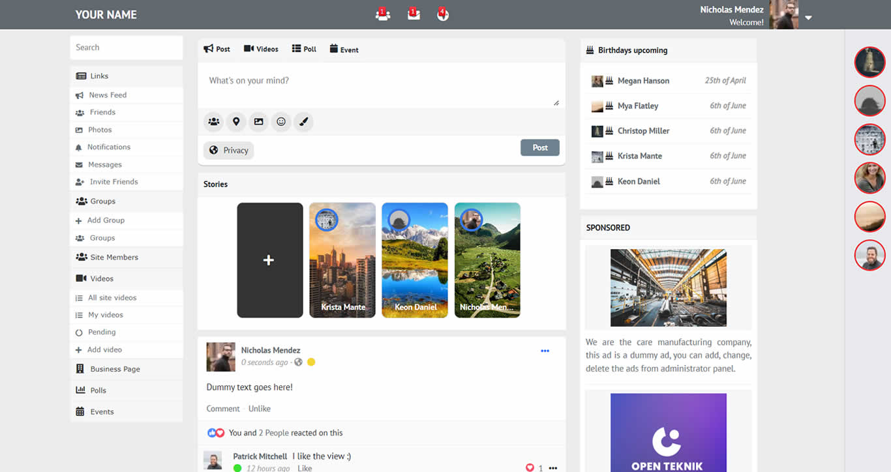
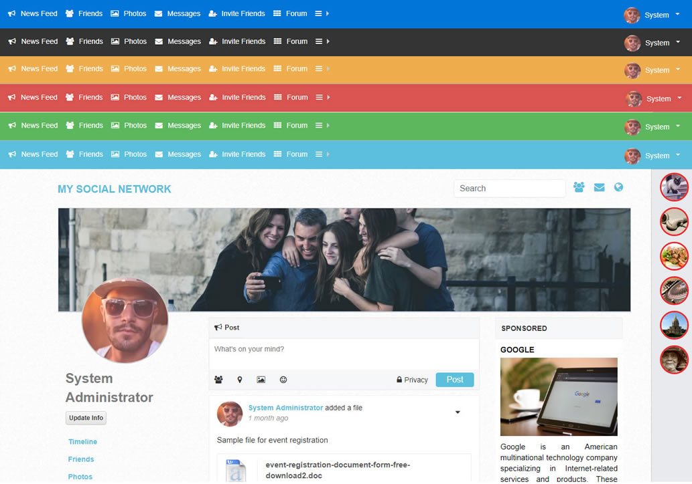
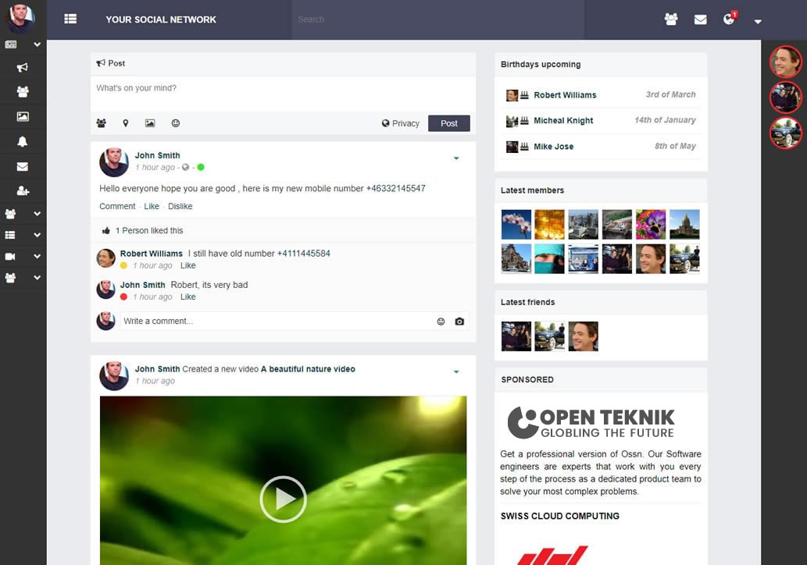

# مقایسه سه شبکه اجتماعی OSSN ، Elgg و Humhub
## بررسی نقاط ضعف و قوت OSSN

<h3>
نقاط ضعف: (نسخه رایگان)
</h3>

<ul>
<li>
<strong>
رابط کاربری:
</strong>
 داشتن یک رابط کاربری مطلوب یکی از ویژگی های مورد نیاز برای یک شبکه اجتماعی است که متاسفانه OSSN رابط کاربری به نسبت قدیمی دارد که میتواند نخستین نقطه ضعف این شبکه باشد.
</li>

<li>
<strong>
فید:
</strong>
 در قسمت فید، کاربر توانایی گذاشتن صوت و ویدیو را ندارد. حریم خصوصی پست دارای تنها دو سطح Public و Friends است. کامنت ها قابلیت پاسخ دادن ندارند که میتواند یک عیب محسوب شود.
</li>

<li>
<strong>
گروه:
</strong>
 در گروه، بخشی برای انجمن وجود ندارد که یکی از بخش های مورد نیاز و کلیدی پروژه می باشد که باعث میشود گروه مبحث دار نداشته باشیم . از آنجایی که در کل قابلیت خاصی ندارد امکانات مورد نیاز پروژه را برای این بخش فراهم نمی سازد.
</li>

<li>
<strong>
داشتن آلبوم:
</strong>
 بخش Photo در این شبکه اجتماعی به گونه ای طراحی شده که این شبکه اجتماعی را خانوادگی محور سازد که برای یک پروژه کاری مناسب نیست.
</li>

<li>
<strong>
رایگان نبودن نسخه برتر:
</strong>
 نسخه دارای امکانات بیشتر این شبکه اجتماعی پولی می باشد که تفاوت آنچنانی با نسخه رایگان آن ندارد و بازهم نیاز های پروژه را به طور کامل پوشش داده نمی شود.
</li>

<li>
<strong>
محدود بودن تعداد پوسته و کامپوننت ها:
</strong>
 با اینکه دارای پوسته و کامپوننت است اما فروشگاه آن در صفحه اصلی وبسایت آن قرار دارد که تنوع آنچنانی نیز ندارد.
</li>

<li>
<strong>
عدم توانی در نقش دهی به کاربر:
</strong>
 توانایی دادن نقش های مختلف به کاربر های مختلف وجود ندارد که باعث کاهش کارایی این شبکه اجتماعی می شود.
</li>

<li>
<strong>
عملکرد ضعیف در برابر تغییر:
</strong>
 در آزمایش ما با تغییر تم، عملکرد سایت بلکل دچار اختلال شد و منو Navbar آن دیگر کار نکرد که این به خودی خود می تواند یکی از دلایل انتخاب نشد این شبکه ی اجتماعی باشد.
</li>

<li>
<strong>
عدم پشتیبانی از زبان فارسی:
</strong>
 این شبکه اجتماعی زبان فارسی را  پشتیبانی نمی کند که این نیز یکی از نقاط ضعفی است که این شبکه را برای انتخاب رد صلاحیت می‌کند.
</li>
</ul>

<h3>
نقاط قوت:
</h3>

<ul>
<li>
<strong>
قابلیت tag:
</strong>
 در قسمت Feed قابیلت tag دوستان دارد که مزیت محسوب می شود همچنین کامنت‌ها دارای چند نوع بازخورد هستند.
</li>

<li>
<strong>
بنر:
</strong>
 می توان برای گروه‌ها و افراد بنر گذاشت.
</li>

<li>
<strong>
لوگو:
</strong>
 میتوان لوگو سایت را عوض کرد که به نوعی می تواند یک مزیت باشد.
</li>

<li>
<strong>
مسدود سازی:
</strong>
 قابلیت block دارد اما از آنجایی که تنها یک لیست نشان می دهد آنچنان کاربردی نیست.
</li>
</ul>

**نکته مهم**: قابل ذکر است که برای تصاویر مستقر شده این سه شبکه اجتماعی از تصاویر شبکه هایی که خودمان مستقر کردیم استفاده نشده است، بلکه برای نشان دادن بهتر تفاوت ها و قابلیت های این سه شبکه اجتماعی از تصاویری که قبلا توسط افراد دیگر مستقر شده، استفاده کرده ایم.

## تصاویری از OSSN مستقر شده

### رابط کاربری

همان طور که مشاهده می شود، رابط کاربری OSSN کاربرپسند نیست و بسیار قدیمی است. 

قابل ذکر است که این عکس از نسخه Premium OSSN می باشد و دارای Story نیز می باشد اما نسخه رایگان آن از این امکانات بهره نمی‌برد.

### فید

امکان اشتراک گذاری صوت و ویدیو در این بخش وجود ندارد اما برای اشتراک گذاری عکس و لوکیشن مشکلی وجود ندارد.
امکان تگ دوستان نیز وجود دارد.

	

حریم خصوصی پست دارای دو حالت Public و Friends است.

### آلبوم

قابلیت گذاشتن یک آلبوم عکس مشاهده می شود که امکان اضافه کردن عکس و حذف آلبوم وجود دارد.

اضافه کردن عکس به این شکل صورت می گیرد.

حریم خصوصی این آلبوم نیز دارای دو حالت Public و Friends است.

### اطلاعیه ها

در این بخش اطلاعیه هایی از رخداد های اخیر نمایش داده می شود که با کلیک بر روی هر کدام از اطلاعیه های وارد جزئیات بیشتر می شویم.

### ارسال پیام

نمونه ای از ارسال پیام و پبام های دریافتی مشاهده می‌شود.

### گروه 

در قسمت گروه قابلیت مشاهده اعضا و درخواست‌ها وجود دارد اما بخشی برای انجمن دیده نمی شود.

### مدیریت 

#### نمای کلی داشبرد مدیریت

داشبورد مدیریت در حالت کلی نمایی از اطلاعات را به مدیر می دهد که می تواند برای مثال شامل مقدار فعالیت کاربران، تعداد کابران، ورژن OSSN و ... باشد.

#### لیست کاربران

لیست کاربران به همراه برخی از اطلاعات آنان برای مدیر قابل مشاهده است.

#### اضافه کردن کاربر

مدیر قابلیت اضافه کردن کاربر جدید و اطلاعاتش را دارد.

#### اعطا نقش

برای اعطا نقش به کاربر فقط دو نقش کاربر معمولی و مدیر وجود دارد.

#### تنظیمات سایت

در این بخش میتوان تنظیمات مورد نیاز را انجام داد.

#### پوسته

قابلیت نصب پوسته های محتلف وجود دارد.

#### کامپوننت

مدیر میتواند کامپوننت مورد نیاز را نصب کند.

قابلیت استفاده از کامپوننت ها مشاهده می شود که امکان فعال سازی و غیر فعال سازی آن ها برای مدیر وجود دارد.

### نسخه Premium

نسخه Premium آن نیز وجود دارد که دارای امکانات بیشتر نسبت به این نسخه است و برای تهیه آن می‌توان اقدام کرد.

برخی از امکانات نسخه Premium می‌توان به، هشتگ، قابلیت اشتراک‌ گذاری ویدیو، نظرسنجی و ... اشاره زد.

#### تصاویری از نسخه Premium

## بررسی نقاط ضعف و قوت Elgg<h3>
نقاط ضعف:
</h3>

<ul>
<li>
<strong>
رابط کاربری:
</strong>
 رابط کاربری آن برای منو دسکتاپی اش از دو طرف صفحه استفاده مناسب نکرده است و ui آن بیشتر برای موبایل و تبلت مناسب است.
</li>

<li>
<strong>
پشتیبانی از چندین زبان:
</strong>
 قابلیت چند زبانه بودن جزیی دارد و زبان فارسی را بصورت نسبی (حدود 43 درصد) پشتیبانی می کند.
</li>
</ul>

<h3>
نقاط قوت:
</h3>

<ul>
<li>
<strong>
مدیریت اعلان:
</strong>
 با استفاده از تنظیمات کاربر میتواند تصمیم بگیرد که اعلانات گروه ها و دیگر کاربر ها از طریق ایمیل برایش ارسال بشود و یا نه، که خود این ویژگی نیز قابلیت ارسال ایمیل با تاخیر دارد که با این قابلیت میتوان مشخص کرد که تمام اعلانات در یک زمان مشخص و باهم ارسال شوند. در کل مدیریت اعلان خوبی دارد.
</li>

<li>
<strong>
داشتن داده های آماری:
</strong>
 حساب آماری خوبی از وضعیت موجود دارد. می توان گفت که داده های مدیریتی بهتری نسبت به OSSN دارد، برای مثال بخشی برای نمایش تاریخچه ورود دارد که با تاریخ و زمان نشان می دهد که چه IP وارد شده است. همین طور آمار فعالیت های انجام شده توسط هر فرد را نیز میتوان در این بخش مشاهده کرد. آمار حساب در Elgg می تواند به ما در ردیابی و تجزیه و تحلیل تعامل کاربر، سطوح فعالیت و استفاده کلی از پلتفرم کمک کند. این آمار می‌تواند بینش‌های ارزشمندی در مورد اینکه کدام ویژگی‌ها محبوب‌تر هستند، نحوه تعامل کاربران با پلتفرم، و شناسایی مناطقی برای بهبود ارائه می‌کند. با نظارت بر آمار حساب‌ها، می‌توانیم تصمیمات مبتنی بر داده‌ها را برای بهینه‌سازی تجربه کاربر، افزایش تعامل کاربر و در نهایت بهبود موفقیت کلی جامعه Elgg خود اتخاذ کنیم.
</li>

<li>
<strong>
سفارشی سازی:
</strong>
 داشبورد آن Widget base است که توانایی شخصی سازی و جابه جایی آیتم ها را قراهم میکند.
</li>

<li>
<strong>
ماژولاریتی:
</strong>
 ماژولار بودن در شبکه Elgg به کاربران اجازه می دهد تا عملکرد پلتفرم شبکه اجتماعی خود را مطابق با نیازهای خاص خود سفارشی و گسترش دهند. این امر باعث افزایش انعطاف پذیری، بهبود عملکرد، تجربه کاربری پیشرفته و یکپارچه سازی آسان می شود.
</li>

<li>
<strong>
به روز رسانی آسان:
</strong>
 به روز رسانی این شبکه اجتماعی آسان است. Elgg دارای یک ابزار به روز رسانی داخلی است که به روز رسانی نرم افزار به آخرین نسخه را تنها با چند کلیک آسان می کند. همینطور Elgg مستندات جامعی در مورد نحوه به روز رسانی نرم افزار، از جمله دستورالعمل های گام به گام و نکات عیب یابی ارائه می دهد که به روز رسانی را ساده تر می کند.
</li>

<li>
<strong>
جداول آماری:
</strong>
 دارای جداول آماری مناسبی است که نشان دهنده bookmarks، users و blogs می باشد.
</li>

<li>
<strong>
افزونه ها:
</strong>
 تعداد افزونه خوبی دارد و هر افزونه صفحه تنظیمات خودش را دارد که این به کاربر توانایی ایجاد تغییر در افزونه را می دهد.
</li>

<li>
<strong>
برقراری ارتباط:
</strong>
 در Elgg، زمانی که کاربر بخواهد با کاربر دیگری در پلتفرم ارتباط برقرار کند، درخواست دوستی آغاز می شود. یکی از قابلیت های این شبکه اجتماعی friendship request است که خود این دوستی دارای دو حالت است. حالت اول: کاربر بعد از درخواست به دوستان شخص مورد نظر اضافه میشود. و در حالت دوم: کاربر پس از درخواست با تایید شخص مورد نظر به دوستان او اضافه می شود. اگر درخواست پذیرفته شود، این دو کاربر در پلتفرم با هم دوست خواهند شد و می‌توانند به‌روزرسانی‌ها، پست‌ها و فعالیت‌های یکدیگر را برجسته‌تر در فیدهای خود ببینند. هر دو کاربر همچنین می توانند در هر زمان درخواست دوستی را قبل از پذیرفته شدن لغو کنند تا از دوست شدن در پلت فرم جلوگیری کنند.
</li>

<li>
<strong>
مدیریت کاربر:
</strong>
 این شبکه اجتماعی دارای قابلیت مدیریتی کاربر خوبی است. می‌توان کاربر های آنلاین، ادمین و یا منع شده را ببیند. ادمین توانایی نقش دادن به کاربر ها را دارد اما فقط دو نقش کاربر و ادمین را دارد.
</li>

<li>
<strong>
ایجاد حساب کاربری:
</strong>
 مدیریت ایجاد حساب این شبکه اجتماعی خوب است. تایید شدن کاربر برای تکمیل ثبت نام وی باعث افزایش قدرت کنترل ادمین می شود. همین طور پس از ثبت نام تغییر نام کاربری باید توسط ادمین تایید شود تا کاربر بتواند آن را انجام دهد.
</li>

<li>
<strong>
سرعت:
</strong>
 امکانات خوبی برای افزایش سرعت cache دارد. Elgg دارای یک ویژگی به نام "Alternative Cache" است که به مدیران اجازه می دهد مکانیسم های مختلف کش را برای بهبود سرعت کش پیاده سازی کنند. این ویژگی به Elgg اجازه می دهد تا از راه حل های ذخیره سازی جایگزین مانند Memcached، Redis یا APCu برای سرعت بخشیدن به عملکرد حافظه پنهان استفاده کند. علاوه بر این، مدیران همچنین می‌توانند گزینه‌های کش را در تنظیمات Elgg پیکربندی کنند تا عملکرد حافظه پنهان را برای سرعت بهتر بهینه کنند.
</li>

<li>
<strong>
گزارش دهی فعالیت ها:
</strong>
 Elgg دارای قابلیت Activity log است که توانایی بررسی اقدامات انجام شده توسط هر شخص را به ادمین می دهد که برای یک سازمان شرکتی مفید است.
</li>

<li>
<strong>
قابلیت Tag:
</strong>
 این قابلیت باعث تسریع در پیدا کردن اطلاعات مورد نظر می شود.
</li>

<li>
<strong>
نشانه گذاری (Bookmark):
</strong>
 با استفاده از این قابلیت کاربر می‌تواند سایت های مورد نیاز را نشانه گذاری کند.
</li>

<li>
<strong>
پست وبلاگی:
</strong>
 با این قابلیت توانایی گذاشتن یک پست طولانی تر به کاربر داده می شود. پست وبلاگی دارای چهار بخش سر تیتر، عنوان، بدنه و خلاصه است. قابلیت پیش نویس نیز برای این پست موجود است. پست وبلاگی می تواند گاها نقش سند را نیز ایفا کند.
</li>
</ul>

## تصاویری از Elgg مستقر شده

### نمای کلی

رابط کاربری Elgg به صورت فوق می باشد.

### وبلاگ

در این بخش وبلاگ ها قابل مشاهده است.

### نشانه گذاری

قابلیت نشانه گذاری سایت های مورد نیاز در Elgg فراهم است.

### افزونه ها

قابلیت نصب افزونه های مختلف وجود دارد.

مشاهده می شود که Elgg دارای تعداد متعددی افزونه می باشد.

### گروه

### گفت و گو

### اطلاعیه ها

### پشتیبانی از زبان فارسی

همان طور که مشاهده می شود، پشتیبانی از زبان فارسی بسیار ناکامل است.

### داده آماری

قابلیت مشاهده تاریخ ورود کابران برای مدیر وجود دارد.

### سطح دسترسی

سطح دسترسی در Elgg دارای چهار سطح فوق است که مدیر میتواند یکی از سطوح را برای پست ها و پیام ها انتخاب کند.

## بررسی نقاط ضعف و قوت Humhub
<h3>
نقاط ضعف:
</h3>

<ul>
<li>
<strong>
عدم بر طرف سازی نیاز Topic:
</strong>
 نحوه پیاده سازی Topic ها به شکل دقیق منطبق دور نمای مورد انتظار برای فاز دوم پروژه نیست.
</li>

<li>
<strong>
افزایش زمان تنظیم اولیه:
</strong>
 Humhub پس از نصب اولیه لزوما تمام نیاز ها را بر طرف نمی سازد اما اگر زمانی برای تنظیم آن گذاشته شود، می‌تواند تا حد مطلوبی به سطح مورد نیاز ما برسد.
</li>
</ul>

<h3>
نقاط قوت:
</h3>

<ul>
<li>
<strong>
رابط کاربر پسند:
</strong>
 استفاده مناسبی از ستون سمت راست شده است و می توان گفت که نسبت به دو شبکه اجتماعی دیگر UX بهتری دارد. در کل UI مدرن تری نیز دارد.
</li>

<li>
<strong>
تنوع افزونه ها:
</strong>
 فروشگاه افزونه این شبکه اجتماعی قابلیت به روز رسانی همزمان دارد و از نظر تنوع افزونه ها  غنی است.
</li>

<li>
<strong>
اعطا نقش:
</strong>
 این شبکه اجتماعی قابلیت اعطای نقش در سطوح مختلف را پشتیبانی می کند.
</li>

<li>
<strong>
پشتیبانی از زبان فارسی:
</strong>
 نسبت به شبکه اجتماعی Elgg تنظیم زبان بهتری دارد. زبان فارسی را تا حد مطلوبی پشتیبانی می کند.
</li>

<li>
<strong>
انجمن:
</strong>
 بخش Space این شبکه اجتماعی خیلی نزدیک به ایده ی انجمن که یکی از نیاز های پروژه می باشد، است. Space توانایی خاموش و روشن کردن ویژگی های مختلف مانند داشتن  یا نداشن نظرسنجی را دارد.
</li>

<li>
<strong>
لینک شبکه اجتماعی:
</strong>
 یکی از قابلیت های Humhub توانایی لینک کردن دیگر شبکه های اجتماعی کاربر در پروفایلش است.
</li>

<li>
<strong>
تنوع افزونه بالا:
</strong>
 Humhub غنی از افزونه های کاربردی است که نیاز های پروژه را فراهم میکند.
</li>

<li>
<strong>
دسترسی:
</strong>
 دسترسی کاربر و ادمین قابل تغییر است اما برای هر ادمین به طور کامل نمی توان دسترسی های آن را تنظیم کرد.
</li>

<li>
<strong>
اشتراک گذاری چند رسانه ای:
</strong>
 علاوه بر قابلیت اشتراک گذاری متن و تصویر، اشتراک گذاری صوت را نیز پشتیبانی می کند.
</li>

<li>
<strong>
ایجاد گروه:
</strong>
 Humhub علاوه بر گروه قابلیت تشکیل سوپر گروه را نیز دارد که باعث می شود که نیاز پروژه را بهتر فراهم کند.
</li>

<li>
<strong>
نشانه گذاری:
</strong>
 Humhub نیز همانند Elgg قابلیت نشانه گذاری سایت های مورد نظر را دارد.
</li>

<li>
<strong>
نظرسنجی:
</strong>
 با استفاده از افزونه های Humhub امکان نظرسنجی نیز فراهم است.
</li>

<li>
<strong>
کنترل حریم خصوصی:
</strong>
 Humhub یک پلتفرم شبکه اجتماعی است که امنیت و حریم خصوصی کاربران خود را در اولویت قرار می دهد. این پلتفرم از پروتکل های رمزگذاری برای محافظت از داده ها و ارتباطات کاربر استفاده می کند. این به جلوگیری از دسترسی غیرمجاز به اطلاعات حساس کمک می کند.
</li>

<li>
<strong>
زمانبندی انتشار:
</strong>
 Humhub قابلیت زمانبندی انتشار پست ها را دارد.
</li>

<li>
<strong>
پرسش و پاسخ:
</strong>
 یکی از دیگر قابلیت های Humhub قابلیت پرسخ و پاسخ برای کابران است.
</li>

<li>
<strong>
امکانات صفحه مدیریت کاربر:
</strong>
 صفحه مدیریت کاربر UI خوبی دراد.
</li>

<li>
<strong>
سفارشی سازی:
</strong>
 به دلیل تنوع بالا در پوسته‌ها و افزونه‌ها، قابلیت سفارشی سازی در Humhub فراهم می سازد.
</li>
</ul>

## تصاویری از Humhub مستقر شده

### نمای کلی

### انجمن 

قابلیت Space به خوبی نیاز **انجمن** را فراهم می سازد.

تنظیمات برای این بخش به صورت فوق می باشد که می‌توان تغییرات مورد نیاز را با آن اعمال کرد.

### گفت و گو

### افراد

در این بخش افراد نمایش داده می شوند و می‌توانیم آن ها را دنبال کنیم.

### تنظیمات پروفایل

### اطلاعیه

در این بخش می‌توان مشخص کرد که با چه فاصله زمانی اطلاعات فعالیت های اخیر برایمان ایمیل شود.

همین طور می‌توان مشخص نمود که برای چه دسته از فعالیت ها و به چه صورتی اطلاعیه داده شود.

### پشتیبانی از زبان فارسی

همان طور که مشاهده می شود Humhub از زبان فارسی پشتیبانی میکند.

### TimeZone

در این بخش امکان تنظیم TimeZone فراهم است.

### پشتیبانی از Markdown

### مسدود سازی

همانطور که مشاهده می شود امکان مسدود کردن کاربران وجود دارد.

### حریم خصوصی

قابلیت انتخاب سطح دسترسی در بخش های مختلف وجود دارد.

### اشتراک چند رسانه ای

قابلیت اشتراک صوت و ویدیو نیز مشاهده میشود.

## جمع بندی سه شبکه اجتماعی OSSN ، Elgg و Humhub

<h3 align="right">OSSN</h3>

#### چیرگی نقاط ضعف به نقاط قوت:

 در کل با وجود نقاط قوتی که این شبکه اجتماعی دارد بازهم نقاط ضعف بارز تری دارد که باعث انتخاب نشدن آن شود. از جمله نقاط ضعف بسیار مهم آن به عملکرد ضعیف در برابر تغییرات و عدم پشتیبانی از زبان فارسی که یکی از نیاز های مهم پروژه می باشد، اشاره کرد. 

  
**نقاط ضعف:**
- عدم پشتیبانی از زبان فارسی
- کاربرپسند نبودن
- عدم وجود بخشی برای انجمن
- رایگان نبودن
- محدودیت تعداد پوسته ها و کامپوننت ها
- محدودیت در نقش دادن به کاربر

<h3 align="right">Elgg</h3>

#### اولویت داشتن کمیت به کفیت در رابطه با ویژگی ها:
با وجود اینکه OSSN دارای ویژگی های بسیار متنوعی، خصوصا در بخش مدیریتی است اما از نظر کیفتی نسبت به Humhub در سطح پایین تری قرار میگیرد.

**نقاط قوت:**
- مدیریت اعلان
- داده های آماری
- سفارشی سازی
- ماژولاریتی
- به روز رسانی آسان
- افزونه های متعدد
- سرعت
- نشانه گذاری
- منعطف در برابر تغییر
- پست وبلاگی

<h3 align="right">Humhub</h3>

#### توانایی رفع نیاز های پروژه:

 در کل Humhub در سطح بالا تری از کیفیت نسبت به دو پلتفرم دیگر قرار دارد و وجود فروشگاه افزونه های متنوع و قوی بیشتر نیاز های پروژه بر طرف می کند.

**نقاط قوت:**
- رابط کاربر پسند
- تنوع افزونه ها
- پشتیبانی از زبان فارسی
- انجمن
- فروشگاه افزونه
- حالت نگهداری
- لینک شبکه ی اجتماعی

جمع‌بندی در یک نما
----------------

<table align="center">
  <tr>
    <th>ویژگی / پلتفرم</th>
    <th>OSSN</th>
    <th>Elgg</th> 
    <th>Humhub</th>
  </tr>
  <tr>
    <td>رابط کاربر پسند</td>
    <td>5</td> 
    <td>6.5</td>
    <td>8</td>
  </tr>
  <tr>
    <td>کنترل های حریم خصوصی </td>
    <td>3</td> 
    <td>8</td>
    <td>9</td>
  </tr>
  <tr>
    <td>پشتیبانی از چندین زبان</td>
    <td>-</td> 
    <td>4</td>
    <td>9</td>
  </tr>
  <tr>
    <td>تنوع  اشتراک گذاری چند رسانه ای</td>
    <td>5</td> 
    <td>8</td>
    <td>9</td>
  </tr>
  <tr>
    <td>ایجاد گروه و رویداد</td>
    <td>6</td> 
    <td>8</td>
    <td>8</td>
  </tr>
  <tr>
    <td> به روز رسانی </td>
    <td>2</td> 
    <td>9</td>
    <td>9</td>
  </tr>
  <tr>
    <td> تنوع افزونه و پوسته </td>
    <td>7</td> 
    <td>8</td>
    <td>8</td>
  </tr>
  <tr>
    <td> نظرسنجی </td>
    <td>-</td> 
    <td>5</td>
    <td>8</td>
  </tr>
  <tr>
    <td> پرسش و پاسخ </td>
    <td>5</td> 
    <td>9</td>
    <td>7</td>
  </tr>
  <tr>
    <td> نشانه گذاری </td>
    <td>-</td> 
    <td>10</td>
    <td>9</td>
  </tr>
  <tr>
    <td> برقراری ارتباط </td>
    <td>7</td> 
    <td>6</td>
    <td>9</td>
  </tr>
  <tr>
    <td> سطوح دسترسی </td>
    <td>5</td> 
    <td>9</td>
    <td>8</td>
  </tr>
  <tr>
    <td> انجمن  </td>
    <td>5</td> 
    <td>6</td>
    <td>8</td>
  </tr>
  <tr>
    <td> اعطا نقش  </td>
    <td>7</td> 
    <td>10</td>
    <td>10</td>
  </tr>
  <tr>
    <td>  سفارشی سازی </td>
    <td>2</td> 
    <td>6</td>
    <td>10</td>
  </tr>
  <tr>
    <td> مدیریت کاربر </td>
    <td>6</td> 
    <td>10</td>
    <td>10</td>
  </tr>
  <tr>
    <td> سرعت بارگذاری </td>
    <td>7</td> 
    <td>8</td>
    <td>7</td>
  </tr>
</table>

