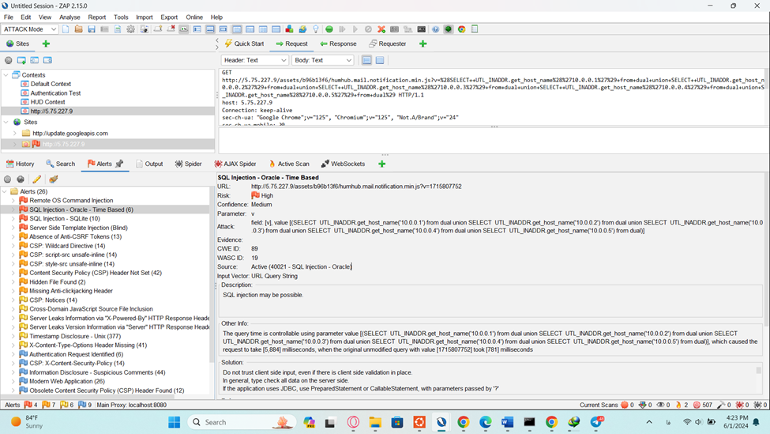

# بررسی امنیت شبکه هام‌هاب با کمک برنامه ZAP:

## OWASP Zed Attack Proxy (ZAP):

برنامه اسکن امنیتی  ZAP که مخفف Zed Attack Proxy است، یکی از ابزارهای پرکاربرد و قدرتمند در حوزه امنیت برنامه‌های وب است. این برنامه توسط (The Open Web Application Security Project) OWASP توسعه داده شده و به منظور شناسایی و تحلیل آسیب‌پذیری‌های امنیتی در برنامه‌های وب استفاده می‌شود. ZAP به کاربران امکان می‌دهد تا با استفاده از قابلیت‌های متعدد مانند اسکن خودکار، تست دستی و گزارش‌دهی دقیق، نقاط ضعف امنیتی را شناسایی و برطرف کنند. این ابزار به ویژه برای متخصصان امنیت، توسعه‌دهندگان و تست‌کنندگان نفوذ (Penetration tester) بسیار مفید است و به صورت منبع باز در دسترس است، که این امکان را به کاربران می‌دهد تا بر اساس نیازهای خود آن را سفارشی‌سازی کنند.
این برنامه رایگان است و برای نصب آن ضمنا نیاز است که بر روی سیستم جاوا نصب باشد.

## بررسی امنیتی:

پس از دانلود و نصب موفقیت‌آمیز، به بخش Manual رفته و قابلیت‌های سایت را به صورت دستی بررسی کردیم. این مرحله به ZAP اجازه می‌دهد تا با crawl دستی، لیستی از لینک‌ها، قابلیت‌ها و APIهای وبسایت را جمع‌آوری کند. این فرایند دستی اطمینان می‌دهد که قابلیت‌های کلیدی به دقت بررسی شوند.

پس از آماده‌سازی اولیه، مرحله بعدی شروع اسکن امنیتی اتوماتیک بود. با کلیک روی گزینه اسکن اتوماتیک، ZAP شروع به جمع‌آوری داده‌ها و شناسایی لینک‌های جدید کرد. این مرحله شامل استفاده از قابلیت spider برای کاوش در وبسایت و یافتن مسیرهای جدید است. ZAP دارای مجموعه‌ای جامع از اسکن‌های امنیتی است که نقاط ضعف و آسیب‌پذیری‌های بالقوه را شناسایی می‌کنند. این اسکن‌ها به صورت پویا با وبسایت تعامل دارند تا نقاط ضعف را پیدا کنند. برخی از اسکن‌های کلیدی را در تصویر زیر قابل مشاهده‌اند از:

پس از پایان اسکن برنامه لیستی از مشکلات امنیتی پیدا شده را در تب Alert نشان داد:

پس از پایان اسکن برنامه لیستی از مشکلات امنیتی پیدا شده را در تب Alert نشان داد:

طبق لیست، اسکن چهار مشکل امنیتی High، هفت مشکل Medium، شش مشکل Low پیدا کرد.

در ادامه به چیستی برخی از این مشکلات و بررسی صحت این مشکلات (بررسی False positives) میپردازیم.

## مشکلات دسته High:

### تزریق کامند سیستم‌عامل (Command injection)

در این مشکل، ورودی کاربر به درستی بررسی و پاکسازی نمی‌شود و در قسمت کامند OS قرار می‌گیرد. این امر باعث می‌شود که یک مهاجم بتواند با تزریق Payload خاص، کامندهای OS را بر روی سرورهای وب‌سایت اجرا کند. طبقZAP، محل آسیب‌پذیر به شرح زیر است:

[لینک](http://collabra.yaramsn.lol/dashboard/dashboard/activity-stream?StreamQuery%5Bfrom%5D=0&StreamQuery%5Blimit%5D=10%7Ctimeout+%2FT+1.0)

پیلود موردنظر "10|timeout /T 15" است، که در آن "10" برای قرارگیری صحیح کامند و عبارت timeout برای آزمایش عملکرد تزریق استفاده می‌شود. هدف از این کار، به تعویق انداختن پاسخ سرور است.

این نوع از Payloadها، تست‌های کور (Blind) نامیده می‌شوند، زیرا هدف آنها تنها به تعویق انداختن پاسخ سرور برای تشخیص محل تزریق است، بدون اینکه خروجی خاصی مدنظر باشد. ZAP با اعمال Payload بر روی پارامتر StreamQuery[limit]، متوجه تأخیر در پاسخ شد و بدین ترتیب هشدار داده شد.

تیم ما پس از بررسی، متوجه شد که ورودی این پارامتر هیچ‌گاه در کامندهای سیستمی استفاده نمی‌شود. بنابراین، تأخیر در پاسخ به دلیل شرایط سرور و شبکه بود و ارتباطی با Payload تزریق‌شده نداشت. در نتیجه، این هشدار یک مثبت کاذب (False positives) بود.

### تزریق Query به Oracle SQL

در حملات sql نیز مانند قبل، ورودی کاربر بدون پاکسازی و چک کردن درست اینبار در کوئری از پیش ساخته شده SQL می‌نشیند. بنابراین مهاجم خواهد توانست با تزریق Payload درست در این کوئری به اهداف خود مانند خواندن اطلاعات پایگاه داده برسد.

در عکس بالا محل و Payload حمله مشخص شده است.

هدف از Payload نسبتا پیچیده بالا، افزایش طول زمان پردازش کوئری بود. که اگر زمان پاسخ افزایش بیابد متوجه می‌شویم که Payload ما در یکی از Queryهای SQL نشسته است و این باعث شده که طول زمان پاسخ افزایش بیابد.

با توجه به محل رخداد گزارش و دانستن آنکه هام‌هاب از این دیتابیس استفاده نمی‌کند بلکه از MySQL و یا MariaDB استفاده می کند. متوجه می‌شویم که این گزارش نیز False positives است.

### تزریق Query به SQLite 

این حمله هم مانند حمله قبلی است با این تفاوت که پایگاه داده شناسایی شده SQLite است و Queryهای آن جایگذاری شده.
خوشبختانه این هشدار نیز مانند هشدار قبل با توجه به محل حمله و استفاده نشدن از SQLite در برنامه False positives است.

### باگ Server-Side template injection:

قالب ها شامل محتواهایی ثابت به همراه محل‌هایی برای قرارگیری محتوای پویا هستند. با کمک استفاده از قالب ها، لایه لاجیک وبسایت از لایه نمایش و ظاهری وبسایت جدا می‌شود. وظیفه یک Template Engine این است که در سمت سرور با قرار دادن  محتواهای‌پویا به جایگاه‌های یک قالب، برای کاربر نهایی خروجی خالص آماده نمایش تولید کند. Template Engineها همچنین با کمک قابلیت‌های اضافه‌ای همچون فیلتر کردن، کنترل ساختار و استفاده از توابع قدرت و کارایی استفاده از قالب هارا افزایش می‌دهند.

در این باگ ورودی کاربر بدون پاکسازی و چک کردن مانند یکی از توکن‌های پردازشی به Template Engine تحویل داده می‌شود و باعث می‌شود که Template Engine بجای قراردهی ساده عبارت، اول آن را پرادازش کرده و خروجی را در محل جایگذاری کند. برای مثال با فرستادن `{{7*7}}` به عنوان نام، Template Engine این عبارت را پردازش کرده وعبارت `49` را جاگذاری می‌کند. در گام بعد مهاجم برای بهره‌وری از این باگ می‌تواند با شناسی Template Engineبه کار رفته در برنامه و سپس استفاده از دستورات مخصوص Template Engine به مرحله تزریق کد برسد.

با مشاهده این خطا از سمت ZAP و خواندن کدهای برنامه متوجه شدیم که هام‌هاب از Template Engine Twig استفاده می‌کند. اگرچه که محل آسیب‌پذیر گزارش شده از طرف ZAP محل معتبری نبود ( بر روی یکی از فایل‌های js سایت) اما تیم با کمک این [لینک گیت‌هاب](https://github.com/swisskyrepo/PayloadsAllTheThings/tree/master/Server%20Side%20Template%20Injection#tools)،  ورودی‌های در دسترس را برای بروز مشکلات احتمالی چک کرد که به نتیجه‌ای نرسید. بنابراین این مشکل نیز یک False positives است.

## 	مشکلات دسته Medium

### عدم تنظیم درست هدر CSP

سرصفحه امنیت محتوا (CSP - Content Security Policy)، یک سرصفحه امنیتی است که به مرورگر می‌گوید کدام محتویات (مانند فایل‌های جاوااسکریپت، تصاویر، فونت‌ها و ...) در یک صفحه وب مجاز به بارگیری از کدام منابع هستند. هدف از استفاده ازCSP، افزایش امنیت در برابر حملات XSS است.

بر اساس پاسخ‌هایی که طی اسکن دریافت شده، مشخص است که این سرصفحه به درستی تنظیم نشده و بارگیری محتوا از هر وب‌سایتی مجاز شمرده شده است. اگرچه این مسئله یک باگ یا مشکل امنیتی حاد محسوب نمی‌شود، اما تنظیم صحیح آن می‌تواند امنیت وب‌سایت را بهبود بخشد.

 ### Hidden file

زپ ZAP در طی اسکن خود، فایلی به نام composer.lock را شناسایی کرد که حاوی متادیتای کاملی از وابستگی‌های (dependency) وب‌اپلیکیشن، از جمله نام، آدرس دقیق، نسخه و اطلاعات سازنده است و از این ظریق متوجه شدیم که Hidden file است. اگرچه دسترسی به این اطلاعات به خودی خود یک باگ یا مشکل امنیتی حاد محسوب نمی‌شود، اما می‌تواند برای مهاجمان فرصت کشف آسیب‌پذیری‌های بالقوه را فراهم آورد.

برای مثال، اگر یک آسیب‌پذیری عمومی (CVE) در یکی از وابستگی‌های مورد استفاده وب‌اپلیکیشن یافت شود، مهاجم بدون نیاز به جستجو برای وجود یا محل آن وابستگی خاص، می‌تواند با داشتن اکسپلویت مربوطه، اقدام به حمله کند. بنابراین، توصیه می‌شود که فایل composer.lock از دسترس عموم خارج شود و تنها در دسترس افراد مجاز قرار گیرد. بر اساس بررسی به این نتیجه رسیدیم که فایل هایی علاوه بر composer.lock وجود دارند و امکان دارند که برنامه نویسان به اشتباه پسورد را به صورت baked-in config قرار داده باشند که این موضوع می تواند باعث مشکلات امنیتی شدید شود. 

