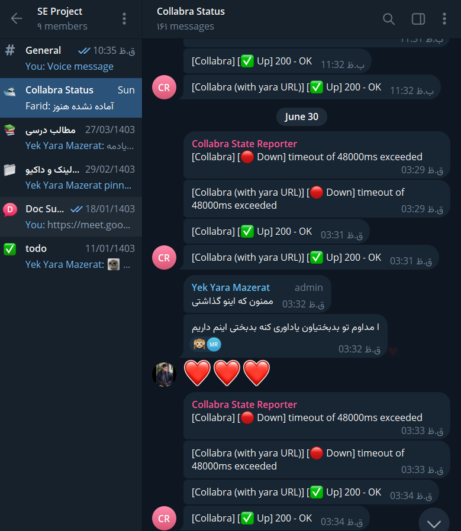
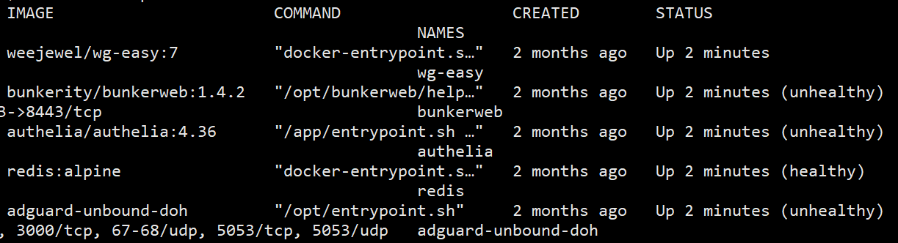

# محیط تست شخصی (بر بستر XAMPP و Windows)
<h2 align="right">XAMPP</h2>

در میان ابزار‌های راه‌اندازی سرور تست، XAMPP نامی آشناست. یک بسته نرم‌افزاری متن‌باز و رایگان که شامل Apache، MySQL، PHP و Perl می‌باشد و برای راه‌اندازی وب‌سرورهای محلی طراحی شده است. این ابزار برای توسعه‌دهندگان وب بسیار مناسب است زیرا به آنها امکان می‌دهد تا وب‌سایت‌ها و برنامه‌های وب خود را به‌صورت محلی بر روی سیستم خود تست و توسعه دهند، بدون نیاز به داشتن یک سرور اینترنتی واقعی. این مزیت بزرگ XAMPP باعث می‌شود که توسعه‌دهندگان بتوانند تغییرات را به سرعت اعمال و آزمایش کنند، خطاها را شناسایی و رفع نمایند و قبل از انتشار نهایی از عملکرد صحیح وب‌سایت یا برنامه خود اطمینان حاصل کنند. از دیگر مزایای آن اجرا بی‌دردسر در سیستم‌عامل ویندوز و اجرای ۳ عضو از چهار عضو از اعضای LAMP Stack (**A**pache, **M**ySQL, **P**HP) بدون هیچ‌گونه دردسر و فقط با یک کلیک است

### نصب
برای نصب XAMPP به [سایت](https://www.apachefriends.org/) آن رفته و ورژن مناسب HumHub را دانلود و نصب می‌کنیم. برای نصب آن، لازم است تا به صورت Run as Administrator اجرا کرده و پس از نصب، آن را همواره به صورت Run as Administrator اجرا می‌کنیم. سپس مسیر پوشه php در محل نصب XAMPP را به Environment Variables اضافه کرده. برای حصول اطمینان از نصب درست php بر روی سیستم خود، با دستور `php -V` در cmd، اطلاعاتی مطابق زیر را خواهیم داشت که نشان‌دهنده نصب درست php است:

<p align="center">

</p>

پس از آن، با اجرا کنترل پنل XAMPP می‌توانیم Apache و MySQL را راه‌اندازی کنیم:

<p align="center">

</p>

### Configuration & HumHub Deployment

برای نصب HumHub ابتدا به [سایت هام هاب](https://www.humhub.com/en/) رفته و به کمک [داکیومنت نصب](https://docs.humhub.org/docs/admin/requirements/) به مسیر [پروژه در گیتهاب](https://github.com/humhub/humhub) رفته و با کپی کردن لینک آن، آن را در cmd مسیر `D:\xampp\htdocs` به صورت زیر و به صورت محلی، clone می‌کنیم:
```
 git clone https://github.com/humhub/humhub
```

در ادامه نیازمند اضافه کردن مجموعه‌ای از extentionها به php نصب شده هستیم که برای این کار فایل php.ini را باز کرده و تغییرات زیر را در آن اعمال می‌کنیم:

<p align="center">

 

</p>


سپس با restart کردن Apache و MySQL، به آدرس `http://localhost/phpmyadmin` رفته تا پایگاه داده‌ای، از طریق منوی New، برای HumHub بسازیم.
سپس `Composer-Setup.exe`  را از [این لینک](https://getcomposer.org/download/) دانلود کرده. پس از دانلود، آن را با فعال‌سازی Developer Mode و با دادن مسیر php، نصب می‌کنیم. مسیر پوشه HumHub در محل نصب XAMPP را در cmd باز کرده و دستور زیر را جهت اعمال نصب composer برای HumHub، اجرا می‌کنیم:
```
composer install
```
 سپس آدرس `http://localhost/humhub` را در مرورگر وارد کرده و پس از setup اولیه آن، HumHub ما به صورت کامل و local، آماده است.

## راه‌اندازی XDebug 
[داکیومنت نصب XDebug](https://xdebug.org/docs/install)
[نصب در ویندوز به کمک wizard](https://xdebug.org/wizard)
به کمک وارد کردن این آدرس در مرورگر http://localhost/dashboard/phpinfo.php اطلاعات مربوط به php خود را دریافت کرده و با copy و paste کردن آن در صفحه wizard می‌توانیم XDebug مناسب php و سیستم خود را دریافت و تنظیم کنیم.
سپس فایل دانلود شده را به پوشه ````xampp\php\ext```` منتقل کرده و نام آن را `php_xdebug.dll` می‌گذاریم.
در ادامه، فایل php.ini را باز کرده و خطوط زیر را جهت تنظیم xdebug به آن اضافه می‌کنیم:
```bash
[xdebug]
zend_extention = "D:\xampp\php\ext\php_xdebug.dll"
xdebug.mode = profile
xdebug.start_with_request = yes
xdebug.output_dir = "C:\Users\User\Desktop\Test"
xdebug.profiler_output_name = callgrind.out.%p
```


پس از این می‌توانیم با [فعال‌سازی افزونه XDebug در Chrome](https://chromewebstore.google.com/detail/xdebug-helper/eadndfjplgieldjbigjakmdgkmoaaaoc?hl=en)، فایل‌های خروجی callgrind را جهت بررسی در QCachegrind داشته باشیم.

<p align="center">

</p>

جهت حصول اطمینان از نصب صحیح XDebug نیز در cmd دستور `php -V` را وارد کرده و گزارشی به صورت زیر به ما نمایش داده می‌شود:

<p align="center">

</p>

به کمک xdebug.info به اطلاعات جزئی xdebug دسترسی خواهیم داشت:

<p align="center">

</p>

هر یک از featureها متناظرا رو به روی خود لینک documentation خود را دارند.
(قابلیت فعال و مورد نیاز ما، profiler است و لینک آن https://xdebug.org/docs/profiler می باشد.)

# سرور عمومی (بر بستر docker، linux و nginx)

## سرور و دامنه
سرور و لینک فعال و قابل‌دسترس پروژه:
```
IP: 188.121.107.234
Domain: https://collabra.yaramsn.lol
```
### سیستم عامل
برای بالا آوردن پروژه روی سرور، روش‌های مختلفی از جمله امتحان کردن سرورهای fedora و ubuntu را در پیش گرفتیم. سپس در debian و با اضافه کردن repository آن، بررسی کرده که در مقایسه با سیستم‌های عامل مذکور پایداری بیشتری در پیاده‌سازی داشتیم، و package manager سرعت و ضریب اطمینان بالاتری را در پروسه نصب ارائه می‌کرد. خصوصا به دلیل نبود package manager ثانوبه مانند snap در ubuntu، یکپارچگی بالاتری در debian در مدیریت package ها وجود دارد.

### سرویس دهنده
انتخاب ابر آروان به عنوان سرویس ارائه‌دهنده خدمات مورد نظر، به دلیل قیمت پایین و هزینه ساعتی، وجود سرورها در داخل ایران و عدم امکان ایجاد مشکلاتی مانند فیلترینگ و سرعت پایین است. ابرآروان در مقایسه با دیگر سرویس‌دهنده‌های داخلی امکانات و رابط کاربری مدرن‌تری را دارد. سرویس ما در دیتاسنتر شهریار تبریز است، به دلیل قیمت پایین‌تر، و به همین دلیل سخت‌افزار چندان قدرت‌مندی ندارد و از حافظه‌ی HDD استفاده می‌کند.

### دامنه
برای تنظیم دامنه برای پروژه نیز از دامنه یکی از هم‌گروهی‌ها استفاده کردیم و برای این کار زیردامنه‌ای از دامنه ایشان، به عنوان آدرس شبکه اجتماعی ما جهت دسترسی راحت‌تر و افزایش امنیت با ستاپ SSL، اختصاص یافت. این کار توسط این عزیز و راه‌اندازی DNS سرور بر روی سرور خود عملی شد.

## Docker

از داکر به دلیل قابلیت قابلیت‌حمل، پایداری و مقیاس‌پذیری بالا برای پیاده‌سازی شبکه اجتماعی در محیط‌ها و سرورهای متفاوت استفاده کردیم. استفاده از داکر باعث شد تا در صورت وجود هر مشکل، با حداقل زمان این شبکه اجتماعی را در سرورها و با تنظیمات متفاوت بالا بیاوریم و نقطه اشکال را سریعا مشخص کنیم، همچنین به ما این قابلیت را داد تا از میان بسیار image موجود در dockerhub استفاده کنیم تا خود همه تنظیمات و dockerfile ها را پیاده نکنیم.
لازم به ذکر است که اتفاقاتی که در هر image از داکر رخ می‌دهند، مختص به همان deployment هستند و تنها عناصر مرتبط با ماژول‌های kernel سیستم‌عامل هستند که در سیستم‌های دیگر احتمال ایجاد مشکل دارند. این یعنی در هر distro مبتنی بر linux با هسته‌های یکسان همواره خروجی یکسان خواهد بود، زیرا تمامی فایل‌ها و networking به صورت isolated است و هر ارتباط به بیرون نیز واضحا در docker-compose.yml تعریف شده، به بیان دیگر تمامی عناصر user-space از image و به صورت کاملا reproducable ایجاد می‌شود.

### نصب
برای اینکار ابتدا مخازن docker را اضافه کرده و اگر VPS در ایران است DNS شکن یا VPN را راه‌اندازی میکنیم تا مشکلی در آپدیت پیش نیاید.
```sh
# Add Docker's official GPG key:
sudo apt-get update
sudo apt-get install ca-certificates curl
sudo install -m 0755 -d /etc/apt/keyrings
sudo curl -fsSL https://download.docker.com/linux/debian/gpg -o /etc/apt/keyrings/docker.asc
sudo chmod a+r /etc/apt/keyrings/docker.asc

# Add the repository to Apt sources:
echo \
  "deb [arch=$(dpkg --print-architecture) signed-by=/etc/apt/keyrings/docker.asc] https://download.docker.com/linux/debian \
  $(. /etc/os-release && echo "$VERSION_CODENAME") stable" | \
  sudo tee /etc/apt/sources.list.d/docker.list > /dev/null
sudo apt-get update
```
پس از این مراحل، می‌توان به آسانی docker را نصب کرد، docker compose را می‌توان هم به صورت یک کامند جدا و هم به عنوان ماژولی برای docker نصب کرد که به دلیل outdated بودن روش اول، از روش دوم استفاده کردیم:

```sh
sudo apt-get install docker-ce docker-ce-cli containerd.io docker-buildx-plugin docker-compose-plugin
```

پس از نصب، باز هم کار ما با فلاکت‌های راه‌اندازی سرویس در ایران تمام نشده و به دلیل تحریم باید از mirror های ایرانی dockerhub استفاده کنیم، که توسط ابرآروان میزبانی می‌شوند. ما از راهنمای [این](https://www.arvancloud.ir/fa/dev/docker) صفحه برای راه‌اندازی mirror استفاده می‌کنیم.

```sh
sudo bash -c 'cat > /etc/docker/daemon.json <<EOF
{
  "insecure-registries" : ["https://docker.arvancloud.ir"],
  "registry-mirrors": ["https://docker.arvancloud.ir"]
}
EOF'
# to put changes in effect, we log out and restart the service.
docker logout
sudo systemctl restart docker
```

و در نهایت، کار ما با راه‌اندازی Docker در سرور ابرآروان به پایان رسید!

### Docker Image


پس از راه‌اندازی Docker نیازمند یافتن Docker Imageهای مناسب هستیم تا طراحی این بخش علاوه بر سایر بخش‌ها، بر عهده خودمان نباشد. در این صورت، پس از یافتن Docker Imageهای مناسب و اتصال آن‌ها به یکدیگر، قادر به بالا آوردن سرویس HumHub خواهیم شد.
روشی که در ابتدا در پیش گرفته بودیم، ساخت تعداد زیادی container بود که در طی زمان و کار کردن با آن، متوجه شدیم که خاموش و روشن کردن همه این‌ها در هر مرحله پروسه طولانی، زمان‌بر و غیربهینه‌ای است که منجر به طولانی شدن flagها نیز می‌شد (اجرای commandها طولانی و گیج‌کننده). در نتیجه از docker compose استفاده کردیم که با تعریف فایل docker-compose.yml به صورت declarative کانتینر‌های لازم و دیگر موارد مربوطه (مانند volumes و networks) که قرار است بالا بیایند، به روشی اصولی‌تر پیاده کردیم. مزیت دیگر استفاده از این imageهای آماده این است که در صورت تعریف ورژن جدید توسط توسعه‌دهنده می‌توانیم به سرعت آن را به روز کنیم و احتمال خطا را پایین می‌آورد. لازم به ذکر است که در این پروژه، در سرور اصلی سه image داریم که دوتا از آن‌ها اصلی و دیگری نقش کمک‌کننده در پروسه دیباگ را ایفا می‌کند (ftp server)، در سرور ثانویه نیز یک ابزار monitoring را بالا آوردیم تا بر عملکرد سرویس‌ها پایش کند.

یکی از شانس‌های از دست‌رفته برای بهبود پروژه، استفاده از docker secrets بوده، که در یک deployment واقعی **بسیار** مهم است. اخبار بسیاری از leak شدن tokenها و رمز‌های عبور شرکت‌های بسیار نام‌دار به دلیل نگه داشت پسوورد در فایل‌های کانفیگ وجود دارد، ما نیز به دلیل کوتاهی وقت، همین مسیر را پیش‌رفتیم ولی به شکل دستی، پسوورد‌ها را از کانفیگ فایل‌ها حذف کردیم.

در ادامه، image اصلی متعلق به HumHub به صورت زیر می‌باشد:

#### وب سرور

ایمیج استفاده شده: `mriedmann/humhub:stable`

کانفیگ مربوطه در docker-compose.yml:

```yml
  humhub:
    image: mriedmann/humhub:stable
    container_name: humhub_webserver
    stop_grace_period: 30s
    networks:
      - collabra-net
    depends_on:
      - db
    ports:
      - "80:80"
    volumes:
      - "config:/var/www/localhost/htdocs/protected/config"
      - "uploads:/var/www/localhost/htdocs/uploads"
      - "modules:/var/www/localhost/htdocs/protected/modules"
      - "xdebug:/log"
    environment:
      HUMHUB_DB_USER: collabra-db
      HUMHUB_DB_PASSWORD: REDACTED
    healthcheck:
      test: ["CMD-SHELL", "curl -f http://localhost:8080 || exit 1"]
      interval: 30s
      timeout: 10s
      retries: 3
```

این image محبوب‌ترین از نوع خود است، و دلایلی بسیاری دارد، در این نسخه به جای apache به عنوان webserver از nginx استفاده شده، که این روز‌ها به دلیل بازده بیشتر، و مناسب‌تر بودن برای معماری microservice بیشتر استفاده می‌شود، هرچند که مقایسه این دو خود می‌تواند مبحث یک مقاله باشد. به دلیل منابع کم سرور و نیاز به تست‌های فشار و بار، استفاده از nginx که بازده بهتری دارد،‌ انتخاب مناسب‌تری بود. همچنین از PHP-FPM استفاده می‌کند. در اینجا،‌ FPM مخفف FastCGI Process Manager است. این یک پیاده‌سازی جایگزین PHP FastCGI با برخی ویژگی‌های اضافی است که برای سایت‌های با هر اندازه، به ویژه سایت‌های پرترافیک، مفید است. مزیت اصلی FPM این است که فرآیندهای PHP را به طور کارآمدتری مدیریت می‌کند، که منجر به عملکرد بهتر و استفاده بهینه از منابع می‌شود. این سیستم پردازش PHP را از سرور وب جدا می‌کند، که امکان مقیاس‌پذیری بهتر و کنترل دقیق‌تر بر روی فرآیندهای PHP را فراهم می‌کند. این موضوع اهمیت دارد زیرا می‌تواند سرعت و پایداری وب‌سایت‌های مبتنی بر PHP را به طور قابل توجهی بهبود بخشد، به خصوص در شرایط ترافیک بالا. FPM امکان اتصال‌های همزمان بیشتر، مدیریت بهتر حافظه و توانایی راه‌اندازی مجدد فرآیندهای PHP بدون نیاز به راه‌اندازی مجدد کل سرور وب را فراهم می‌کند. همچنین این نسخه به دلیل استفاده از alpine به عنوان base image، حجم و مصرف رم کمی را دارد، و فقط آنچه نیاز است، روی سیستم نصب می‌شود.

#### پایگاه داده

ایمیج استفاده شده: `mariadb:10.2`

کانفیگ مربوطه در docker-compose.yml:

```yml
  db:
    image: mariadb:10.2
    container_name: database
    networks:
      - collabra-net
    hostname: collabra-db
    stop_grace_period: 30s
    environment:
      MYSQL_ROOT_PASSWORD: REDACTED
      MYSQL_DATABASE: collabra-db
      MYSQL_USER: collabra-db
      MYSQL_PASSWORD: REDACTED
```

برای پایگاه داده از MariaDB استفاده شده است. از MySQL نیز میتوان استفاده کرد و تفاوتی زیادی باهم ندارند، در مورد تفاوت این دو دیتابیس در پاراگراف‌های بعدی توضیح داده شده، و تیم، با سنجش نکات و مثبت و منفی به این نتیجه رسید که از MariaDB استفاده کند.

#### مقایسه MariaDB و MySQL

##### منشأ و توسعه

در ابتدا MySQL توسط شرکت سوئدی MySQL AB تأسیس شد که توسط Michael Widenius، David Axmark و Allan Larsson بنیان‌گذاری شد. در سال ۲۰۰۸، Sun Microsystems شرکت MySQL AB را خریداری کرد و پس از آن، شرکت Oracle در سال ۲۰۱۰ Sun Microsystems را خریداری کرد و MySQL تحت مالکیت Oracle قرار گرفت. این خرید منجر به نگرانی‌هایی درباره آینده MySQL به عنوان یک پروژه منبع باز شد.

در پاسخ به این نگرانی‌ها، Michael Widenius، توسعه‌دهنده اصلی MySQL، در سال ۲۰۰۹ پروژه MySQL را فورک کرد و MariaDB را ایجاد کرد. این سیستم مدیریت پایگاه داده جدید به عنوان یک جایگزین منبع باز برای اطمینان از در دسترس بودن مداوم یک پایگاه داده MySQL-سازگار جامعه‌محور توسعه یافت. MariaDB اکنون توسط بنیاد MariaDB و شرکت MariaDB نگهداری می‌شود و تمرکز آن بر حفظ منبع باز و جامعه‌محور بودن آن است.

##### مجوزدهی

متاسفانه، MySQL تحت یک مدل دوگانه مجوزدهی عمل می‌کند. نسخه منبع باز آن تحت GPL (مجوز عمومی همگانی گنو) ارائه می‌شود که رایگان است اما نیاز دارد که هر گونه تغییرات در کد نیز تحت GPL منتشر شود. Oracle همچنین یک نسخه تجاری از MySQL ارائه می‌دهد که برای برخی استفاده‌ها ضروری است و شامل ویژگی‌ها و گزینه‌های پشتیبانی اضافی می‌شود.

در مقابل، MariaDB به طور کامل منبع باز است و تحت ترکیبی از مجوزهای GPL، BSD و LGPL منتشر می‌شود. این رویکرد مجوزدهی به این معنی است که تمام ویژگی‌های MariaDB در نسخه منبع باز موجود است و نیازی به نسخه تجاری نیست. این تفاوت در فلسفه مجوزدهی نشان‌دهنده تعهد MariaDB به جامعه منبع باز است و می‌تواند یک عامل مهم برای سازمان‌هایی باشد که نگران تغییرات مجوزدهی آینده هستند یا کسانی که ترجیح می‌دهند راه‌حل‌های کاملاً منبع باز داشته باشند.

##### ویژگی‌ها و عملکرد

هر دو MariaDB و MySQL مجموعه گسترده‌ای از ویژگی‌های معمول سیستم‌های مدیریت پایگاه داده رابطه‌ای مدرن را ارائه می‌دهند. با این حال، MariaDB تلاش کرده است تا سازگاری بالایی با MySQL حفظ کند و در عین حال ویژگی‌ها و بهبودهای عملکردی اضافی را معرفی کرده است.

در زمینه موتورهای ذخیره‌سازی، هر دو از گزینه‌های محبوبی مانند InnoDB و MyISAM پشتیبانی می‌کنند، اما MariaDB شامل موتورهای اضافی مانند Aria و ColumnStore است که می‌توانند برای برخی استفاده‌ها بهبودهای عملکردی ارائه دهند. MariaDB اغلب در بنچمارک‌ها، به ویژه برای کوئری‌های پیچیده، عملکرد بهتری نشان می‌دهد به دلیل بهینه‌سازی‌ها و بهبودهای مختلفی که توسط تیم توسعه آن اعمال شده است.

تکرار داده‌ها یکی دیگر از حوزه‌هایی است که هر دو پایگاه داده راه‌حل‌های قوی ارائه می‌دهند، اما MariaDB ویژگی‌های پیشرفته‌ای معرفی کرده است که می‌تواند انعطاف‌پذیری بیشتر و عملکرد بهتری در محیط‌های توزیع شده ارائه دهد.

##### امنیت

هر دو MySQL و MariaDB اولویت بالایی به امنیت می‌دهند و به طور منظم به‌روزرسانی‌ها و پچ‌هایی برای رفع آسیب‌پذیری‌ها منتشر می‌کنند. با این حال، MariaDB به خاطر اجرای سریع‌تر پچ‌های امنیتی شهرت پیدا کرده است و اغلب MySQL را در رفع مسائل جدید کشف شده پشت سر می‌گذارد.

در MariaDB همچنین شامل ویژگی‌های امنیتی اضافی از پیش نصب شده است، مانند گزینه‌های رمزنگاری پیشرفته و قابلیت‌های مدیریت رمز عبور پیشرفته‌تر. این اقدامات امنیتی اضافی می‌توانند به ویژه برای سازمان‌هایی با نیازهای حفاظت از داده‌های سختگیرانه جذاب باشند.

##### جامعه و پشتیبانی

در باب پشتیبانی، MySQL، که توسط منابع قابل توجه Oracle پشتیبانی می‌شود، گزینه‌های پشتیبانی تجاری قوی ارائه می‌دهد و از تجربه گسترده شرکت در حوزه سازمانی بهره می‌برد. این می‌تواند به ویژه برای سازمان‌های بزرگی که نیاز به پشتیبانی تضمین شده و حسابرسی دارند جذاب باشد.

از سوی دیگر، MariaDB دارای جامعه‌ای قوی و فعال منبع باز است. این رویکرد جامعه‌محور اغلب منجر به رفع سریع‌تر اشکالات و توسعه سریع‌تر ویژگی‌ها می‌شود. MariaDB همچنین پشتیبانی تجاری را از طریق شرکت MariaDB ارائه می‌دهد که تعادلی بین مشارکت جامعه و گزینه‌های پشتیبانی حرفه‌ای ارائه می‌دهد.

##### پشتیبانی ابری

هر دو MySQL و MariaDB به طور گسترده‌ای در محیط‌های ابری پشتیبانی می‌شوند و بیشتر ارائه‌دهندگان ابری بزرگ خدمات مدیریت شده پایگاه داده برای هر دو را ارائه می‌دهند. MySQL به دلیل تاریخچه طولانی‌تر و پذیرش گسترده‌تر، ممکن است یکپارچگی نزدیک‌تری با برخی ارائه‌دهندگان ابری و طیف گسترده‌تری از ابزارها و خدمات پیرامون آن داشته باشد.

با این حال، MariaDB به سرعت در این حوزه پیشرفت می‌کند و با پشتیبانی فزاینده از سوی ارائه‌دهندگان ابری و یک اکوسیستم رو به رشد از ابزارها و خدمات سازگار، در حال رشد است. انتخاب بین این دو برای استقرارهای ابری اغلب به ارائه‌دهنده‌های خاص و نیازهای پروژه فردی بستگی دارد.

این بخش جزئی از شبکه collabra-net است که پایگاه داده و HumHub بتوانند به صورت مستقیم با هم در ارتباط باشند.

<h4 align="right"> FTP Server </h4>

ایمیج استفاده شده: `fauria/vsftpd:latest`

کانفیگ مربوطه در docker-compose.yml:

```yml
  ftp:
    image: fauria/vsftpd
    container_name: ftp_server
    ports:
      - "21:21"
      - "21000-21010:21000-21010"
    volumes:
      - "xdebug:/home/vsftpd/vsftpd"
    environment:
      FTP_USER: vsftpd
      FTP_PASS: REDACTED
      PASV_ADDRESS: "188.121.107.234"
      PASV_MIN_PORT: 21000
      PASV_MAX_PORT: 21010
      FILE_OPEN_MODE: 0666
      LOCAL_UMASK: 022
      LOG_STDOUT: "YES"
```

دلیل اصلی به کار بردن ftp، نیاز به استخراج فایل‌های profiling به صورت مجموعه چندتایی و بررسی آن‌ها است، با کمک این پروتکل، می‌توان به راحتی حتی از File Explorer ویندوز و یا FileZilla و حتی با fuse در لینوکس به آسانی فایل‌های سرور را ذخیره، ویرایش و یا حذف داد. پورت‌های استفاده شده، پورت‌های عادی و استاندارد. برای اتصال به این سرویس FTP می‌توانید با نام‌کاربری `vsftpd` و آدرس آی‌پی `188.121.107.234‍` اقدام کنید، password به دلایل امنیتی در این داکیومنت ذکر نخواهد شد. این سرویس با به اشتراک‌گذاری یک پوشه با کانتینر webserver، توسط یک docker volume، می‌تواند اطلاعاتی از container وب‌سرور را توسط ftp با دنیای بیرون به اشتراک بگذارد، و در این مورد پوشه به اشتراک گذاشته شده، پوشه `log/` وب‌سرور است که در آن همه لاگ‌ فایل‌های مربوط به xdebug ذخیره شده.

<h4 align="right"> Uptime Kuma </h4>

ایمیج استفاده شده: `fauria/vsftpd:latest`

کانفیگ مربوطه در docker-compose.yml:

```yaml
services:
  uptime-kuma:
    image: louislam/uptime-kuma:latest
    container_name: uptime_kuma
    ports:
      - "3001:3001"
    volumes:
      - uptime-kuma_data:/app/data

volumes:
  uptime-kuma_data: {}
```

در نهایت، در سروری دیگر،‌ برای نظارت بر بالا بودن و عملکرد درست سرویس، uptime kuma را اجرا آوردیم تا وضعیت اتصال با دامنه و IP، همراه با نسخه HTTPs و instanceهای تست را به ما گزارش بدهد،‌ در بخش مربوط به مکانیزم‌های مانیتورینگ، این مورد را با تمام ویژگی‌های آن بررسی کردیم. از مزایای اجرای این سرویس بر روی سرویسی دیگر، بررسی اتصال و ارتباطات سرور با سرویس‌های جهانی خارج از شبکه VPS، و همچنین، استفاده از APIهای تلگرام، برای گزارش وضعیت سرور داخل گروه مربوطه در تلگرام بوده، تا همواره از وضعیت سرویس در شبکه‌اجتماعی که بیشتر بررسی می‌کنیم، مطلع شویم.

<h3 align="right">Docker Compose</h3> 

داکر کامپوز (Docker Compose) ابزاری قدرتمند برای تعریف و اجرای برنامه‌های داکر چند کانتینری است. این ابزار به توسعه‌دهندگان اجازه می‌دهد تا کل استک برنامه خود را، شامل سرویس‌ها، network‌ها و volume‌ها، در یک فایل YAML به نام docker-compose.yml توصیف کنند. با داکر کامپوز، می‌توانید به راحتی برنامه‌های پیچیده‌ای را که از چندین کانتینر مرتبط به هم تشکیل شده‌اند مدیریت کنید و فرآیندهای توسعه، تست و استقرار را ساده‌تر سازید، یکی از بزرگترین مزیت‌های آن هندل کردن اجرای چندین container با هم،‌ و جلوگیری از اجرای دستورات خط فرمانی بلند و پیچیده است. برخی از فیلدهای رایج در فایل docker-compose.yml شامل 'version' (مشخص کردن نسخه فرمت فایل Compose)، 'services' (تعریف کانتینرهایی که برنامه شما را تشکیل می‌دهند)، 'networks' (مشخص کردن network‌های سفارشی برای کانتینرهای شما) و 'volumes' (تعریف volume‌های پایدار) هستند. در بخش 'services'، معمولاً نام‌های کانتینر، تصاویر، نگاشت‌های پورت، متغیرهای محیطی و وابستگی‌های بین سرویس‌ها را تعریف می‌کنید. این رویکرد اعلامی امکان تکرار آسان محیط برنامه شما را در سیستم‌های مختلف فراهم می‌کند. Network‌ها و volume‌ها اجزای مهمی در برنامه‌های کانتینری هستند. Network‌ها به کانتینرها اجازه می‌دهند با یکدیگر و دنیای خارج ارتباط برقرار کنند و ایزوله‌سازی را فراهم کرده و معماری میکروسرویس را تسهیل می‌کنند. می‌توانید network‌های پل سفارشی، network‌های روکش برای حالت سوآرم یا network میزبان ایجاد کنید. از طرف دیگر، volume‌ها ذخیره‌سازی پایدار برای کانتینرها فراهم می‌کنند. آنها اجازه می‌دهند داده‌ها حتی پس از نابودی یک کانتینر باقی بمانند و می‌توانند به راحتی بین کانتینرها به اشتراک گذاشته شوند. volume‌ها برای برنامه‌های با وضعیت و برای جدا کردن کد برنامه از داده‌ها ضروری هستند. 

اسکریپت‌هایی که در توضیحات هر Image می‌بینید، بخش مربوطه به هر سرویس در فیلد `service` در فایل `docker-compose.yml` است. فایل docker compose سرور اصلی در ‌[اینجا](https://github.com/aarmn/Collabra/blob/main/docker/server/docker-compose.yml) و فایل مربوط به سرور مانیتورینگ در [اینجاست](https://github.com/aarmn/Collabra/blob/main/docker/monitor/docker-compose.yml)

### پاک‌سازی Docker
به کمک دستورات زیر، می‌توانیم فضای سرور را از اطلاعات و داده‌های ایجاد شده توسط Docker را خالی کنیم.

<div dir="ltr">

```bash
#!/bin/bash

echo "Starting Docker cleanup process..."

# Remove all stopped containers
echo "Removing stopped containers..."
docker container prune -f

# Remove unused images
echo "Removing dangling images..."
docker image prune -f

# Remove unused volumes
echo "Removing unused volumes..."
docker volume prune -f

# Remove unused networks
echo "Removing unused networks..."
docker network prune -f

# Remove build cache
echo "Removing build cache..."
docker builder prune -f

echo "Cleanup complete!"

# Display current Docker disk usage
echo "Current Docker disk usage:"
docker system df
```

</div>

پس از مدتی ممکن است حجم اطلاعات موجود در کش Docker بر روی سرور خصوصا پس از حذف نصب ورژن‌های مختلف به اندازه‌ای زیاد شود که در اجرای تست‌ها و آزمایشات دچار مشکل شویم. در این حالت از دستورات زیر برای پاک کردن‌ build cacheها و cacheهای Docker استفاده می‌شود. لازم به ذکر است که این دستورات، برای پاک کردن logها و محتوای داخل containerهای عملیاتی نیستند و فقط کش docker و موارد استفاده نشده توسط docker را برای ایجاد فضا، حذف می‌کنند. برای cleanup داخل container ما استراتژي خاصی به کار نبردیم، چون تا این لحظه، نیاز نشد.

## کانفیگ Nginx

بر اساس بررسی‌های به عمل آمده در فازهای قبل و در طول این فاز، دریافتیم بخشی از فایل‌هایی که حاوی اطلاعات محرمانه مانند رمز عبور، نسخه به کار رفته از تکنولوژی‌های استفاده‌شده و... مخفی نیستند و احتمال درز به بیرون برای آن‌ها وجود دارد. از جمله این فایل‌ها composer.lock است که همان طور که ذکر شد، حاوی رمز عبور به صورت آشکار است. با توجه به این که امکان نشت اطلاعاتی مانند رمز عبور و نسخه‌های deployement به واسطه لو رفتن این فایل وجود دارد، درصدد حل این مشکل برآمدیم.
برای حل ابتدا از روش `403Forbidden` استفاده شد تا در صورتی که فردی تمایل به دسترسی به فایل nginx.conf داشت، با ارور عدم اجازه دسترسی یا همان 403Frobidden مواجه می‌شد. در ادامه متوجه شدیم که این پیغام، خود می‌تواند فرد مهاجم را از وجود چنین فایلی مطلع کند و فرد تلاش کند تا به هر صورت به محتوای این فایل دسترسی پیدا کند.
در نتیجه تصمیم به جایگزینی ارور با 404 گرفته که در صورت تقاضا برای دسترسی توسط مهاجمین، با ارور عدم وجود چنین فایلی مواجه شوند که به ظاهر مناسب نبود.
در روندی دیگر، در راستای ایجاد Wormwhole path قدم برداشته تا در صورت مواجهه با ارور 404، ارور 404 متعلق به nginx نباشد تا مهاجک یا کاربران متوجه block list نشوند.
این کار به صورت زیر در فایل `nginx.conf` انجام شد:
```bash
#!/bin/sh

# Other setup commands...

# Add blacklist configuration to nginx.conf
sed -i '/index index.php index.html;/r /dev/stdin' /etc/nginx/nginx.conf << EOF

        # Blacklist files
        location ~* \/(CHANGELOG.md|CONTRIBUTING.md|Gruntfile.js|LICENSE|LICENSE.AGPL-3.0-or-later|README.md|SECURITY.md|composer.json|composer.lock|package-lock.json|package.json) {
            rewrite ^(.*)$ /wormhole last;
        }
EOF

# Reload nginx configuration
nginx -s reload
```

## راه‌اندازی XDebug
 
در نسخه Docker برای نصب xdebug ما از script زیر استفاده می‌کنیم که در ابتدا یک package manager php به نام pecl را در alpine linux که سیستم عامل docker image  وب‌سرور ماست نصب می‌کند، سپس، با کمک آن، به نصب xdebug می‌پردازیم. در انتها، یک پوشه برای خروجی لاگ‌ها می‌سازیم که این پوشه، در آدرس docker volume ای مشترک با container مربوط به FTP قرار گرفته تا یک deployment مبتنی بر microservice را ایجاد کند. در پایان به پروسه‌ها دسترسی کامل به این پوشه را می‌دهیم.

```sh
apk update # alpine package manager
apk add php-pear php81-dev build-base linux-headers # stuff needed for compiling xdebug
pecl install xdebug # installation of xdebug
mkdir /log
touch /log/xdebug.log
chmod 777 -R /log
chmod 777 /log/xdebug.log
```

سپس با دستور `sudo docker exec -it humhub_webserver_container_name /bin/sh` وارد کانتینر humhub می‌شویم و  با دستور `vi /etc/php81/php.ini` فایل کانفیگ php در container را ادیت می‌کنیم تا این موارد را به آن اضافه کنیم.

<div dir="ltr">

```bash
[xdebug]
zend_extension = "/usr/lib/php81/modules/xdebug.so"
xdebug.mode = profile
xdebug.log = /log/xdebug.log
xdebug.start_with_request = trigger
xdebug.output_dir = "/log"
xdebug.profiler_output_name = callgrind.out.%p
```


### بررسی خط به خط کانفیگ بالا

۱. در خط اول، ما آدرس کتابخانه Xdebug را روی سیستم خود می‌دهیم، به دلیل اینکه این کتاب‌خانه با C نوشته شده و مستقیما با موتور PHP که Zend نام دارد در ارتباط است، حتما لازم است در لیست zend extension ها بیاید، بجای فیلد معمول دیگر extensionهای مربوط به PHP، همچنین به همین دلیل که با موتور Php در ارتباط است لازم است سریع باشد و روی سیستم کامپایل می‌شود و به همین دلیل بالاتر، ما یک باینری داریم، و در alipne، ابزار‌های مربوط به کامپایل کردن را نصب کردیم.

۲. در خط دوم، حالت را روی پروفایل می‌گذاریم، پایین‌تر به دقت این مورد را بررسی می‌کنیم.

۳. در خط سوم،‌ آدرسی برای لاگ‌های Xdebug می‌گذاریم، این آدرس، آدرس ذخیره‌سازی فایل‌های پروفایلر نیست، بلکه لاگی بر اجرای خود XDebug است.

۴. در خط چهارم، حالت را روی trigger mode میگذاریم، اگر yes باشد، سر هر درخواست به php افزونه Xdebug فعال می‌شود، این مدنظر ما نیست، خصوصا در یک سیستم عمومی، بهینه است که برای آن یک secret تعیین کنیم، ولی برای اینکه پروژه دانشجویی است، صرفا وجود cookie مربوطه برای فعال سازی فرایند کافیست، این مورد را نیز به دقت و دیگر حالات فعال سازی این حالت را گسترده‌تر، بحث خواهیم کرد.

۵. در خط پنچ، پوشه خروجی فایل‌های پروفایل را داریم.

۶. در خط ششم، ما قانون نحوه نام‌گذاری فایل‌های پروفایلر را داریم، به دلیل اینکه QCacheGrind و KCacheGrind و WebCacheGrind همگی انتظار فایلی به فرمت `callgrind.out.*` را دارند، ما نام آن را به این صورت گذاشتیم، %p نام پروسه اجرا شده است، می‌توان به این مورد زمان را نیز اضافه کرد با اضافه کردن ‍`.%t` اما در این مورد، به نظر نیازی به آن نبود، چون فقط وقتی collision رخ می‌دهد که دو پروسه با دقیقا یک نام ایجاد شوند که شانسش چندان بالا نیست، به همین دلیل از نام‌گذاری بهتر، صرف‌نظر کردیم، همچنین این روش آنالیز را نیز کمی آسان‌تر می‌کرد.


</div>

در نسخه‌های جدید xdebug نیاز به کانفیگ‌های مربوط به ریموت نیست، همچنین چون در اینجا ما با یک ستاپ آنلاین مواجه هستیم، بهتر است از trigger با Secret استفاده کنیم، یعنی نه تنها باید یک cookie را ست کنیم تا پروسه پروفایلینگ آغاز شود، بلکه باید حتما محتوی کوکی توسط سرور تایید شود. این رویکرد پیچیده‌تر به دلیل آنلاین بودن این سرویس لازم است، برخلاف رویکرد deployment در XAMPP که به دلیل آفلاین بودن می‌توانستیم آن را فقط روی trigger ست کنیم یا حتی به سادگی روی yes بگذاریم تا هر بسته‌ای را پروفایل کند.

البته روش‌های دیگری نیز برای این کار وجود دارد که در بخش بعد به تفصیل به آن خواهیم پرداخت

### حالت‌های اجرای XDebug

 خوشبختانه Xdebug دارای چندین حالت اجرا است که هر کدام برای هدف خاصی طراحی شده‌اند. حالت "debug" برای عیب‌یابی کد استفاده می‌شود و امکان اجرای خط به خط کد را فراهم می‌کند. حالت "trace" برای ردیابی فراخوانی توابع و متدها به کار می‌رود. حالت "profile" برای تحلیل عملکرد و بهینه‌سازی برنامه استفاده می‌شود و اطلاعات مربوط به زمان اجرا و مصرف منابع را جمع‌آوری می‌کند. حالت "coverage" برای بررسی پوشش کد در تست‌ها به کار می‌رود. حالت "develop" ترکیبی از قابلیت‌های مفید برای توسعه‌دهندگان را ارائه می‌دهد. این حالت‌ها را می‌توان از طریق تنظیمات php.ini یا به صورت پویا در زمان اجرا فعال کرد، و می‌توان چندین حالت را همزمان فعال نمود تا از مزایای هر کدام بهره‌مند شد.

اجزای مورد بررسی ما در این جا بیشتر دو حالت debugging (حالت پیش‌فرض) و حالت profiling است.

<ul>
<li>
<strong>
حالت خطایابی (Debugging Mode):
</strong>
<ul>
<li>
هدف: یافتن و رفع خطاها در کد
</li>
<li>
عملکرد: اجازه می‌دهد برنامه را خط به خط اجرا کنید
</li>
<li>
قابلیت‌ها:
<ul>
<li>
تنظیم breakpoint
</li>
<li>
بررسی مقادیر متغیرها در زمان اجرا
</li>
<li>
اجرای گام به گام کد
</li>
</ul>
</li>
<li>
تنظیم در php.ini: xdebug.mode=debug
</li>
</ul>
</li>
<li>
<strong>
حالت بررسی اجرا (Profiling Mode):
</strong>
<ul>
<li>
هدف: بهینه‌سازی عملکرد برنامه
</li>
<li>
عملکرد: اطلاعات مربوط به زمان اجرا و مصرف منابع را جمع‌آوری می‌کند
</li>
<li>
قابلیت‌ها:
<ul>
<li>
اندازه‌گیری زمان اجرای توابع
</li>
<li>
تشخیص نقاط کند برنامه
</li>
<li>
بررسی مصرف حافظه
</li>
</ul>
</li>
<li>
تنظیم در php.ini: xdebug.mode=profile
</li>
</ul>
</li>
<li>
<strong>
تفاوت‌های کلی:
</strong>
<ul>
<li>
هدف:
<ul>
<li>
خطایابی: برای یافتن خطاها و رفع آن‌ها
</li>
<li>
پروفایلینگ:  برای بهبود کارایی و عملکرد برنامه
</li>
</ul>
</li>
<li>
خروجی:
<ul>
<li>
خطایابی: معمولاً تعاملی است و در IDE نمایش داده می‌شود
</li>
<li>
پروفایلینگ:  معمولاً یک فایل خروجی تولید می‌کند که باید با ابزارهای دیگر تحلیل شود
</li>
</ul>
</li>
<li>
تأثیر بر عملکرد:
<ul>
<li>
خطایابی: می‌تواند اجرای برنامه را کند کند، زیرا اجازه توقف و بررسی می‌دهد
</li>
<li>
پروفایلینگ:  تأثیر کمتری بر سرعت اجرا دارد، اما همچنان باعث کاهش عملکرد می‌شود
</li>
</ul>
</li>
<li>
زمان استفاده:
<ul>
<li>
خطایابی: معمولاً در مراحل توسعه و تست استفاده می‌شود
</li>
<li>
پروفایلینگ:  اغلب در مراحل بهینه‌سازی و قبل از انتشار نهایی استفاده می‌شود
</li>
</ul>
</li>
<li>
مهارت‌های مورد نیاز:
<ul>
<li>
خطایابی: نیاز به درک عمیق از جریان اجرای برنامه دارد
</li>
<li>
پروفایلینگ:  نیاز به درک مفاهیم عملکرد و بهینه‌سازی دارد
</li>
</ul>
</li>
</ul>
</li>
</ul>

### مکانیزم فعال‌سازی (ماشه)

1. استفاده از پارامتر XDEBUG_PROFILE در GET/POST

برای استفاده از این روش، به داده پست، یا آدرس سایت، درخواست ‍‍`XDEBUG_PROFILE` را اضافه می‌کنیم

<div dir="ltr">

```
https://your-site.com/your-page?XDEBUG_PROFILE
```

</div>

این مورد برای profile کردن سریع و یا به اصطلاح on-demand و یا در محیط‌های که دسترسی به کوکی درخواست دهنده نداریم کاربردیست.

2. استنفاده از کوکی XDEBUG_PROFILE

شما می‌توانید، یک کوکی با نام ‍‍`XDEBUG_PROFILE` تنظیم کنید،‌ مقدار آن در حالت بدون secret اهمیت ندارد و صرف وجودش profiling را آغاز می‌کند. مزیت این متد پروفایل کردن چندین صفحه در یک نشست است.

<div dir="ltr">

```php
setcookie('XDEBUG_PROFILE', '1', time() + 3600, '/');
```
</div>

افزونه‌های مرورگر بسیاری برای تنظیم این کوکی وجود دارند که جلو‌تر یکی را خواهیم دید.

3. تنظیم متغییر محیطی، XDEBUG_PROFILE=1

این روش معمولا وقتی به کار می‌رود که می‌خواهیم موقتا همه ترافیک برنامه را profile کنیم، یا در صورتی که تست را روی خط فرمان سرویس ران کنیم، برای پروفایل کردن همه برنامه. در کانتینرها نیز این روش به وفور استفاده می‌شود.

<div dir="ltr">

```bash
export XDEBUG_PROFILE=1
php your-script.php
```
</div>

این مورد بیشتر برای پروفایل کردن کد با کمک ابزار‌های خط فرمانی یا در کانتینر به کار می رود.

هم‌اکنون اگر xdebug به درستی تنظیم شده باشد، باید بتوانید با هر یک از این روش‌ها شروع به پروفایل کردن کنید، اگر از مرورگر استفاده می‌کنید، می‌توانید با نصب افزونه `xdebug helper` پروسه تنظیم کوکی xdebug را آسان‌تر کنید. یا با چسباندن یک `?XDEBUG_PROFILE` به انتهای هر درخواست که در آن کنترل کوکی به دست شما نیست، به این مهم دست یابید.

## Health Check & Monitoring

### Uptime Kuma

آپتایم کوما (Uptime Kuma) یک ابزار نظارت بر وضعیت سرور و خدمات است که به صورت متن‌باز توسعه داده شده است. این نرم‌افزار به کاربران امکان می‌دهد تا به طور مداوم وب‌سایت‌ها، سرورها، و سرویس‌های مختلف را بررسی کنند و از در دسترس بودن آنها اطمینان حاصل کنند. آپتایم کوما با رابط کاربری ساده و زیبای خود، امکان نظارت بر خدمات مختلف را از طریق پروتکل‌هایی مانند HTTP(S)، TCP، Ping و غیره فراهم می‌کند.

یکی از ویژگی‌های برجسته آپتایم کوما، قابلیت ارسال هشدار در صورت بروز مشکل است. این نرم‌افزار می‌تواند از طریق ایمیل، پیامک، تلگرام و سایر پلتفرم‌های پیام‌رسان، کاربران را از قطعی سرویس یا مشکلات احتمالی آگاه سازد. علاوه بر این، آپتایم کوما امکان ایجاد گزارش‌های دقیق از وضعیت سرویس‌ها، زمان پاسخگویی و درصد در دسترس بودن آنها را فراهم می‌کند.

نصب و راه‌اندازی آپتایم کوما بسیار ساده است و می‌تواند به راحتی روی سرورهای شخصی یا فضاهای ابری نصب شود. این نرم‌افزار از داکر (Docker) پشتیبانی می‌کند که نصب و به‌روزرسانی آن را آسان‌تر می‌کند. با توجه به متن‌باز بودن آپتایم کوما، کاربران می‌توانند آن را متناسب با نیازهای خود تغییر دهند و در توسعه آن مشارکت کنند. این ویژگی‌ها باعث شده است که آپتایم کوما به یکی از محبوب‌ترین ابزارهای نظارت بر وضعیت سرویس‌ها در میان توسعه‌دهندگان و مدیران سیستم تبدیل شود.

در پیاده‌سازی خود،‌ ما سرور دیگری را برای uptime kuma استفاده کردیم تا از قابلیت اطلاع‌رسانی در تلگرام آن استفاده کنیم و در گروه از وضعیت پروژه مطلع شویم. به مانند باقی پروژه uptime kuma نیز با کمک docker compose دیپلوی شده ولی به دلیل فیلترینگ تلگرام،‌ در یک VPS خارج از کشور آن را دیپلوی کردیم تا استفاده از API تلگرام برای آن مقدور باشد

آدرس deployment:

http://up.yaramsn.lol

<p align="center">

</p>

### بررسی سلامت در داکر (Docker Healthchecks)

ساختار Docker Health Checks یک مکانیزم داخلی در Docker است که به شما امکان می‌دهد وضعیت سلامت کانتینرها را به صورت دوره‌ای بررسی کنید. این قابلیت به شما اجازه می‌دهد تا دستورات یا اسکریپت‌هایی را تعریف کنید که به طور منظم در داخل کانتینر اجرا می‌شوند تا مطمئن شوید که سرویس درون کانتینر به درستی کار می‌کند. اگر این بررسی‌ها شکست بخورند، Docker وضعیت کانتینر را به عنوان "ناسالم" علامت‌گذاری می‌کند، که می‌تواند برای اتخاذ اقدامات لازم مانند راه‌اندازی مجدد کانتینر یا هدایت ترافیک به یک نمونه سالم استفاده شود.

مثالی از نحوه مشخص شدن سالم یا ناسالم بودن container در خروجی `sudo docker ps`

<p align="center">

</p>

مثالی از خروجی در مراحل توسعه کولابرا که در آن می‌توان دید وضعیت uptime kuma سالم گزارش شده (در اینجا healthcheck برای هام‌هاب ستاپ نشده و uptime kuma همجنان در سرور ابرآروان است)

<p align="center">

</p>

برای استفاده از Docker Health Checks، می‌توانید آن‌ها را در Dockerfile یا در فایل docker-compose.yml تعریف کنید. در Dockerfile، از دستور HEALTHCHECK استفاده می‌کنید، به عنوان مثال: `HEALTHCHECK CMD curl --fail http://localhost:8080 || exit 1`. در docker-compose.yml، می‌توانید بخش healthcheck را به تعریف سرویس اضافه کنید. به عنوان مثال:

```yaml
services:
  web:
    image: nginx
    healthcheck:
      test: ["CMD", "curl", "-f", "http://localhost"]
      interval: 30s
      timeout: 10s
      retries: 3
      start_period: 40s
```

در این مثال، 'test' دستور بررسی سلامت را مشخص می‌کند، 'interval' فاصله زمانی بین بررسی‌ها را تعیین می‌کند، 'timeout' حداکثر زمان انتظار برای هر بررسی را مشخص می‌کند، 'retries' تعداد دفعات تلاش مجدد قبل از اعلام ناسالم بودن کانتینر را تعیین می‌کند، و 'start_period' مدت زمانی را مشخص می‌کند که کانتینر برای راه‌اندازی اولیه نیاز دارد و در این مدت شکست‌های health check نادیده گرفته می‌شوند. با استفاده از این قابلیت، می‌توانید اطمینان حاصل کنید که کانتینرهای شما نه تنها در حال اجرا هستند، بلکه به درستی نیز کار می‌کنند و health check را برای هر سرویس در فایل docker-compose به صورت جداگانه و متناسب با نیازهای آن سرویس تنظیم کنید.

#### تفاوت‌های Uptime Kuma و Docker Healthcheck در یک نگاه

<div align="center" dir="rtl">

| Uptime Kuma | Docker Healthchecks | ویژگی |
| ----------- | ------------------- | ----- |
| نظارت و هشدار خارجی | تأیید سلامت کانتینر | هدف اصلی |
| معمولاً نقاط پایانی خارجی | داخل کانتینر | محدوده |
| هشدارها، اعلان‌ها | می‌تواند کانتینر را راه‌اندازی مجدد کند، بر زمان‌بندی تأثیر بگذارد | اقدام در صورت شکست |
| ابزار مستقل | ادغام شده با اکوسیستم Docker | ادغام |
| از طریق رابط کاربری Uptime Kuma | در Dockerfile یا docker-compose.yml | پیکربندی |
| انواع مختلف بررسی (HTTP, TCP و غیره) | هر دستور یا اسکریپتی که می‌تواند در کانتینر اجرا شود | سفارشی‌سازی |
| گزارش‌های دقیق زمان فعالیت و آمار | وضعیت سلامت اولیه (سالم/ناسالم) | گزارش‌دهی |
| فرآیند/کانتینر جداگانه | درون کانتینر هدف اجرا می‌شود | استفاده از منابع |
| نظارت کلی بر سرویس | سلامت خاص کانتینر | مورد استفاده |

</div>

<!-- 
  more on xdebug
  callgrind naming
-->
