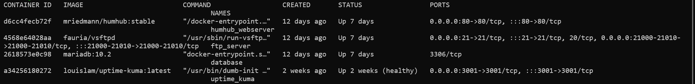

# محیط تست شخصی (بر بستر XAMPP و Windows)
<h2 align="right">XAMPP</h2>

در میان ابزار‌های راه‌اندازی سرور تست، XAMPP نامی آشناست. یک بسته نرم‌افزاری متن‌باز و رایگان که شامل Apache، MySQL، PHP و Perl می‌باشد و برای راه‌اندازی وب‌سرورهای محلی طراحی شده است. این ابزار برای توسعه‌دهندگان وب بسیار مناسب است زیرا به آنها امکان می‌دهد تا وب‌سایت‌ها و برنامه‌های وب خود را به‌صورت محلی بر روی سیستم خود تست و توسعه دهند، بدون نیاز به داشتن یک سرور اینترنتی واقعی. این مزیت بزرگ XAMPP باعث می‌شود که توسعه‌دهندگان بتوانند تغییرات را به سرعت اعمال و آزمایش کنند، خطاها را شناسایی و رفع نمایند و قبل از انتشار نهایی از عملکرد صحیح وب‌سایت یا برنامه خود اطمینان حاصل کنند. از دیگر مزایای آن اجرا بی‌دردسر در سیستم‌عامل ویندوز و اجرای ۳ عضو از چهار عضو از اعضای LAMP Stack (**A**pache, **M**ySQL, **P**HP) بدون هیچ‌گونه دردسر و فقط با یک کلیک است

### نصب
برای نصب XAMPP به [سایت](https://www.apachefriends.org/) آن رفته و ورژن مناسب HumHub را دانلود و نصب می‌کنیم. برای نصب آن، لازم است تا به صورت Run as Administrator اجرا کرده و پس از نصب، آن را همواره به صورت Run as Administrator اجرا می‌کنیم. سپس مسیر پوشه php در محل نصب XAMPP را به Environment Variables اضافه کرده. برای حصول اطمینان از نصب درست php بر روی سیستم خود، با دستور `php -V` در cmd، اطلاعاتی مطابق زیر را خواهیم داشت که نشان‌دهنده نصب درست php است:


پس از آن، با اجرا کنترل پنل XAMPP می‌توانیم Apache و MySQL را راه‌اندازی کنیم:


## Configuration & HumHub Deployment

برای نصب HumHub ابتدا به [سایت هام هاب](https://www.humhub.com/en/) رفته و به کمک [داکیومنت نصب](https://docs.humhub.org/docs/admin/requirements/) به مسیر [پروژه در گیتهاب](https://github.com/humhub/humhub) رفته و با کپی کردن لینک آن، آن را در cmd مسیر `D:\xampp\htdocs` به صورت زیر و به صورت محلی، clone می‌کنیم:
```
 git clone https://github.com/humhub/humhub
```

در ادامه نیازمند اضافه کردن مجموعه‌ای از extentionها به php نصب شده هستیم که برای این کار فایل php.ini را باز کرده و تغییرات زیر را در آن اعمال می‌کنیم:


سپس با restart کردن Apache و MySQL، به آدرس `http://localhost/phpmyadmin` رفته تا پایگاه داده‌ای، از طریق منوی New، برای HumHub بسازیم.
سپس `Composer-Setup.exe`  را از [این لینک](https://getcomposer.org/download/) دانلود کرده. پس از دانلود، آن را با فعال‌سازی Developer Mode و با دادن مسیر php، نصب می‌کنیم. مسیر پوشه HumHub در محل نصب XAMPP را در cmd باز کرده و دستور زیر را جهت اعمال نصب composer برای HumHub، اجرا می‌کنیم:
```
composer install
```
 سپس آدرس `http://localhost/humhub` را در مرورگر وارد کرده و پس از setup اولیه آن، HumHub ما به صورت کامل و local، آماده است.

## XDebug Setup
[داکیومنت نصب XDebug](https://xdebug.org/docs/install)
[نصب در ویندوز به کمک wizard](https://xdebug.org/wizard)
به کمک وارد کردن این آدرس در مرورگر http://localhost/dashboard/phpinfo.php اطلاعات مربوط به php خود را دریافت کرده و با copy و paste کردن آن در صفحه wizard می‌توانیم XDebug مناسب php و سیستم خود را دریافت و تنظیم کنیم.
سپس فایل دانلود شده را به پوشه ````xampp\php\ext```` منتقل کرده و نام آن را `php_xdebug.dll` می‌گذاریم.
در ادامه، فایل php.ini را باز کرده و خطوط زیر را جهت تنظیم xdebug به آن اضافه می‌کنیم:
````bash
[xdebug]
zend_extention = "D:\xampp\php\ext\php_xdebug.dll"
xdebug.mode = profile
xdebug.start_with_request = yes
xdebug.output_dir = "C:\Users\User\Desktop\Test"
xdebug.profiler_output_name = callgrind.out.%p
````
>[!tip] Aryan
>یه سری توضیح ریز برای هر خط توی یه ویس یا نوشته برای مریم بفرست - یه اشاره‌ای باید بشه که مشابه همه اینا رو پایین‌تر برای پیاده‌سازی روی سرور هم داریم


>[!tip] Maryam
>بر اساس گفته‌های آرین، توضیحات مربوط به هر خط تعریف شده بالا باید کامل بشه 
>این توضیحات دقیقا همینجوری یا مشابهشون برای بخش XDebug سرور هم هستن.

پس از این می‌توانیم با [فعال‌سازی افزونه XDebug در Chrome](https://chromewebstore.google.com/detail/xdebug-helper/eadndfjplgieldjbigjakmdgkmoaaaoc?hl=en)، فایل‌های خروجی callgrind را جهت بررسی در QCachegrind داشته باشیم.


جهت حصول اطمینان از نصب صحیح XDebug نیز در cmd دستور `php -V` را وارد کرده و گزارشی به صورت زیر به ما نمایش داده می‌شود:


به کمک xdebug.info به اطلاعات جزئی xdebug دسترسی خواهیم داشت:


هر یک از featureها متناظرا رو به روی خود لینک documentation خود را دارند.
(قابلیت فعال و مورد نیاز ما، profiler است و لینک آن https://xdebug.org/docs/profiler می باشد.)

### Locust Installation

با کمک گرفتن از [لینک‌ داکیومنت نصب Locust](https://docs.locust.io/en/stable/installation.html) و [لینک داکیومنت راه‌اندازی آن](https://docs.locust.io/en/stable/quickstart.html) جلو می‌رویم.

با فرض نصب داشتن پایتون، در cmd 
`pip install locust`
را برای نصب locust وارد میکنیم.
سپس برای حصول اطمینان از نصب آن، 
`locust -V`
را در cmd نوشته و خواهیم داشت:


در ادامه، برای تست یک فایل با نام 'locustfile.py' ایجاد میکنیم و کد زیر را در آن مینویسیم:

````python
from locust import HttpUser, task

class HelloWorldUser(HttpUser):
    @task
    def hello_world(self):
        self.client.get("/hello")
        self.client.get("/world")
````
در cmd به پوشه فایل مذکور رفته و فایل ساخته شده با دستور
`locust -f locustfile.py`
به صورت زیر اجرا میکنیم:


به آدرسی نوشته شده (http://localhost:8089) رفته و منویی مطابق زیر خواهیم داشت:
![[Pasted image 20240701134619.png]]
حال میتوانیم با اعمال سناریوهای مد نظر بر روی HumHub به کمک locust، خروجی های مناسب XDebug را دریافت کرده و آن ها را برای تحلیل به KCacheGrind دهیم.

## Server Linux/Docker (Production Deployment)

### Server & Domain
سرور و لینک فعال و قابل‌دسترس پروژه:
```
debian@188.121.107.234
Arvan Cloud
Collabra.yaramsn.lol
```
برای بالا آوردن پروژه روی سرور، روش‌های مختلفی از جمله امتحان کردن سرورهای fedora و ubuntu را در پیش گرفتیم. سپس در debian و با اضافه کردن repository آن، بررسی کرده که در مقایسه با سیستم‌های عامل مذکور پایداری بیشتری در پیاده‌سازی داشتیم. 
لازم به ذکر است که debian، بر خلاف ubuntu با نداشتن snap package manager، نصب یکپارچه‌تری را داراست.
با اضافه کردن ریپازیتورهای ubuntu به debian 
>[!tip] Aryan
>گفتی داکیومنت می‌فرستی
>یه پروسه‌ای طی شد تا داکر اضافه بشه...

سپس در لیست mirrorهای داکر، mirror متعلق به ابر آروان را برای نصب imageها اضافه کردیم. این کار به این دلیل بود که mirrorهای دیگر از سرورهای ابر آروان که در ایران هستند، کارایی نداشتند.
(انتخاب ابر آروان به عنوان سرویس ارائه‌دهنده خدمات مورد نظر، به دلیل قیمت پایین و هزینه ساعتی، وجود سرورها در داخل ایران و عدم امکان ایجاد مشکلاتی مانند فیلترینگ و سرعت پایین است.)
برای تنظیم دامنه برای پروژه نیز از دامنه یکی از هم‌گروهی‌ها استفاده کردیم و برای این کار زیردامنه‌ای از دامنه ایشان، به عنوان آدرس شبکه اجتماعی ما جهت دسترسی راحت‌تر و با آدرس به شبکه اجتماعی، اختصاص یافت. این کار توسط ایشان و تبدیل سرور خود به DNS سرور برای سرور پروژهُ عملی شد.
### Docker
از داکر به دلیل قابلیت portability، پایداری و مقیاس‌پذیری بالا برای پیاده‌سازی شبکه اجتماعی در محیط‌ها و سرورهای متفاوت استفاده کردیم. استفاده از داکر باعث شد تا در صورت وجود هر مشکل، با حداقل زمان این شبکه اجتماعی را در سرورها و با تنظیمات متفاوت بالا بیاوریم.
لازم به ذکر است که اتفاقاتی که در هر image از داکر رخ می‌دهند، مختص به همان deployment هستند و تنها عناصر مرتبط با ماژول‌های هسته امکان ایجاد مشکل دارند. فارغ از این بخش، تمام عناصر موجود در user space به صورت image به image کپی می‌شوند.
### Installation
>[!tip] Aryan
>اطلاعاتش باید از بالا دست‌چین بشن یه بخشیشون بیان پایین ولی نمی‌دونم کدوما... :))
### Docker Image
در این مرحله نیازمند یافتن Docker Imageهای مناسب هستیم تا طراحی این بخش علاوه بر سایر بخش‌ها، بر عهده خودمان نباشد. در این صورت، پس از یافتن Docker Imageهای مناسب و اتصال آن‌ها به یکدیگر، قادر به بالا آوردن سرویس HumHub خواهیم شد.
روشی که در ابتدا در پیش گرفته بودیم، ساخت تعداد زیادی container بود که در طی زمان و کار کردن با آن، متوجه شدیم که خاموش و روشن کردن همه این‌ها در هر مرحله پروسه طولانی، زمان‌بر و غیربهینه‌ای است که منجر به طولانی شدن flagها نیز می‌شد (اجرای commandها طولانی و گیج‌کننده). در نتیجه از docker compose استفاده کردیم که با تعریف یک فایل به صورت declarative و تعیین کننده imageهایی که قرار است بالا بیایند، به روشی بهینه‌تر رسیدیم.
لازم به ذکر است که در این پروژه، سه image داریم که دوتا از آن‌ها اصلی و دیگری نقش کمک‌کننده را ایفا می‌کند.
در ادامه، image اصلی متعلق به HumHub به صورت زیر می‌باشد:


که با php fpm و nginnx ساخته شده.
مزیت استفاده از این image، این است که در صورت تعریف ورژن جدید توسط توسعه‌دهنده می‌توانیم به سرعت آن را به روز کنیم.
نامی برای این container انتخاب کردیم:


>[!tip] Maryam
>ویس سوم آرین توضیخات کامل این بخشا رو داره که اگه جاییش مبهمه می‌تونی به من یا خود آرین بگی


ضعف در پیاده‌سازی داریم چون یوزر و پسورد رو Environment Variable تعریف کردیم:


![[Pasted image 20240707030958.png]]
>[!tip] Maryam
>ویس سوم آرین که داره راجع به عدم امنیت توی این حالت تعریف می‌گه

## Web Server (HumHub/Nginx)
### Database

برای پایگاه داده از MariaDB استفاده شده است.(از MySQL نیز میتوان استفاده کرد و تفاوتی زیادی باهم ندارند) 
>[!tip] Maryam
>ویس سوم آرین - توضیحات مربوط به دیتابیس که هر بخش و دلیل وجودش رو توضیح می‌ده
>هم می‌شه از MySQL استفاده کرد هم mariaDB
>چون MariaDB متن باز هستش انتخاب کردیم
>Search difference between MySQL and MariaDB
>سرچشو بدیم آرین چون گفت خودش دوست داره بخونه راجع بهش D: 


![[Pasted image 20240707030454.png]]
این بخش جزئی از شبکه collabra-net است که پایگاه داده و HumHub بتوانند به صورت مستقیم با هم در ارتباط باشند.

### FTP Server

>[!tip] Maryam
>ویس سوم - توضیحات مربوط به ftp
>توضیح هر بخش و پورتاش ویس چهارم
>توضیحات مربوط به شبکه اضافه به نظرم میان. می‌تونی ردشون کنی.
>فقط هر چیزی که توی کد نوشته شده، توضیحش باشه کافیه 3>

دلیل اصلی به کار بردن ftp، نیاز به استخراج فایل‌های profiling به صورت مجموعه چندتایی و بررسی آن‌ها است.


>[!tip] Aryan
>لینک داکر ftp رو باید بیاری این جا

>[!tip] Aryan
>توی ویست این پایینی رو این جا گفتی ولی نمی‌دونم کجا باید باشه. توضیحاتشم خودت لطفا اضافه کن چون چیزی به جز ترجمه کامنتش به ذهنم نمی‌رسه.
```bash
# connect to container
sudo docker exec -it humhub_webserver /bin/sh

# get tail log of the container 
sudo docker logs ghavi-test-humhub-1 -n 100 -f
```

>[!tip] Aryan
>راجع به اینا آخرای ویس ۴ توضیح دادی ولی نمی‌دونم جاش توی داکیومنت کجاست. جاش رو مشخص کن و کامنت زیر که واسه مریم هستش رو هم ببر کنارش

>[!tip] Maryam
>آخرای ویس ۴ یه سری توضیح سرسری داریم که باتوجه به درجه اهمیتش، همونا کافین


## Docker Compose
### Clean up
به کمک دستورات زیر، می‌توانیم فضای سرور را از اطلاعات و داده‌های ایجاد شده توسط Docker و داخل containerها خالی کنیم.
در واقع، پس از مدتی ممکن است حجم اطلاعات موجود در Docker بر روی سرور به اندازه‌ای زیاد شود که در اجرای تست‌ها و آزمایشات دچار مشکل شویم. در این حالت از دستورات زیر برای پاک کردن‌ build cacheها و cacheهای Docker استفاده می‌شود.
لازم به ذکر است که این دستورات، برای پاک کردن logها و محتوای داخل containerهای عملیاتی نیستند و تنها در صورت وجود چند deployment اشتباه از Docker، فایل‌های cache سیستمی Docker را پاک می‌کند.
>[!tip] Maryam
>مربوط به ویس ۵ هستش که همه رو نوشتم فقط باید با توانایی‌هات متنش رو استاندارد کنی =)

<div dir="ltr">

```bash
#!/bin/bash

echo "Starting Docker cleanup process..."

# Remove all stopped containers
echo "Removing stopped containers..."
docker container prune -f

# Remove unused images
echo "Removing dangling images..."
docker image prune -f

# Remove unused volumes
echo "Removing unused volumes..."
docker volume prune -f

# Remove unused networks
echo "Removing unused networks..."
docker network prune -f

# Remove build cache
echo "Removing build cache..."
docker builder prune -f

echo "Cleanup complete!"

# Display current Docker disk usage
echo "Current Docker disk usage:"
docker system df
```

</div>

### Nginx Configuration
>[!tip] Maryam
>مربوط به نیمه اول ویس ۶
>اکثرش رو نوشتم فقط یه دور گوش بده ببین اگه جمله‌بندی بهتری داری با توجه به حرفای آرین، لحاظش کنی یا کلا در راستای طولانی‌تر کردن متن قدم برداری :-:

بر اساس بررسی‌های به عمل آمده در فازهای قبل و در طول این فاز، دریافتیم بخشی از فایل‌هایی که حاوی اطلاعات محرمانه مانند رمز عبور، نسخه به کار رفته از تکنولوژی‌های استفاده‌شده و... مخفی نیستند و احتمال درز به بیرون برای آن‌ها وجود دارد. از جمله این فایل‌ها composer.lock است که همان طور که ذکر شد، حاوی رمز عبور به صورت آشکار است. با توجه به این که امکان نشت اطلاعاتی مانند رمز عبور و نسخه‌های deployement به واسطه لو رفتن این فایل وجود دارد، درصدد حل این مشکل برآمدیم.
برای حل ابتدا از روش `403Forbidden` استفاده شد تا در صورتی که فردی تمایل به دسترسی به فایل nginx.conf داشت، با ارور عدم اجازه دسترسی یا همان 403Frobidden مواجه می‌شد. در ادامه متوجه شدیم که این پیغام، خود می‌تواند فرد مهاجم را از وجود چنین فایلی مطلع کند و فرد تلاش کند تا به هر صورت به محتوای این فایل دسترسی پیدا کند.
در نتیجه تصمیم به جایگزینی ارور با 404 گرفته که در صورت تقاضا برای دسترسی توسط مهاجمین، با ارور عدم وجود چنین فایلی مواجه شوند که به ظاهر مناسب نبود.
در روندی دیگر، در راستای ایجاد Wormwhole path قدم برداشته تا در صورت مواجهه با ارور 404، ارور 404 متعلق به nginx نباشد تا مهاجک یا کاربران متوجه block list نشوند.
این کار به صورت زیر در فایل `nginx.conf` انجام شد:
```bash
#!/bin/sh

# Other setup commands...

# Add blacklist configuration to nginx.conf
sed -i '/index index.php index.html;/r /dev/stdin' /etc/nginx/nginx.conf << EOF

        # Blacklist files
        location ~* \/(CHANGELOG.md|CONTRIBUTING.md|Gruntfile.js|LICENSE|LICENSE.AGPL-3.0-or-later|README.md|SECURITY.md|composer.json|composer.lock|package-lock.json|package.json) {
            rewrite ^(.*)$ /wormhole last;
        }
EOF

# Reload nginx configuration
nginx -s reload
```

## XDebug Setup
 
در نسخه Docker برای نصب xdebug ما از script زیر استفاده می‌کنیم که در ابتدا یک package manager php به نام pecl را در alpine linux که سیستم عامل docker image  وب‌سرور ماست نصب می‌کند، سپس، با کمک آن، به نصب xdebug می‌پردازیم. در انتها، یک پوشه برای خروجی لاگ‌ها می‌سازیم که این پوشه، در آدرس docker volume ای مشترک با container مربوط به FTP قرار گرفته تا یک deployment مبتنی بر microservice را ایجاد کند. در پایان به پروسه‌ها دسترسی کامل به این پوشه را می‌دهیم.

```sh
apk update # alpine package manager
apk add php-pear php81-dev build-base linux-headers # stuff needed for compiling xdebug
pecl install xdebug # installation of xdebug
mkdir /log
touch /log/xdebug.log
chmod 777 -R /log
chmod 777 /log/xdebug.log
```

سپس با دستور `sudo docker exec -it humhub_webserver_container_name /bin/sh` وارد کانتینر humhub می‌شویم و  با دستور `vi /etc/php81/php.ini` فایل کانفیگ php در container را ادیت می‌کنیم تا این موارد را به آن اضافه کنیم.

<div dir="ltr">

```bash
[xdebug]
zend_extension = "/usr/lib/php81/modules/xdebug.so"
xdebug.mode = profile
xdebug.log = /log/xdebug.log
xdebug.start_with_request = trigger
xdebug.output_dir = "/log"
xdebug.profiler_output_name = callgrind.out.%p
```

</div>

در نسخه‌های جدید xdebug نیاز به کانفیگ‌های مربوط به ریموت نیست، همچنین چون در اینجا ما با یک ستاپ آنلاین مواجه هستیم، بهتر است از trigger با Secret استفاده کنیم، یعنی نه تنها باید یک cookie را ست کنیم تا پروسه پروفایلینگ آغاز شود، بلکه باید حتما محتوی کوکی توسط سرور تایید شود. این رویکرد پیچیده‌تر به دلیل آنلاین بودن این سرویس لازم است، برخلاف رویکرد deployment در XAMPP که به دلیل آفلاین بودن می‌توانستیم آن را فقط روی trigger ست کنیم یا حتی به سادگی روی yes بگذاریم تا هر بسته‌ای را پروفایل کند.

البته روش‌های دیگری نیز برای این کار وجود دارد که در بخش بعد به تفصیل به آن خواهیم پرداخت

### حالت‌های اجرای XDebug

 خوشبختانه Xdebug دارای چندین حالت اجرا است که هر کدام برای هدف خاصی طراحی شده‌اند. حالت "debug" برای عیب‌یابی کد استفاده می‌شود و امکان اجرای خط به خط کد را فراهم می‌کند. حالت "trace" برای ردیابی فراخوانی توابع و متدها به کار می‌رود. حالت "profile" برای تحلیل عملکرد و بهینه‌سازی برنامه استفاده می‌شود و اطلاعات مربوط به زمان اجرا و مصرف منابع را جمع‌آوری می‌کند. حالت "coverage" برای بررسی پوشش کد در تست‌ها به کار می‌رود. حالت "develop" ترکیبی از قابلیت‌های مفید برای توسعه‌دهندگان را ارائه می‌دهد. این حالت‌ها را می‌توان از طریق تنظیمات php.ini یا به صورت پویا در زمان اجرا فعال کرد، و می‌توان چندین حالت را همزمان فعال نمود تا از مزایای هر کدام بهره‌مند شد.

اجزای مورد بررسی ما در این جا بیشتر دو حالت debugging (حالت پیش‌فرض) و حالت profiling است.

<ul>
<li>
<strong>
حالت خطایابی (Debugging Mode):
</strong>
<ul>
<li>
هدف: یافتن و رفع خطاها در کد
</li>
<li>
عملکرد: اجازه می‌دهد برنامه را خط به خط اجرا کنید
</li>
<li>
قابلیت‌ها:
<ul>
<li>
تنظیم breakpoint
</li>
<li>
بررسی مقادیر متغیرها در زمان اجرا
</li>
<li>
اجرای گام به گام کد
</li>
</ul>
</li>
<li>
تنظیم در php.ini: xdebug.mode=debug
</li>
</ul>
</li>
<li>
<strong>
حالت بررسی اجرا (Profiling Mode):
</strong>
<ul>
<li>
هدف: بهینه‌سازی عملکرد برنامه
</li>
<li>
عملکرد: اطلاعات مربوط به زمان اجرا و مصرف منابع را جمع‌آوری می‌کند
</li>
<li>
قابلیت‌ها:
<ul>
<li>
اندازه‌گیری زمان اجرای توابع
</li>
<li>
تشخیص نقاط کند برنامه
</li>
<li>
بررسی مصرف حافظه
</li>
</ul>
</li>
<li>
تنظیم در php.ini: xdebug.mode=profile
</li>
</ul>
</li>
<li>
<strong>
تفاوت‌های کلی:
</strong>
<ul>
<li>
هدف:
<ul>
<li>
Debugging: برای یافتن خطاها و رفع آن‌ها
</li>
<li>
Profiling: برای بهبود کارایی و عملکرد برنامه
</li>
</ul>
</li>
<li>
خروجی:
<ul>
<li>
Debugging: معمولاً تعاملی است و در IDE نمایش داده می‌شود
</li>
<li>
Profiling: معمولاً یک فایل خروجی تولید می‌کند که باید با ابزارهای دیگر تحلیل شود
</li>
</ul>
</li>
<li>
تأثیر بر عملکرد:
<ul>
<li>
Debugging: می‌تواند اجرای برنامه را کند کند، زیرا اجازه توقف و بررسی می‌دهد
</li>
<li>
Profiling: تأثیر کمتری بر سرعت اجرا دارد، اما همچنان باعث کاهش عملکرد می‌شود
</li>
</ul>
</li>
<li>
زمان استفاده:
<ul>
<li>
Debugging: معمولاً در مراحل توسعه و تست استفاده می‌شود
</li>
<li>
Profiling: اغلب در مراحل بهینه‌سازی و قبل از انتشار نهایی استفاده می‌شود
</li>
</ul>
</li>
<li>
مهارت‌های مورد نیاز:
<ul>
<li>
Debugging: نیاز به درک عمیق از جریان اجرای برنامه دارد
</li>
<li>
Profiling: نیاز به درک مفاهیم عملکرد و بهینه‌سازی دارد
</li>
</ul>
</li>
</ul>
</li>
</ul>

### مکانیزم فعال‌سازی (ماشه)

1. GET/POST parameter: XDEBUG_PROFILE

   To use this method, you add XDEBUG_PROFILE to your URL or POST data:
   
<div dir="ltr">

```
https://your-site.com/your-page?XDEBUG_PROFILE
```

</div>

   This is useful for profiling specific pages or requests on demand.

2. Cookie: XDEBUG_PROFILE

   You can set a cookie named XDEBUG_PROFILE. The value doesn't matter, its presence triggers profiling. This method allows you to profile multiple pages in a session:

<div dir="ltr">

```php
setcookie('XDEBUG_PROFILE', '1', time() + 3600, '/');
```
</div>

   Many browser extensions exist to easily toggle this cookie.

3. Environment variable: XDEBUG_PROFILE=1

   This method is typically used in CLI environments or when you want to profile an entire application:

<div dir="ltr">

```bash
export XDEBUG_PROFILE=1
php your-script.php
```
</div>

این مورد بیشتر برای پروفایل کردن کد با کمک ابزار‌های خط فرمانی یا در کانتینر به کار می رود.

هم‌اکنون اگر xdebug به درستی تنظیم شده باشد، باید بتوانید با هر یک از این روش‌ها شروع به پروفایل کردن کنید، اگر از مرورگر استفاده می‌کنید، می‌توانید با نصب افزونه `xdebug helper` پروسه تنظیم کوکی xdebug را آسان‌تر کنید. یا با چسباندن یک `?XDEBUG_PROFILE` به انتهای هر درخواست که در آن کنترل کوکی به دست شما نیست، به این مهم دست یابید.

### Health Check & Monitoring

#### Uptime Kuma

آپتایم کوما (Uptime Kuma) یک ابزار نظارت بر وضعیت سرور و خدمات است که به صورت متن‌باز توسعه داده شده است. این نرم‌افزار به کاربران امکان می‌دهد تا به طور مداوم وب‌سایت‌ها، سرورها، و سرویس‌های مختلف را بررسی کنند و از در دسترس بودن آنها اطمینان حاصل کنند. آپتایم کوما با رابط کاربری ساده و زیبای خود، امکان نظارت بر خدمات مختلف را از طریق پروتکل‌هایی مانند HTTP(S)، TCP، Ping و غیره فراهم می‌کند.

یکی از ویژگی‌های برجسته آپتایم کوما، قابلیت ارسال هشدار در صورت بروز مشکل است. این نرم‌افزار می‌تواند از طریق ایمیل، پیامک، تلگرام و سایر پلتفرم‌های پیام‌رسان، کاربران را از قطعی سرویس یا مشکلات احتمالی آگاه سازد. علاوه بر این، آپتایم کوما امکان ایجاد گزارش‌های دقیق از وضعیت سرویس‌ها، زمان پاسخگویی و درصد در دسترس بودن آنها را فراهم می‌کند.

نصب و راه‌اندازی آپتایم کوما بسیار ساده است و می‌تواند به راحتی روی سرورهای شخصی یا فضاهای ابری نصب شود. این نرم‌افزار از داکر (Docker) پشتیبانی می‌کند که نصب و به‌روزرسانی آن را آسان‌تر می‌کند. با توجه به متن‌باز بودن آپتایم کوما، کاربران می‌توانند آن را متناسب با نیازهای خود تغییر دهند و در توسعه آن مشارکت کنند. این ویژگی‌ها باعث شده است که آپتایم کوما به یکی از محبوب‌ترین ابزارهای نظارت بر وضعیت سرویس‌ها در میان توسعه‌دهندگان و مدیران سیستم تبدیل شود.

در پیاده‌سازی خود،‌ ما سرور دیگری را برای uptime kuma استفاده کردیم تا از قابلیت اطلاع‌رسانی در تلگرام آن استفاده کنیم و در گروه از وضعیت پروژه مطلع شویم. به مانند باقی پروژه uptime kuma نیز با کمک docker compose دیپلوی شده ولی به دلیل فیلترینگ تلگرام،‌ در یک VPS خارج از کشور آن را دیپلوی کردیم تا استفاده از API تلگرام برای آن مقدور باشد

آدرس deployment:

http://up.yaramsn.lol


#### Docker Healthchecks

ساختار Docker Health Checks یک مکانیزم داخلی در Docker است که به شما امکان می‌دهد وضعیت سلامت کانتینرها را به صورت دوره‌ای بررسی کنید. این قابلیت به شما اجازه می‌دهد تا دستورات یا اسکریپت‌هایی را تعریف کنید که به طور منظم در داخل کانتینر اجرا می‌شوند تا مطمئن شوید که سرویس درون کانتینر به درستی کار می‌کند. اگر این بررسی‌ها شکست بخورند، Docker وضعیت کانتینر را به عنوان "ناسالم" علامت‌گذاری می‌کند، که می‌تواند برای اتخاذ اقدامات لازم مانند راه‌اندازی مجدد کانتینر یا هدایت ترافیک به یک نمونه سالم استفاده شود.

مثالی از نحوه مشخص شدن سالم یا ناسالم بودن container در خروجی `sudo docker ps`


مثالی از خروجی در مراحل توسعه کولابرا که در آن می‌توان دید وضعیت uptime kuma سالم گزارش شده (در اینجا healthcheck برای هام‌هاب ستاپ نشده و uptime kuma همجنان در سرور ابرآروان است)



برای استفاده از Docker Health Checks، می‌توانید آن‌ها را در Dockerfile یا در فایل docker-compose.yml تعریف کنید. در Dockerfile، از دستور HEALTHCHECK استفاده می‌کنید، به عنوان مثال: `HEALTHCHECK CMD curl --fail http://localhost:8080 || exit 1`. در docker-compose.yml، می‌توانید بخش healthcheck را به تعریف سرویس اضافه کنید. به عنوان مثال:

```yaml
services:
  web:
    image: nginx
    healthcheck:
      test: ["CMD", "curl", "-f", "http://localhost"]
      interval: 30s
      timeout: 10s
      retries: 3
      start_period: 40s
```

در این مثال، 'test' دستور بررسی سلامت را مشخص می‌کند، 'interval' فاصله زمانی بین بررسی‌ها را تعیین می‌کند، 'timeout' حداکثر زمان انتظار برای هر بررسی را مشخص می‌کند، 'retries' تعداد دفعات تلاش مجدد قبل از اعلام ناسالم بودن کانتینر را تعیین می‌کند، و 'start_period' مدت زمانی را مشخص می‌کند که کانتینر برای راه‌اندازی اولیه نیاز دارد و در این مدت شکست‌های health check نادیده گرفته می‌شوند. با استفاده از این قابلیت، می‌توانید اطمینان حاصل کنید که کانتینرهای شما نه تنها در حال اجرا هستند، بلکه به درستی نیز کار می‌کنند و health check را برای هر سرویس در فایل docker-compose به صورت جداگانه و متناسب با نیازهای آن سرویس تنظیم کنید.

#### تفاوت‌های Uptime Kuma و Docker Healthcheck در یک نگاه

| Uptime Kuma | Docker Healthchecks | ویژگی |
| ----------- | ------------------- | ----- |
| نظارت و هشدار خارجی | تأیید سلامت کانتینر | هدف اصلی |
| معمولاً نقاط پایانی خارجی | داخل کانتینر | محدوده |
| هشدارها، اعلان‌ها | می‌تواند کانتینر را راه‌اندازی مجدد کند، بر زمان‌بندی تأثیر بگذارد | اقدام در صورت شکست |
| ابزار مستقل | ادغام شده با اکوسیستم Docker | ادغام |
| از طریق رابط کاربری Uptime Kuma | در Dockerfile یا docker-compose.yml | پیکربندی |
| انواع مختلف بررسی (HTTP, TCP و غیره) | هر دستور یا اسکریپتی که می‌تواند در کانتینر اجرا شود | سفارشی‌سازی |
| گزارش‌های دقیق زمان فعالیت و آمار | وضعیت سلامت اولیه (سالم/ناسالم) | گزارش‌دهی |
| فرآیند/کانتینر جداگانه | درون کانتینر هدف اجرا می‌شود | استفاده از منابع |
| نظارت کلی بر سرویس | سلامت خاص کانتینر | مورد استفاده |

more on xdebug