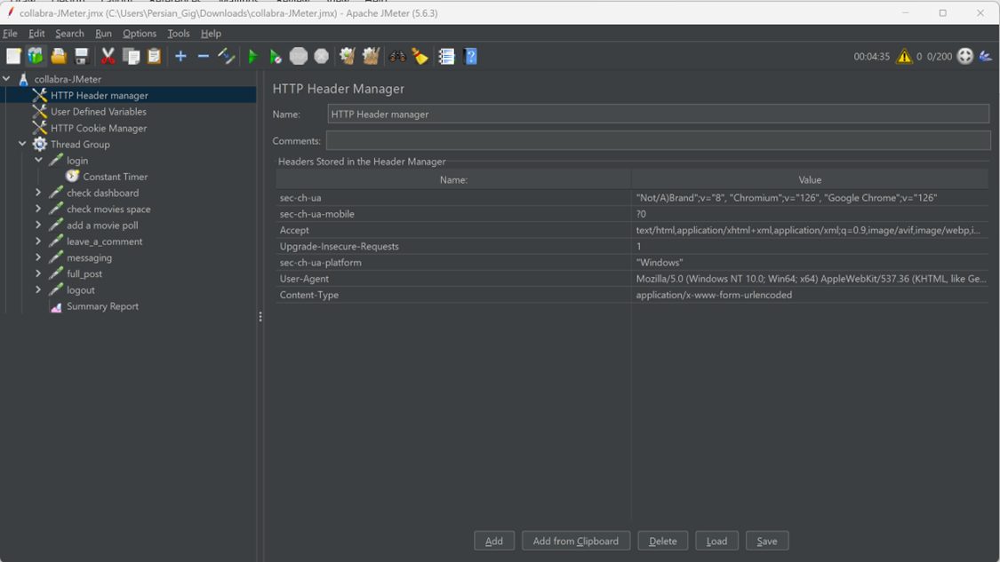

# بررسی Jmeter

ابزار JMeter یکی از نرم افزارهای منبع باز و محبوب شرکت Apache است. این ابزار با زبان جاوا توسعه پیدا کرده است و در لینوکس و مک و ویندوز به راحتی کار می کند. از این ابزار برای تست بار (Load testing) و بررسی عملکرد نرم افزار ها استفاده می شود. بوسیله JMeter می توان یک شبیه سازی اعمال بارِ سنگین روی یک سرور یا مجموعه ای از سرور ها ایجاد کرد تا عملکرد سرور را در مقدار بارهای مختلف مورد بررسی قرار داد. از مزیت های JMeter می توان به مواردی همچون قابلیت انجام و بررسی تست روی انواع برنامه ها و سرورها و پروتکل ها مانند HTTP, HTTPS, SOAP, FTP, JDBC, LDAP, SMTP, IMAP, TCP، قابلیت CLI، ارائه گزارش کامل HTML، اپن سورس بودن و قابلیت Full Multi-Threading اشاره نمود.

## توضیحات نصب JMeter

از پیش نیازهایی ستاپ این نرم افزار، نصب بودن جاوا بر روی سیستم می باشد. دلیل این امر، توسعه JMeter با زبان جاوا می باشد. بدین منظور می توانید از طریق [لینک](https://www.oracle.com/java/technologies/downloads/#java22 ) نسخه متناسب با سیستم عامل خود را دانلود و نصب کنید. حتما بررسی کنید که جاوا به path های سیستم اضافه شده باشد. بدین منظور می تواند در CMD ویندوز (یا محیط های مشابه در سایر سیستم های عامل) عبارت java -version را وارد کنید تا ورژن جاوا نصب شده بر روی سیستمتان را مشاهده کنید. نمونه ای از انجام این کار در تصویر زیر نمایش داده شده است.

پس از نصب جاوا، می توانید JMeter را نصب کنید. بدین منظور به وبسایت رسمی jmeter به [آدرس](https://jmeter.apache.org/download_jmeter.cgi) مراجعه می کنیم.

مطابق تصویر بالا از بخش Binaries فایل apache-jmeter-5.6.3.zip را دانلود میکنیم و در یک پوشه ای در سیستم extract می کنیم.

برای اجرای برنامه وارد پوشه bin شوید.

بر روی فایل jmeter.bat در ویندوز و jmeter.sh در لینوکس و مک کلیک کنید تا برنامه اجرا شود.
پس از کلیک، یک CMD باز می شود که تصویر آن را در زیر مشاهده می کنیم:

پس از اتمام کار، برنامه به شکل زیر باز می شود:

در صورتی که این پنجره برای شما باز شد، یعنی عملیات نصب و راه اندازی به درستی انجام شده است . با توجه به نیاز پروژه و نزدیک شدن نتایج تست های نرم افزار JMeter به تست های نرم افزار locust، نیاز به نصب برخی از اکستنشن ها داریم که این کار بوسیله jmeter plugins صورت می گیرد. برای نصب آن به [وبسایت](https://jmeter-plugins.org/ ) مراجعه کرده و مطابق تصویر زیر از طریق صفحه install، فایل plugins-manager.jar را دانلود نمایید.

سپس آن را در سورس برنامه و در آدرس lib/ext قرار دهید. برنامه را ببندید و دوباره اجرا کنید. در صورتی که مراحل را به درستی انجام داده باشید آیکون jmeter-plugins در سمت چپ و بالای برنامه قابل مشاهده می باشد.

بر روی آیکون jmeter plugins کلیک کنید تا صفحه زیر باز شود.

از بخش available Plugins، پلاگین های زیر را انتخاب نمایید و برروی Apply Changes and Restart JMeter کلیک کنید و منتظر بمانید تا عملیات نصب به درستی انجام شود.

- 	3 basic Graphs
-	5 Additional Graphs
-	Auto-stop Listener
-	Custom Thread Group
-	Dummy Sampler
-	PerfMon(Servers Performance Monitoring)
-	Weighted Switch Controller

پس از اتمام این مراحل، عملیات ستاپ JMeter به پایان میرسد و در بخش های بعدی به توضیحات بخش های اصلی برنامه و برخی پلاگین های موجود در مرورگر برای تهیه سناریوهای تست میپردازیم.

معرفی اجزا:

 1. Thread Group: 

به مجموعه‌ای از Threadها می‌گویند که هرکدام نشان‌دهنده یک کاربر در برنامه تحت‌تست هستند. این عنصر با استفاده از شبیه‌سازی درخواست‌های کاربر را مانند درخواست واقعی به سرور نشان می‌دهد. این بخش به شما اجازه می‌دهد تعداد کاربران را مشخص کنید تا تست دقیق‌تری تجربه کنید. برای مثال، با تنظیم صد Thread نرم‌افزار هم صد کاربر را شبیه‌سازی می‌کند.

**نحوه ایجاد Thread Group:** 
مطابق تصویر زیر، بر روی Test Plan کلیک راست کنید سپس بخش Threads(Users) و سپس Thread Group را انتخاب کنید تا یک Thread Group ایجاد شود.

2. Samplers: 

نرم افزار JMeter  برای انجام تست از پروتکل‌های مختلف مانند HTTP و FTP و JDBC پشتیبانی می‌کند. این گروه‌ها درخواست‌های کاربر (FTP ،HTTP و…) به سرور را شبیه‌سازی می‌کنند. درواقع، Thread Group به نمونه‌گیرها برای انتخاب نوع درخواست‌هایی (HTTP و FTP) که باید انجام شوند، کمک می‌کنند.

- **درخواست FTP:**
برای تست عملکرد روی سرور FTP، می‌توانید از نمونه‌گیر درخواست FTP در نرم‌افزار JMeter استفاده کنید. این کنترلر به شما اجازه می‌دهد یک درخواست آپلود یا دانلود به سرور FTP ارسال کنید.

- **درخواست HTTP:**
با استفاده از این کنترلر در نرم‌افزار JMeter، می‌توانید یک درخواست HTTP/HTTPS به وب سرور مدنظر ارسال کنید.

- **درخواست JDBC:**
تست عملکرد پایگاه داده با این کنترلر اجرا می‌شود. این کار را با ارسال یک درخواست JDBC به پایگاه داده می‌توان انجام داد.

- **سمپلر BSF:**
این سمپلر امکان نوشتن نمونه‌ای را با استفاده از زبان برنامه‌نویسی BSF فراهم می‌کند.

- **سمپلر Access Log:**
با استفاده از این سمپلر، علاوه‌بر ایجاد درخواست HTTP، می‌توانید با دسترسی به Logها آن‌ها را بخوانید.

- **سمپلر SMTP:**
برای ارسال ایمیل با پروتکل SMTP، از این سمپلر می‌توان استفاده کرد.

**توضیح کانفیگ اجزای یک HTTP Request:**

در بخش Protocol، پروتکل مد نظر خود را وارد نمایید که بصورت پیش فرض بر روی http قرار دارد. در بخش Server Name or IP، نام دامنه اصلی وبسایت را وارد نمایید. به عنوان [مثال](Collabra.yaramsn.lo). توجه کنید که https:// یا http:// قبل دامنه را نباید در این بخش وارد کنید. در صورتی پروژه را روی localhost اجرا کرده اید، نیاز است پورت را در بخش Port Number وارد کنید. در بخش HTTP Request باید نوع ریکوئست خود را (GET یا POST) مشخص نمایید. در قسمت Path، ادرس داخلی صفحه مورد نظر را وارد نمایید. به عنوان مثال user/auth/login . در بخش Parameters نیز می توانید پارامترهای مورد نیاز برای لاگین را وارد نمایید. به عنوان مثال نیاز است username، password و token csrf را وارد نمایید.

**نحوه ایجاد یک Sampler از نوع HTTP Request:**

بر روی Thread Group کلیک راست کنید و از طریق بخش Sampler، HTTP Request را انتخاب کنید. در صورتی که پروتکل متفاوت تری را در نظر دارید ، می توان از نوع دیگری از Sampler ها استفاده کنید.

3. Listeners:

این عناصر می‌توانند نتایج اجرای تست را نشان و آن‌ها را در قالب‌های مختلف مانند نمودار، جدول، درختی یا فایل log ارائه دهند.

در این عنصر:

1. زمان‌های پاسخ سرور در گراف به‌نمایش گذاشته می‌شوند.
2. نمایش به‌صورت درختی، درخواست کاربر را در قالب فرمت HTTP نمایش می‌دهد.
3. خلاصه‌ای از نتیجه تست را می‌توان در قالب جدول مشاهده کرد.
4. فایل لاگ نیز همان خلاصه نتایج را به‌صورت فایل متنی ارائه می‌دهد.

**نحوه ایجاد:**
برای هر Request می توانید یک Listeners جداگانه داشته باشد تا نتایج تست را مشاهده کنید. بدین منظور می توانید روی HTTP Request کلیک راست کنید و از بخش Listeners یک view Results tree یا نوع دیگری از Listeners ها را انتخاب نمایید.

4. configuration:

با استفاده از این عنصر می‌توان پیش‌فرض‌ها و متغیرهایی را برای استفاده‌های بعدی تعیین کرد؛ ازجمله:

- **داده پیکربندی‌شده CSV:**
با استفاده از این مجموع‌داده، می‌توان پارامترهای مختلف یک فایل متنی را خواند. همچنین، برای خواندن خطوط تقسیم‌بندی به متغیرها استفاده می‌شود.

- **مدیریت کوکی HTTP:**
کوکی HTTP مانند کاربرد کوکی در صفحات وب است. اگر درخواست HTTP حاوی کوکی باشد، این قسمت اطلاعات کوکی را برای استفاده‌های مجدد ذخیره می‌کند.

- **پیش‌فرض درخواست HTTP:**
این عنصر به شما امکان می‌دهد مقادیر پیش‌فرضی را تنظیم کنید که کنترل‌کننده‌های درخواست HTTP شما استفاده می‌کنند.

-**عنصر پیکربندی ورود:**
عنصر پیکربندی ورود به شما امکان می‌دهد تنظیمات نام کاربری و رمزعبور را در نمونه‌گیرها اضافه یا لغو کنید.

برای افزودن configurations برای هر Request یا Thread Group می توانید از بخش Config elements به انواع مختلفی از آن دسترسی داشته باشید.

Test Plan چیست؟

یکی از مراحل مهم‌ و ضروری‌ راه‌اندازی هر نرم‌افزاری تست عملکرد آن است. در این تست، بررسی می‌شود که نرم‌افزار زیر فشار چه واکنشی نشان می‌دهد: به کار خود ادامه می‌دهد یا دچار مشکل می‌شود. روی‌هم‌رفته، می‌توان گفت که Test Plan برای بررسی سرعت، قابلیت اطمینان، زمان پاسخ‌دهی و میزان مصرف منابع انجام می‌شود. هدف نهایی این تست شناسایی و حل مشکلات احتمالی هنگام استفاده از نرم‌افزار است. نرم‌افزار JMeter جایی است که عناصر موردنیاز برای تست را اضافه می‌کنیم. تمام عناصر (ThreadGroup) و(Timers) و تنظیمات مربوط به آن‌ها برای انجام تست مانند تصویر زیر ذخیره می‌شوند

**سه معیار مهم در تست عملکرد**

- 	تست سرعت: اینکه زمان پاسخ‌دهی مطابق با پیش‌بینی‌هاست یا خیر؟

- 	توانایی پاسخ‌دهی به درخواست‌ها: حداکثر توانایی به درخواست‌های کاربر چقدر است؟

- 	پایداری: برنامه چه میزان فشار را می‌تواند تحمل کند؟

فعالیت هایی که برای مشابه شدن نتایج حاصل از تست در jmeter و locust انجام شده اند:

بدین منظور نیاز است افزونه هایی را در jmeter نصب کنیم که لیست آنها در زیر آمده است. این افزونه ها شرایطی را فراهم می کنند تا مشابه locust بتوانیم تست فشار و لود را انجام دهیم.

-	3 basic Graphs
-	5 Additional Graphs
-	Auto-stop Listener
-	Custom Thread Group
-	Dummy Sampler
-	PerfMon(Servers Performance Monitoring)
-	Weighted Switch Controller

همچنین کلیه پارامتر ها (مانند مقدار spawn rate در تست لود)در هر دو اپ باید یکسان تنظیم شوند. نوع درخواست ها و URL ها باید به دقت چک شود و cache مربوط به هر دو اپ به درستی تنظیم شود. با توجه به نتایجی که در ادامه شرح خواهیم داد، نتایج بدست آمده در locust و jmeter بسیار به هم نزدیک شدند و می توان گفت این فعالیت ها موثر بوده اند.

**اجرای تست فشار و لود توسط jmeter بر روی شبکه هام هاب :**

مطابق تصویر زیر ابتدا یک Thread Group ایجاد می نماییم.

تعداد یوزری که درخواست را وارد میکنند 1000 و Ramp-up برابر 10 ثانیه درنظر گرفته شد.

**تنظیم برخی کانفیگ ها:**

در HTTP Header Manager داده های مربوط به هدر درخواست ها را قرار میدهیم تا نیاز نباشد آنها را در هر درخواست تنظیم کنیم . هدر شامل مواردی همچون user-agent و content type و غیره می باشد.

**HTTP Defined variables:**

در اینجا مقادیری را که در درخواست ها، از آنها زیاد استفاده می شود را به عنوان متغیر تعریف می کنیم و با استفاده از این متغیرها در درخواست ها ، به مقادیر دسترسی پیدا میکنیم. به عنوان مثال دامنه اصلی وبسایت شبکه اجتماعی هام هاب را با عنوان base_url ذخیره کردیم تا در تمامی درخواست ها از این متغیر به جای آدرس استفاده کنیم تا در صورت تغییر، ریفکتور کردن درخواست ها ساده تر باشد.

**HTTP Cookie Manager:**

برای تنظیم کوکی های مورد استفاده در تمامی ریکوئست ها کاربرد دارد. در اینجا کوکی های مربوط به xdebug را ست می کنیم تا در تمامی تست ها مورد استفاده قرار بگیرد.

در صورتی که بخواهیم xdebug_profile را غیر فعال کنیم و دیتاهای مربوط به آن ذخیره نشوند، کافی است در همین جا مقدار این کوکی را برابر صفر قرار دهیم.

سناریو های تعیین شده در مرحله بررسی با نرم افزار locust به شرح زیر می باشد:

-	لاگین کاربر 
-	بررسی داشبورد 
-	بررسی یک اسپیس (انجمن) 
-	اضافه کردن یک نظرسنجی 
-	اضافه کردن یک کامنت 
-	افزودن پیام 
-	لاگ اوت 

که برای هر یک از این سناریوها یک HTTP Request ساخته شد که در ادامه جزئیات برخی از آنان را توضیح خواهیم داد.

تمامی این سناریوها را به همان شکلی که در locust تست شدند، وارد میکنیم تا نتایج با هم یکسان شود. این موارد برخی از تلاش ها برای یکسان بودن نتایج در locust و jmeter می باشد.

**درخواست لاگین:**

مطابق تصویر، آدرس داخلی را در بخش path قرار میدهیم و داده های مورد نیاز را در بخش send parameters ارسال می کنیم. نوع درخواست را نیز از نوع post قرار می دهیم و تیک follow redirect را نیز می زنیم. تمامی داده ها نیز URL Encode فعال دارند.

**درخواست مشاهده داشبورد:**

این درخواست از نوع get می باشد و به ادرس داخلی dashboard خواهد رفت.

**درخواست add movie poll:**

**درخواست leave a comment:**

نتایج تست 180 کاربر با spawn rate برابر هر 3 ثانیه، یک یوزر و کوکی xdebug فعال:

مشاهده می کنیم که بطور میانگین حدود 6 درصد ارور برای برخی درخواست ها داریم. میانگین ریسپنانس تایم برابر 33.906 ثانیه بوده و بطور میانگین 22 کیلوبایت داده منتقل شده است. مطابق نتایج بدست آمده در locust، تست لود در jmeter نیز به میزان 170 تا 175 کاربر می تواند کلیه درخواست ها را به درستی پاسخ دهد و پس از آن رفته رفته دچار خطا می شود و نمیتواند پاسخگوی تمام درخواست ها باشد.
با توجه به تست های انجام داده شده ، شبکه هام هاب در سرور میتواند تا 170 کاربر را پاسخگو باشد اما همین میزان نیز بر اساس لود تست و soak test تا مدت زمان کوتاهی ( مثلا در حدود 5 دقیقه) ممکن است و سپس بدلیل مواردی چون پر شدن cache سرور، بازهم دچار fail شدن درخواست ها خواهیم شد. در stress test های انجام شده نیز، سرور تا 300 درخواست را به خوبی پاسخ داده (با ارور کمتر از 5درصد) اما از آن به بعد دچار مشکل می شود و پس از چند درخواست بعدتر(حدود 370)، down شده و نمی تواند پاسخگو باشد.

**نتایج stress test**

سرور تا 320 درخواست به خوبی پاسخ داد اما در همان لحظه دچار ارور شد و استرس تست به پایان رسید. میانگین زمان پاسخ 10.524 ثانیه بوده، بیشترین زمان 43.336 ثانیه و کمترین زمان پاسخ 1.717 ثانیه می باشد.

