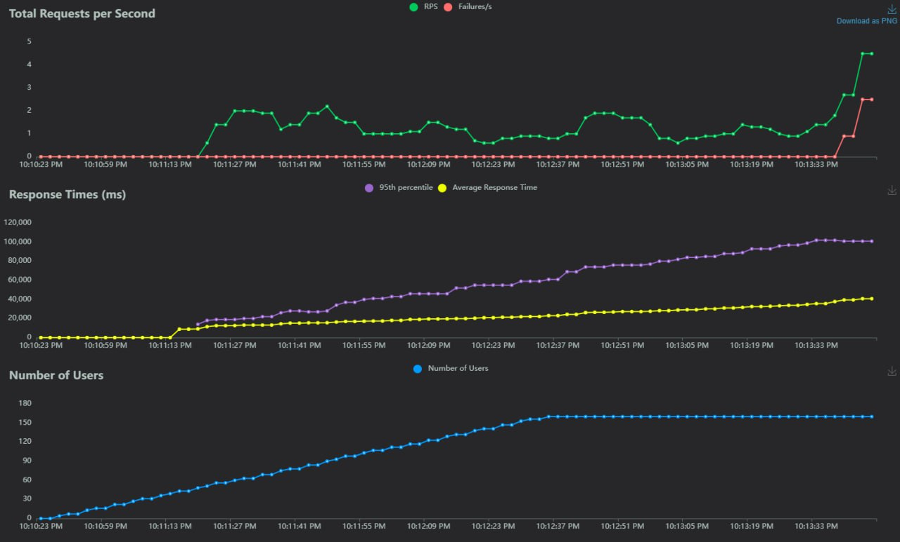
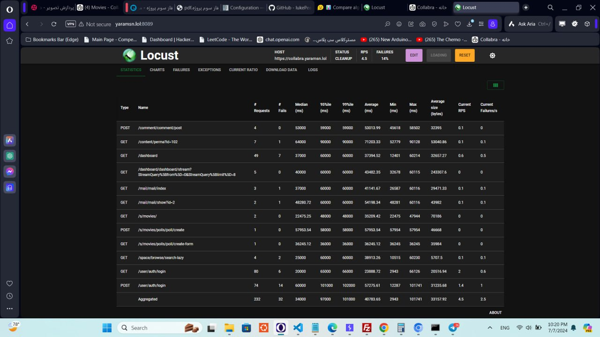

# نصب QCacheGrind (KCacheGrind)  

نرم‌افزار QCacheGrind را از [این لینک](https://sourceforge.net/projects/qcachegrindwin/) دانلود کرده و به صورت Portable و بدون نصب می‌توانیم از آن استفاده کنیم.
محیط این برنامه به صورت زیر می‌باشد:

  

در صورتی که فایل‌های خروجی XDebug را در این برنامه باز کنیم، نمودارها و نمایشی مانند زیر خواهیم داشت:

 

# توضیحات QCacheGrind (KCacheGrind)
https://kcachegrind.github.io/html/GUIAreas.html

توضیحات منوی این برنامه به شرح زیر می‌باشد:
 
(با فعال کردن گزینه % تمام زمان‌های ذکر شده در برنامه را به صورت نسبی خواهیم داشت.)
 

<b>Incl. (Inclusive Time):</b> زمانی که توسط تابع نوشته شده در این فایل صرف می‌کند تا اجرا شود.
 
<b>Self (Self Time):</b>زمانی که صرف اجرای کد درونی این فایل شده و بدون در نظر گرفتن زمان مصرف شده توسط سایر تابع های فراخوانی شده توسط آن
 
<b>Called:</b> تعداد دفعاتی که این تابع توسط سایر توابع فراخوانی شده است.
 
<b>Function:</b> نام تابع مورد بررسی
 
<b>Location:</b> محل قرارگیری فایل مورد بررسی
 
 
 

<b>Callers:</b> توابعی که تابع مد نظر را فراخوانی کرده‌اند.
 

که در منوی خود تعداد دفعات و زمان صرف‌شده را نیز نشان می‌دهد.
 
 

<b>All Callers:</b> همه توابعی که منجر به فراخوانی این تابع شده ان، فارغ از فاصله آن‌ها.
 

که در زیرمنوی Distance، می‌توان مشاهده نمود که چند مرحله فراخوانی انجام شده تا از تابع مورد نظر به تابع نمایش داده شده برسیم. (رابطه از نوع parent ،grandparent یا دورتر)
 
 

<b>Callee Map:</b> نمایشی بصری که در آن هر منطقه با فضایی که اشغال کرده، نشان‌دهنده زمان صرف شده برای آن تابع است.
 
 
 

<b>Callees:</b> توابعی که توسط تابع مد نظر، فراخوانی شده اند.
 
که در منوی خود تعداد دفعات و زمان صرف شده را نیز نشان می‌دهد.
 
 
 

<b>Call Graph:</b> نمایشی گرافی از روند فراخوانی توابع در این بخش از برنامه نشان می‌دهد هر تابع فراخوانی‌شده چند درصد از زمان کل مصرف‌شده را به خود اختصاص می‌دهد.
 
 
 

<b>All Callees:</b> همه توابعی که این تابع فراخوانی می‌کند را نمایش می‌دهد.
 

با بررسی دقیق‌تر متوجه می‌شویم که در این منو، می‌توانیم درصد زمان مصرف شده توسط هر بخش، فاصله تابع مورد بررسی تا هر یک از تابع‌های فراخوانی‌شده و تعداد دفعات فراخوانی‌شدن هر تابع را نیز مشاهده کنیم.
 
 

<b>Caller Map:</b> نمایشی بصری که در آن هر منطقه با فضایی که اشغال کرده، نشان دهنده زمان صرف شده برای آن تابع است.
 
 

# تحلیل خروجی XDebug در QCahceGrind برای HumHub در حالت عادی (بدون اعمال load)
در یک بررسی اجمالی، متوجه خواهیم شد که تابع main  در `index.php` حدود 99.96% زمان مصرف شده توسط کل برنامه را به خود اختصاص داده.

 

با انتخاب آن برای بررسی دقیق‌تر در منوی سمت راست با گراف زیر رو به رو می‌شویم که نشان‌دهنده روند فراخوانی توابع و در واقع اجرای برنامه است:

با مشاهده گراف، متوجه می‌شویم که اکثر زمان صرف شده در نیمه راست گراف جریان دارد، در نتیجه به بررسی دقیق تر آن می‌پردازیم.
در ادامه متوجه می‌شویم که هر تابع تنها درصد کمی از زمان اختصاص داده شده به خودش را مصرف کرده و باقی آن به ادامه گراف اختصاص داده شده است. این روند تا جایی ادامه خواهد داشت که مجددا به یک دو راهی دیگر در گراف می‌رسیم:

این بخش در SetUpController اتفاق می‌افتد.
 
قابل توجه است که در ادامه مجددا این دو مسیر به یک تابع واحد ختم می‌شوند و تنها حدود 10% از زمان مصرفی کل صرف این تقاطع و شروطش شده است.
 
در پایان گراف خواهیم دید که 70.91% از 99.96% از زمان مصرفی، در تابع curl_exec از php:internal صرف شده است.

 
 

# خروجی XDebug روی سرور و در حالت تست بار با ۱۶۰ کاربر و Spawn Rate = 1.5

نمایش تست در Locust:

در این حالت، تعدادی خروجی XDebug برای باز کردن در QCacheGrind خواهیم داشت که همه آن‌ها را برای دقت بیشتر و در بر گرفتن تمام اطلاعات، به صورت همزمان باز می‌کنیم.
 

فایل‌های انتخاب شده به صورت زیر می‌باشد که آن را بر اساس نسبت زمان استفاده شده در ستون self که مختص همان کلاس و تابع است، می‌چینیم:

 
 

## ۳ تابعی که بیشترین زمان را به خودشان اختصاص داده‌اند:

### تابع `php::PDOStatement->execute` 
اینن تابع ۳۱۳ بار در این بخش فراخوانی شده و به صورت زیر می‌باشد:

این تابع از مسیر نشان داده شده در گراف بالا، فراخوانی شده و خلاصه‌ای از تعداد دفعات فراخوانی شدن این تابع در بخش All Callers نشان داده شده است.
این تابع، Callee Map مطابق زیر دارد و نشان می‌دهد که تمام زمان اختصاص یافته به این تابع، در همین تابع صرف شده و همان طور که در بالا مشخص است، در واقع گره پایانی گراف است:

 
 

### تابع `BaseYii::autoload` که ۲۷۲۵ بار در این بخش فراخوانی شده و به صورت زیر می‌باشد:

این تابع از مسیر نشان داده شده در گراف بالا، فراخوانی شده و خلاصه‌ای از تعداد دفعات فراخوانی شدن این تابع در بخش All Callers نشان داده شده است.
این تابع، Callee Map مطابق زیر دارد و نشان می‌دهد که بخش زیادی از  زمان اختصاص یافته به این تابع، در همین تابع و `BaseYii::autoload` صرف شده است:

 
 

### تابع `PermissionManager` که ۱۸۴ بار در این بخش فراخوانی شده و به صورت زیر می‌باشد:

این تابع از مسیر نشان داده شده در گراف بالا، فراخوانی شده و خلاصه‌ای از تعداد دفعات فراخوانی شدن این تابع در بخش All Callers نشان داده شده است.
این تابع، Callee Map مطابق زیر دارد و نشان می‌دهد که بخش زیادی از  زمان اختصاص یافته به این تابع، در همین تابع صرف شده است و در صورت تمایع به بهینه‌سازی، باید در خود این تابع تغییراتی اعمال کنیم:

