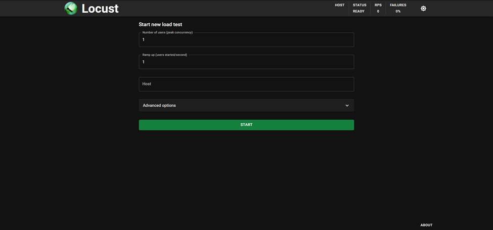

<div dir="rtl">

# آزمون‌ بار (Load Testing) و آزمون فشار (Stress Testing) و آزمون خستگی (Soak Testing)

## آزمون بار (Load Testing):

آزمون بار (Load Testing) یکی دیگر از انواع تست‌های غیرکارکردی در حوزه تست نرم‌افزار است که به ارزیابی عملکرد یک نرم‌افزار یا سیستم تحت بار یا تقاضای شبیه‌سازی‌شده می‌پردازد. هدف از آزمون بار، تحلیل رفتار نرم‌افزار در شرایط عادی یا نزدیک به عادی از نظر تعداد کاربران، تراکنش‌ها یا مقدار داده‌ها است.

### فواید و مزایای آزمون بار:

- **شناسایی مشکلات عملکردی:** آزمون بار به شما کمک می‌کند تا مشکلات عملکردی نرم‌افزار را شناسایی کنید. این مشکلات ممکن است شامل زمان پاسخ کند، استفاده بیش از حد از منابع سیستم، یا مشکلات مقیاس‌پذیری باشد.

- **اطمینان از کارایی نرم‌افزار:** از طریق آزمون بار، می‌توانید اطمینان حاصل کنید که نرم‌افزار شما کارایی مناسبی دارد و می‌تواند تحت بار عادی یا پیش‌بینی‌شده عملکرد خوبی ارائه دهد.

- **شبیه‌سازی شرایط واقعی:** این آزمون با شبیه‌سازی بار یا تقاضای شبیه به شرایط واقعی، به شما کمک می‌کند تا درک بهتری از رفتار نرم‌افزار در دنیای واقعی به دست آورید.

- **شناسایی گلوگاه‌ها:** آزمون بار می‌تواند به شناسایی گلوگاه‌ها یا بخش‌هایی از نرم‌افزار که تحت بار سنگین دچار مشکل می‌شوند، کمک کند. این اطلاعات ارزشمندی را برای بهینه‌سازی و بهبود عملکرد نرم‌افزار ارائه می‌دهد.

- **اعتبارسنجی معماری و طراحی:** با انجام آزمون بار، می‌توانید اعتبار معماری و طراحی نرم‌افزار خود را ارزیابی کنید. این آزمون نشان می‌دهد که آیا سیستم شما به درستی طراحی شده است و می‌تواند بار مورد انتظار را مدیریت کند.

آزمون بار یک ابزار مهم برای ارزیابی عملکرد نرم‌افزار و اطمینان از کارایی آن در شرایط عادی استفاده است. با انجام منظم این نوع تست، می‌توانید نرم‌افزاری کارآمد و با عملکرد بالا ارائه دهید که بتواند انتظارات کاربران را برآورده کند.


## آزمون فشار (Stress Testing):

آزمون فشار (Stress Testing) یکی از انواع تست‌های غیرکارکردی (Non-Functional Testing) در حوزه تست نرم‌افزار است که هدف آن ارزیابی عملکرد و پایداری یک نرم‌افزار یا سیستم تحت شرایط فشار یا بار شدید است. در این نوع تست، نرم‌افزار تحت بار یا تقاضای بالاتر از حد معمول قرار می‌گیرد تا رفتار آن تحلیل شود.

### فواید و مزایای آزمون فشار:

- **شناسایی محدودیت‌ها و نقاط شکست:** آزمون فشار به شما کمک می‌کند تا محدودیت‌های نرم‌افزار را شناسایی کنید و بفهمید در چه شرایطی ممکن است شکست بخورد. این امر به شما در بهینه‌سازی نرم‌افزار و اطمینان از عملکرد آن در شرایط دشوار کمک می‌کند.

- **ارزیابی پایداری و قابلیت اطمینان:** با اعمال فشار بر نرم‌افزار، می‌توانید استحکام و پایداری آن را ارزیابی کنید. این آزمون نشان می‌دهد که آیا نرم‌افزار در شرایط بار زیاد یا استفاده مداوم همچنان عملکرد پایداری دارد یا دچار مشکل می‌شود.

- **بهبود عملکرد:** از طریق آزمون فشار، می‌توانید نقاط ضعف نرم‌افزار را شناسایی کرده و آن را بهینه کنید. این امر می‌تواند شامل بهینه‌سازی کد، بهبود معماری نرم‌افزار یا افزایش ظرفیت منابع سیستم باشد.

- **کاهش ریسک:** با شناسایی مشکلات و محدودیت‌های نرم‌افزار پیش از استقرار آن در محیط واقعی، می‌توانید ریسک خرابی سیستم یا نارضایتی کاربران را کاهش دهید.

- **شبیه‌سازی شرایط واقعی:** آزمون فشار می‌تواند شرایط واقعی را که نرم‌افزار ممکن است با آن مواجه شود، شبیه‌سازی کند. این امر به شما کمک می‌کند تا مطمئن شوید که نرم‌افزار در شرایط دشوار عملکرد مناسبی خواهد داشت.

آزمون فشار یک ابزار ارزشمند در جعبه ابزار تست نرم‌افزار است که به شما کمک می‌کند تا نرم‌افزاری با کیفیت بالاتر و قابلیت اطمینان بیشتر ارائه دهید. با انجام منظم این نوع تست، می‌توانید مشکلات پنهان را شناسایی کرده و نرم‌افزاری با پایداری و عملکرد بهتر ارائه دهید.

## آزمون خستگی(Soak Testing):

آزمون خستگی یا Soak Testing نوعی تست غیرکارکردی در حوزه تست نرم‌افزار است که هدف آن ارزیابی پایداری و قابلیت اطمینان یک نرم‌افزار یا سیستم در طول یک دوره زمانی طولانی است. این آزمون همچنین به عنوان "آزمون ماندگاری" یا "آزمون ماندگاری طولانی مدت" شناخته می‌شود.

### هدف آزمون خستگی:

هدف اصلی آزمون خستگی، شناسایی مشکلاتی است که ممکن است در طول استفاده طولانی مدت از نرم‌افزار ظاهر شوند. این مشکلات ممکن است شامل نشت حافظه (memory leaks)، مشکلات پایداری، کاهش عملکرد یا هرگونه رفتار غیرعادی دیگری باشد که با گذشت زمان رخ می‌دهد.

### فواید و مزایای آزمون خستگی:

- **شناسایی مشکلات بلندمدت:** آزمون خستگی به شما کمک می‌کند تا مشکلاتی را شناسایی کنید که ممکن است تنها در طول استفاده طولانی مدت از نرم‌افزار ظاهر شوند. این مشکلات ممکن است در تست‌های کوتاه‌مدت نادیده گرفته شوند.

- **ارزیابی پایداری و قابلیت اطمینان:** این آزمون، پایداری و قابلیت اطمینان نرم‌افزار را در طول زمان ارزیابی می‌کند. با شبیه‌سازی استفاده طولانی مدت، می‌توانید اطمینان حاصل کنید که نرم‌افزار همچنان عملکرد مناسبی دارد و دچار مشکلات پایداری یا کاهش عملکرد نمی‌شود.

- **بهبود کیفیت نرم‌افزار:** از طریق آزمون خستگی، می‌توانید کیفیت نرم‌افزار را بهبود بخشید و اطمینان حاصل کنید که کاربران در طول استفاده طولانی مدت از نرم‌افزار، تجربه خوبی خواهند داشت.

- **کاهش ریسک:** با شناسایی و رفع مشکلاتی که ممکن است در طول زمان ظاهر شوند، می‌توانید ریسک خرابی سیستم یا نارضایتی کاربران را کاهش دهید.


- **اعتبارسنجی معماری و طراحی:** آزمون خستگی می‌تواند اعتبار معماری و طراحی نرم‌افزار را در طول زمان ارزیابی کند. این آزمون نشان می‌دهد که آیا سیستم شما می‌تواند در طول یک دوره طولانی مدت عملکرد پایدار و قابل اطمینانی داشته باشد.


آزمون خستگی یک ابزار مهم در جعبه ابزار تست نرم‌افزار است که به شما کمک می‌کند تا نرم‌افزاری با کیفیت بالاتر و قابلیت اطمینان بیشتر ارائه دهید. با انجام منظم این نوع تست، می‌توانید مشکلات پنهان را شناسایی کرده و نرم‌افزاری با پایداری و عملکرد بهتر ارائه دهید.

## مقایسه آزمون‌ها:

تفاوت بین آزمون فشار، آزمون بار و آزمون خستگی در خلاصه زیر ارائه شده است:

### آزمون فشار (Stress Testing):

- **هدف:** ارزیابی عملکرد نرم‌افزار تحت شرایط فشار یا بار شدید، فراتر از استفاده عادی.

- **تمرکز:** شناسایی محدودیت‌ها، نقاط شکست و ارزیابی پایداری.

- **سناریو:** شبیه‌سازی شرایط دشوار، بار سنگین یا غیرعادی.

- **فواید:** شناسایی نقاط ضعف، بهبود عملکرد، کاهش ریسک.

###	آزمون بار (Load Testing):

- **هدف:** ارزیابی عملکرد نرم‌افزار تحت بار یا تقاضای شبیه‌سازی‌شده نزدیک به شرایط عادی.

- **تمرکز:** تحلیل کارایی، شناسایی مشکلات عملکردی و ارزیابی قابلیت مقیاس‌پذیری.

- **سناریو:** شبیه‌سازی بار عادی یا پیش‌بینی‌شده، از جمله تعداد کاربران، تراکنش‌ها یا حجم داده‌ها.

- **فواید:** اطمینان از کارایی، شناسایی گلوگاه‌ها، اعتبارسنجی معماری.

###	آزمون خستگی (Soak Testing):

- **هدف:** ارزیابی پایداری و قابلیت اطمینان نرم‌افزار در طول یک دوره زمانی طولانی.

- **تمرکز:** شناسایی مشکلات بلندمدت، ارزیابی عملکرد در طول زمان.

- **سناریو:** شبیه‌سازی استفاده طولانی مدت از نرم‌افزار، نظارت بر رفتار در طول زمان.

- **فواید:** بهبود کیفیت، کاهش ریسک، اعتبارسنجی پایداری و معماری.

## Locust:

<div dir="rtl">
Locust یک ابزار منبع باز برای انجام آزمون بار و آزمون فشار بر روی نرم‌افزارهایی است که از پروتکل HTTP یا سایر پروتکل‌ها استفاده می‌کنند. این ابزار به شما امکان می‌دهد تا سناریوهای آزمون خود را به راحتی با استفاده از کد پایتون تعریف کنید. شما رفتار کاربران خود را به جای درگیری با یک رابط کاربری یا زبان خاص با دامنه محدود، در کد معمولی پایتون، تعریف می کنید. این باعث میشود Locust بی‌نهایت قابل گسترش و برای توسعه‌دهندگان بسیار مناسب باشد.
</div>

### مزایای استفاده از Locust عبارتند از:

<div dir="rtl">

1. **انعطاف‌پذیری:** Locust به شما امکان می‌دهد تا آزمون‌های خود را به راحتی با استفاده از پایتون بنویسید. شما می‌توانید رفتار هر کاربر مجازی را تعریف کنید، شرایط را شبیه‌سازی کنید و منطق آزمون خود را پیاده‌سازی نمایید.

2. **مقیاس‌پذیری:** Locust می‌تواند تعداد زیادی کاربر مجازی را برای شبیه‌سازی بار سنگین بر روی نرم‌افزار شما ایجاد کند. این ابزار به شما امکان می‌دهد تا آزمون‌های خود را در مقیاس بزرگ اجرا کنید و عملکرد سیستم خود را تحت فشار ارزیابی نمایید.

3. **نظارت در زمان واقعی:** Locust یک رابط کاربری مبتنی بر وب ارائه می‌دهد که به شما امکان می‌دهد تا در طول اجرای آزمون، به صورت زنده، آمار و اطلاعات مربوط به بار، زمان پاسخ و خطاها را مشاهده کنید. همچنین می‌توانید این داده‌ها را برای تحلیل‌های بعدی ذخیره کنید.

4. **قابلیت گسترش:** Locust دارای معماری قابل انعطاف است که امکان گسترش و سفارشی‌سازی آن را بر اساس نیازهای خاص شما فراهم می‌کند. شما می‌توانید ماژول‌ها و پلاگین‌های جدیدی ایجاد کنید یا از کتابخانه‌های پایتون موجود در آزمون‌های خود استفاده نمایید.

5. **نصب و راه‌اندازی آسان:** Locust را می‌توانید به راحتی با استفاده از مدیر بسته pip در پایتون نصب کنید. همچنین، Locust دارای مستندات و منابع جامع برای کمک به شما در شروع کار و درک مفاهیم اساسی آن است.

به طور خلاصه، Locust یک ابزار قدرتمند و انعطاف‌پذیر برای انجام آزمون بار و آزمون فشار است که به شما امکان می‌دهد تا سناریوهای پیچیده را با استفاده از پایتون تعریف کنید و عملکرد نرم‌افزار خود را تحت شرایط شدید ارزیابی نمایید.

</div>

### مراحل نصب Locust:

<div dir="rtl">


1. برای نصب Locust ابتدا پایتون باید بر روی سیستم شما نصب باشد. اگر آن را ندارید میتوانید از این لینک آن را دانلود کرده و نصب کنید.

2. سپس با اجرای دستور زیر در محیط CMD میتوانید Locust را نصب کنید.

```pip install locust```


3. برای مطمئن شدن از نصب درست Locust می‌توان از کد زیر استفاده کرد:

```locust --v```


همانطور که در عکس بالا مشخص است، locust ورژن 2.29.1 با موفقیت روی سیستم نصب شده است.


</div>

## سنگین‌ترین صفحه شبکه اجتماعی:

سنگین ترین صفحه شبکه اجتماعی Humhub، صفحه داشبورد است. چرا که برای لود کردن این صفحه برای هر کارب، شبکه اجتماعی نیاز است که اطلاعات پست‌ها و فعالیت‌های اخیر انجمن‌ها و افرادی که آن‌هارا دنبال می‌کند را از دیتابیس فراخوانی کند. همچنین نیاز است که پیام‌های دریافتی و اعلانات نیز در این صفحه به کاربر اعلام شود.


## اجرای Locust روی شبکه HumHub:

ابتدا یک فایل با نام "locustfile.py" ایجاد کنید تا سناریوهای مختلف کاربران برای آزمون بارگذاری را در آن تعریف کنیم. ابتدا یک کلاس برای کاربران تعریف می‌کنیم که از کلاس "HttpUser" ارث‌بری می‌کند و به هر کاربر یک ویژگی "client" اختصاص می‌دهد که نمونهای از "HttpSession" است. این نمونه می‌تواند برای ارسال درخواست‌های HTTP به سیستم هدف که می‌خواهیم آزمون بار روی آن انجام دهیم، مورد استفاده قرار گیرد. هنگامی که یک تست بارگذاری آغاز می‌شود، Locust برای هر کاربری که شبیه‌سازی می‌کند، نمونه‌ای از این کلاس ایجاد می‌کند و هر یک از این کاربران به صورت موازی اجرا می‌شوند. 

ما 6 سناریو در نظر گرفتیم و برای هر سناریو یک تابع تعریف کردیم. سناریو ها عبارتند از:

<div dir="rtl">

1. مشاهده نسخه کامل یک پست
2. پیام فرستادن در یک گروه
3. کامنت گذاشتن
4. پست جدید گذاشتن
5. چک کردن یکی از انجمن‌ها
6. چک کردن صفحه داشبورد


</div>

همچنین در هنگام ایجاد شدن هر کاربر جدید در Locust تابع on_start فراخوانی می‌شود که در این تابع عملیات احراز هویت و ورود پیاده شده است. در هنگام متوقف شدن Locust تابع on_stop فراخوانی می‌شود که در آن عملیات خروج کاربر شبیه‌سازی شده است.
با توجه به سناریوهای تعریف شده برای آنکه شبیه‌سازی بیشتر به رفتار یک کاربر عادی نزدیک باشد به هر تسک وزن داده شده است.


### توابع locustfile.py:

#### تابع مشاهده کامل یک پست:

<div dir="ltr">

````python 
1.	    @task(6)
2.	    def full_post(self):
3.	        proxy_url = "127.0.0.1:8080"
4.	        proxy_dict = {"http": proxy_url, "https": proxy_url}
5.	        with self.client.get('/dashboard', catch_response=True) as dashboard_response:
6.	            if dashboard_response.status_code == 200:
7.	                dashboard_response.success()
8.	            else:
````

</div>

<div dir="ltr">

````python 
9.	                dashboard_response.failure("[-] dashboard failed")
10.	                return
11.	        with self.client.get('/content/perma?id=102', catch_response=True) as post_response:
12.	            if post_response.status_code == 200:
13.	                post_response.success()
14.	                logging.info("[+]checked the fulled post")
15.	            else:
16.	                post_response.failure("checking post failed")

````

</div>

#### تابع ارسال یک پیام در گروه:

<div dir="ltr">

````python 
1.	    @task(2)
2.	    def messaging(self):
3.	        proxy_url = "127.0.0.1:8080"
4.	        proxy_dict = {"http": proxy_url, "https": proxy_url}
5.	        with self.client.get('/mail/mail/index', catch_response=True) as mail_response:
6.	            if mail_response.status_code==200:
7.	                mail_response.success()
8.	                logging.info("[+] mail box opened")
9.	                csrf_token = self.extract_csrf_token(mail_response.text,True)
10.	            else:
11.	                mail_response.failure(f"Failed to open mailBox. Status code: {mail_response.status_code}")
12.	                return
13.	            
14.	        with self.client.get('/mail/mail/show?id=2', catch_response=True) as group_response:
15.	            if group_response.status_code==200:
16.	                group_response.success()
17.	                logging.info("[+] chat box opened")
18.	                self.client.headers["X-CSRF-Token"] = csrf_token
19.	                message_data = {
20.	                    "ReplyForm[message]" : "This a message from Locust. from messaging"
21.	                }
22.	            else:
23.	                group_response.failure(f"Failed to open the group. Status code: {group_response.status_code}")
24.	                return
25.	            
26.	        with self.client.post("/mail/mail/reply?id=2",data=message_data, catch_response=True) as message_response:
27.	            if message_response.status_code==200:
28.	                logging.info("[+] messaged something")

````
</div>

<div dir="ltr">

````python 
29.	                message_response.success()
30.	            else:
31.	                message_response.failure(f"Failed to post comment. Status code: {message_response.status_code}")
32.	        self.client.headers.pop("X-CSRF-Token")  
````

</div>

#### تابع گذاشتن کامنت:

<div dir="ltr">

````python 
            1.	 @task(4)
2.	    def leave_a_comment(self):
3.	        proxy_url = "127.0.0.1:8080"
4.	        proxy_dict = {"http": proxy_url, "https": proxy_url}
5.	        with self.client.get('/dashboard', catch_response=True) as response:
6.	            if response.status_code == 200 and "csrf" in response.text:
7.	                response.success()
8.	                csrf_token = self.extract_csrf_token(response.text, True)
9.	            else:
10.	                response.failure("Couldnt load the dashboard")
11.	                return
12.	        
13.	        with self.client.get("/dashboard/dashboard/stream?StreamQuery%5Bfrom%5D=0&StreamQuery%5Blimit%5D=8",  catch_response=True) as dashboard_update:
14.	            dashboard_update.success()
15.	            object_model = 'humhub\\modules\\polls\\models\\Poll'
16.	            comment_data = {
17.	                "objectModel": object_model,
18.	                "objectId": 19,
19.	                "Comment[message]": "This is an automated comment from Locust. with leaving"
20.	                }
21.	            self.client.headers["X-CSRF-Token"]=csrf_token
22.	
23.	        self.client.headers["X-CSRF-Token"]=csrf_token
24.	        with self.client.post("/comment/comment/post",data=comment_data, catch_response=True) as comment_Response:
25.	            if comment_Response.status_code == 200:
26.	                comment_Response.success()
27.	                logging.info("[+] commented something")
28.	            else:
29.	                comment_Response.failure(f"Failed to post comment. Status code: {comment_Response.status_code}")
30.	        self.client.headers.pop("X-CSRF-Token")
````

</div>

#### -	تابع گذاشتن یک پست:

<div dir="ltr">

````python 
1.	    @task(1)
2.	    def add_a_movie(self):
3.	        proxy_url = "127.0.0.1:8080"
4.	        proxy_dict = {"http": proxy_url, "https": proxy_url}
5.	        try:
6.	            with self.client.get('/space/browse/search-lazy',  catch_response=True) as space_response:
7.	                if "Movies" in space_response.text:
8.	                    space_response.success()
9.	                    logging.info("Navigated to space directory successfully.")
10.	                else:
11.	                    space_response.failure(f"Failed to navigate to space directory. Status code: {space_response.status_code}")
12.	                    return
13.	
14.	            with self.client.get('/s/movies/',  catch_response=True) as movies_response:
15.	                if "/s/movies/about" in movies_response.text:
16.	                    movies_response.success()
17.	                    logging.info("Navigated to movies space successfully.")
18.	                else:
19.	                    movies_response.failure(f"Failed to navigate to specific space. Status code: {movies_response.status_code}")
20.	                    return
21.	
22.	            with self.client.get('/s/movies/polls/poll/create-form',  catch_response=True) as form_response:
23.	                if "_csrf" in form_response.text:
24.	                    form_response.success()
25.	                    csrf_token = self.extract_csrf_token(movies_response.text, False)
26.	                    new_movies_data = {
27.	                        "_csrf": csrf_token,
28.	                        "Poll[question]": "Batman Begins 1",
29.	                        "Poll[description]": "After witnessing his parents' death, Bruce learns the art of fighting to confront injustice. When he returns to Gotham as Batman, he must stop a secret society that intends to destroy the city.",
30.	                        "newAnswers[]": ["Perfect", "Good", "Average", "Not good", "Bad"],
31.	                        "Poll[allow_multiple]": 0,
32.	                        "Poll[is_random]": 0,
33.	                        "Poll[anonymous]": 0,
````

</div>


<div dir="ltr">

````python 
34.	                        "Poll[show_result_after_close]": 0,
35.	                        "postTopicInput[]": [2, 3, 4],
36.	                        "containerGuid": "3e7693d6-e5c2-4c13-8133-942cd871a9db",
37.	                        "containerClass": "humhub%5Cmodules%5Cspace%5Cmodels%5CSpace",
38.	                        "state": 1
39.	                    }
40.	                else:
41.	                    form_response.failure("form_response failed to find csrf")
42.	                    return
43.	
44.	                with self.client.post('/s/movies/polls/poll/create', data=new_movies_data,  catch_response=True) as polls_response:
45.	                    if 'guid' in polls_response.text:
46.	                        logging.info("[+] Added a movie")
47.	                        polls_response.success()
48.	                    else:
49.	                        polls_response.failure(f"Failed to create post. Status code: {polls_response.status_code}")
50.	
51.	        except Exception as e:
52.	            logging.exception("An error occurred during the process")
````

</div>

#### تابع چک کردن یک انجمن:
<div dir="ltr">

````python 
1.	    @task(5)
2.	    def Check_movies_space(self):
3.	        proxy_url = "127.0.0.1:8080"
4.	        proxy_dict = {"http": proxy_url, "https": proxy_url}
5.	        with self.client.get('/space/browse/search-lazy', catch_response=True) as jresponse:
6.	            if "Movies" in jresponse.text or "movies" in jresponse.text:
7.	                jresponse.success()
8.	                with self.client.get('/s/movies/', catch_response=True) as space_response:
9.	                    if space_response.status_code == 200:
10.	                        space_response.success()
11.	                        logging.info("[+] movies space checked successful")
12.	                    else:
13.	                        space_response.failure("[-] movies space failed")
14.	            else:
15.	                jresponse.failure(f'[-] space lazy search failed {jresponse.status_code}')
````

</div>

#### تابع چک کردن داشبورد:

<div dir="ltr">

````python 
1.	   @task(10)
2.	    def Check_dashboard(self):
3.	        proxy_url = "127.0.0.1:8080"
4.	        proxy_dict = {"http": proxy_url, "https": proxy_url}
5.	        with self.client.get('/dashboard', catch_response=True) as response:
6.	            if response.status_code == 200:
7.	                response.success()
8.	                logging.info("[+] dashboard checked successfully")
9.	            else:
10.	                response.failure("[-] dashboard failed")

````

</div>

#### تابع Login:


<div dir="ltr">

````python 
1.	  def on_start(self):
2.	        proxy_url = "127.0.0.1:8080"
3.	        proxy_dict = {"http": proxy_url, "https": proxy_url}
4.	        self.client.cookies["XDEBUG_PROFILE"]='1'
5.	        with self.client.get('/user/auth/login', catch_response=True) as Gresponse:
6.	            if Gresponse.status_code == 200:
7.	                csrf_token = self.extract_csrf_token(Gresponse.text,False)
8.	                with self.client.post("/user/auth/login", data={
9.	                                                                "_csrf": csrf_token,
10.	                                                                "Login[username]": "yara.sadeghi.81@gmail.com",
11.	                                                                "Login[password]": "12345",
12.	                                                                "Login[rememberMe]": "1"
13.	                                                                },catch_response=True) as response:
14.	                    if response.status_code==200 and "logout" in response.text:
15.	                        response.success()
16.	                    else:
17.	                        response.failure("[-] Login faild")
18.	            else:
19.	                Gresponse.failure("[-] Couldn't load the login page")

````

</div>

#### تابع Logout:

<div dir="ltr">

````python 
1.	def on_stop(self):
2.	        proxy_url = "127.0.0.1:8080"
3.	        proxy_dict = {"http": proxy_url, "https": proxy_url}
4.	        with self.client.get('/dashboard', catch_response=True) as dresponse:
5.	            if dresponse.status_code == 200:

````

</div>


<div dir="ltr">

````python 
             csrf_token = self.extract_csrf_token(dresponse.text,True)
7.	                with self.client.post('/user/auth/logout',data={"_csrf":csrf_token}, catch_response=True) as log_response :
8.	                    if "login" in log_response.text:
9.	                        logging.info("[+] Logout successful")
10.	                    else:
11.	                        log_response.failure(f"[-] Logout failed{log_response.status_code}")
12.	            else:
13.	                dresponse.failure(f"failed to load the dashboard{dresponse.status_code}")

````

</div>

## انجام آزمون بار (Load Testing) با استفاده از Loctus

ابتدا به پوشه‌ای که فایل “locustfile.py” در آن قرار دارد رفته و سپس با وارد کردن کامند “locust” برنامه اجرا می‌شود.


برنامه یک GUI به صورت web در پورت 8089 بالا می‌آورد که با کمک آن می‌توان به انجام تنظیمات پرداخت:



شبکه اجتماعی ما به نام کولبرا، به طور کامل پیاده‌سازی و برروی یک سرور عملیاتی شده است. باتوجه به محدودیت‌های سرور امکان تست 1000 یوزر فعال و همزمان وجود ندارن؛ بلکه سایت تنها توان پاسخ‌دهی به 170 کاربر را دارد. بنابراین مقادیر به مانند زیر تغییر کرده‌اند:
حال منتظر می‌مانیم تا تعداد کاربران به 170 برسد. سپس چند دقیقه پس از آن هم منتظر می‌مانیم و در نهایت به بررسی نتایج می‌پردازیم.


در تصویر اول چارت مربوط به تعداد کل requestها و میزان failشدنشان با افزایش تعداد userها قابل مشاهده است. کل Request Httpها، همچنین تعداد requestهای fail شده و time response در جدول بالا نیز قابل مشاهده است.
فایل loctusfile.py و ریپورتهای csv مربوط به این اجرای locust در repository گیتهاب قرار گرفته است.
همانطور که مشاهده می‌شود شبکه توان پاسخ‌دهی به  170 یوزر (وحتی بیشتر) را دارد ولی رفته رفته پس از مدتی به دلایل مختلف مانند پر شدن کش‌ها و یا خستگی سیستم از پاسخ دادن ناتوان می‌ماند و سایت به طور کامل پایین می‌رود. به همین دلیل در آزمون خستگی تعداد کاربران از 170 کمتر قرار خواهد گرفت.
همچنین در تست‌ها مشاهده شد که وجود کوکی XDEBUG_PROFILE=1 که باعث تریگر شدن xdebug می‌شود در عملکرد کلی سایت تاثیر منفی دارد بنابراین با برداشتن این کوکی توان عملیاتی وبسایت افزایش می‌یابد. این افزایش توان در آزمون فشار مشهود تر است.

## انجام آزمون فشار با Locust

برای پیدا کردن آستانه تحمل فشار شبکه، یک تست با 400 کاربر spawn rate=1 انجام دادیم. اگر xdebug فعال باشد، زمانی که تعداد کاربران به حدود 180 میرسد، عملکرد سیستم مختل می‌شود و شروع به برگرداندن ارور‌های رده 500 می‌کند. در صورت غیر فعال بودن xdebug این عدد به 360 می‌رسد.


نمودار ها در صورت فعال نبودن هدر xdebug.

نمودار ها در صورت فعال بودن هدر xdebug.

## انجام آزمون خستگی

همانطور که پیش تر گفته شد در این آزمون، هدف بیشتر تداوم وجود کاربر در سایت است. بنابر این آزمون با حداکثر تعداد کاربر 100 کاربر و spawn rate=1.5 انجام گرفت. آستانه شکست وقتی است که میانگین زمان پاسخ به 50 ثانیه برسد و یا سایت با دادن ارور های 500 از دسترس خارج شود. 
سایت به طور موفقیت آمیزی به کار خود ادامه داد. 


البته که آزمون خستگی باید در ساعات طولانی تست شود اما ما در اینجا به همین بسنده میکنیم.

</div>