# مقدمه
این نرم‌افزار یک ابزار کنترل کننده کیفیت کد است که کد‌های برنامه را دریافت کرده و در یک محیط یکپارچه شده از ابزار‌هایی چون Cehckstyle، CPD، PMD و FindBugs تجزیه و تحلیل استاتیک و داینامیک انجام می‌دهد و در نتیجه گزارش‌هایی را برای کیفیت کدی که نوشته شده است، ارائه می‌دهد در کنسول مدیریتی تحت‌وب خود ارائه می‌دهد. این فرآیند در طول زمان توسعه نرم‌افزار انجام می‌شود و تغییرات در نرم‌افزار رصد می‌شود. SonarQube این قابلیت را دارد که توسط نرم‌افزارهای CI مانند Jenkins به صورت خودکار اجرا شود.

# سرور
سرور sonarqube از وجوه تمایز و برتری آن نسبت به سایر ابزار‌های تحلیل کد است. با استفاده از کنسول مدیریتی تحت وب آن می‌توانیم پروژه‌ها را مدیریت کنیم و نتایج گزارش‌ها را مشاهده کنیم.

# تعریف Rule
در sonarqube با استفاده از کنسول مدیریتی می‌توانیم Rule ها را مشاهده کنیم و اولویت آنها را بررسی کنیم. همچنین می‌توانیم متناسب با نیاز خودمان Ruleهایی را تعیین کنیم که بررسی شوند. همچنین می‌توانیم اهمیت این قواعد را نیز تعیین کنیم.
می‌توانیم Ruleها را در کنسول مدیریتی sonarqube مشاهده و مدیریت کنیم:

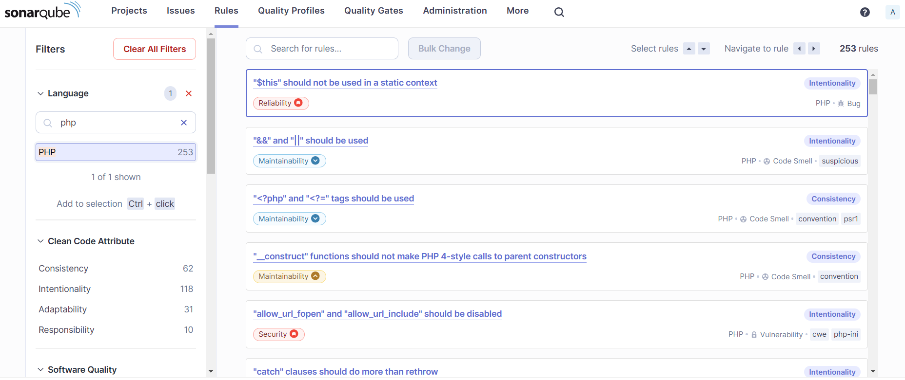

# تست humhub
این ابزار مشکلات امنیتی، نگهداری و قابلیت اطمینان را با توجه به Ruleها بررسی می‌کند و گزارش را در کنسول تحت‌وب خود نمایش می‌دهد. برای مثال بعد از تست humhub گزارش sonarqube را در کنسول آن مشاهده می‌کنیم.

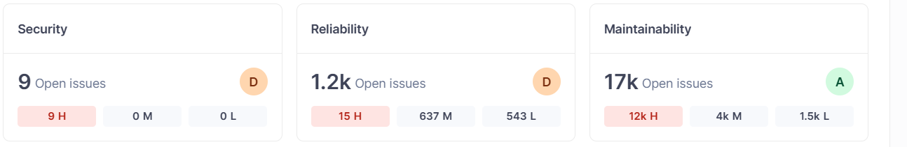

همانطور که مشاهده می‌کنیم 9 مشکل امنیتی و 1.2k مشکل قابلیت اطمینان و 17k مشکل نگهداری توسط sonarqube و متناسب با ruleهای تعریف شده برای آن پیدا شده است.

# مشکلات امنیتی
پس از انجام تست مشکلات امنیتی با توجه به ruleهای تعریف شده گزارش می‌شوند.

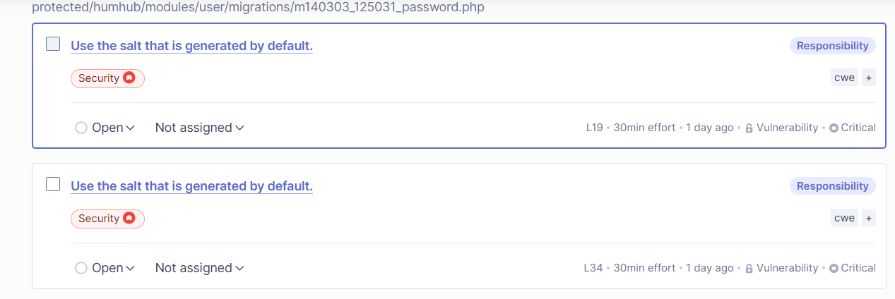
همانطور که مشاهده می‌کنیم مشکلات امنیتی و به طور کلی تمام ruleهایی که تعریف می‌شوند Priority دارند sonarqube مشکل‌امنیتی شناخته شده یعنی "Use the salt that is generated by default" را با اولو

یت بالا(رنگ قرمز) گزارش کرده است.
با کلیک کردن روی هرکدام از این مشکلات گزارش شده می‌توانیم اطلاعات بیشتری دریافت کنیم.

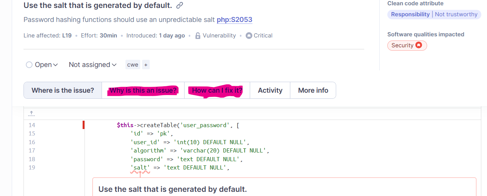

همانطور که مشاهده می‌کنیم، sonarqube بخشی که به عنوان مشکل گزارش شده را نشان می‌دهد. همچنین می‌توانیم مشاهده کنیم که چرا چنین‌ مشکلی گزارش شده و چگونه می‌توان آن را رفع کرد.

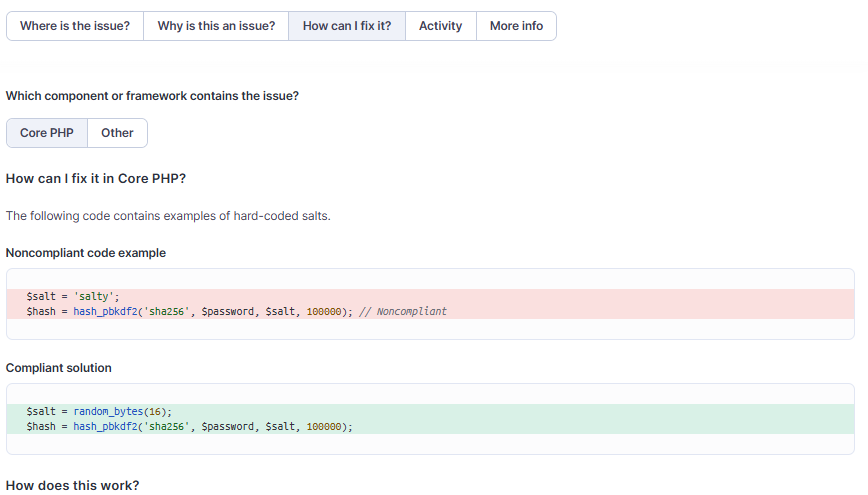

# نگهداری
طبق ruleهای تعریف شده مشکلات گزارش می‌شوند. می‌توانیم چند نمونه از این مشکلات را مشاهده کنیم:

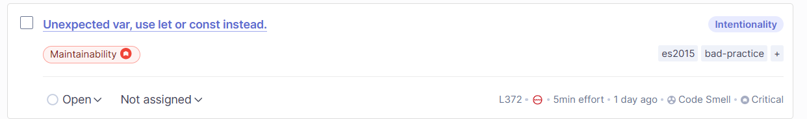
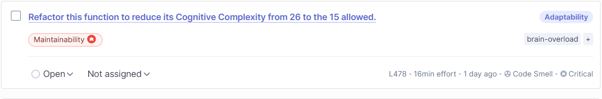
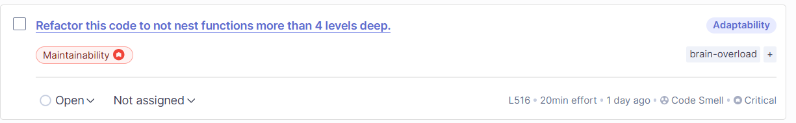

# قابلیت اطمینان
در این بخش مشکلاتی گزارش می‌شوند که ممکن است روند اجرای درست برنامه را دچار مشکل کنند.
برای مثال:

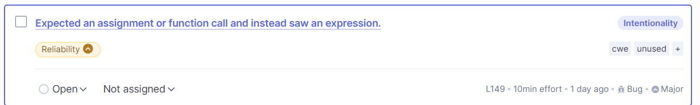
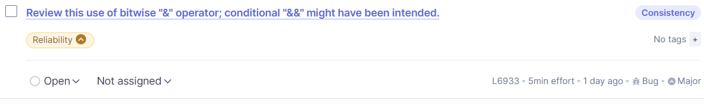
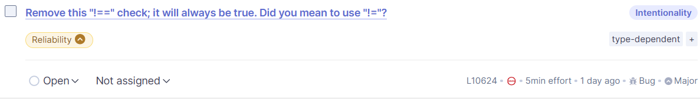
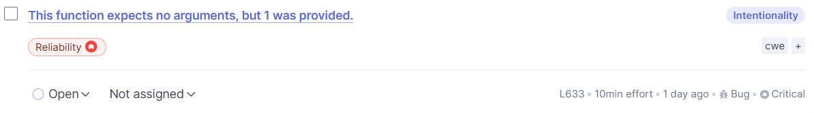

# دروازه کیفیت
دروازه کیفیت(Quality Gate) مجموعه قوانینی است که مشخص می‌کند که آیا کد آماده عملیاتی شدن است یا خیر.
همچنین با تغییر کد sonarqube کد را بررسی می‌کند و ruleها را برای تغییرات ایجاد شده و به طور کلی در پروژه بررسی می‌کند. و با توجه به Qulity Gate تعریف شده تعیین می‌کند که نرم‌افزار آماده عملیاتی شدن هست یا خیر.
برای تعریف کردن quality gate باید به پنجره quality gate برویم:

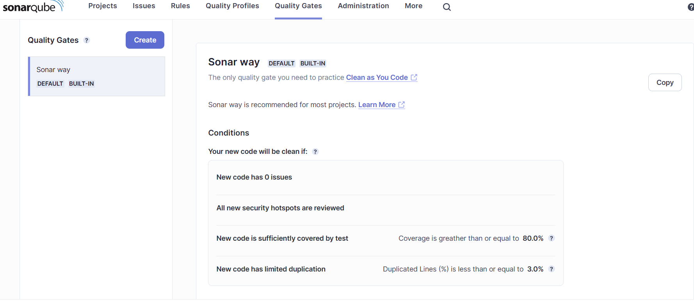
